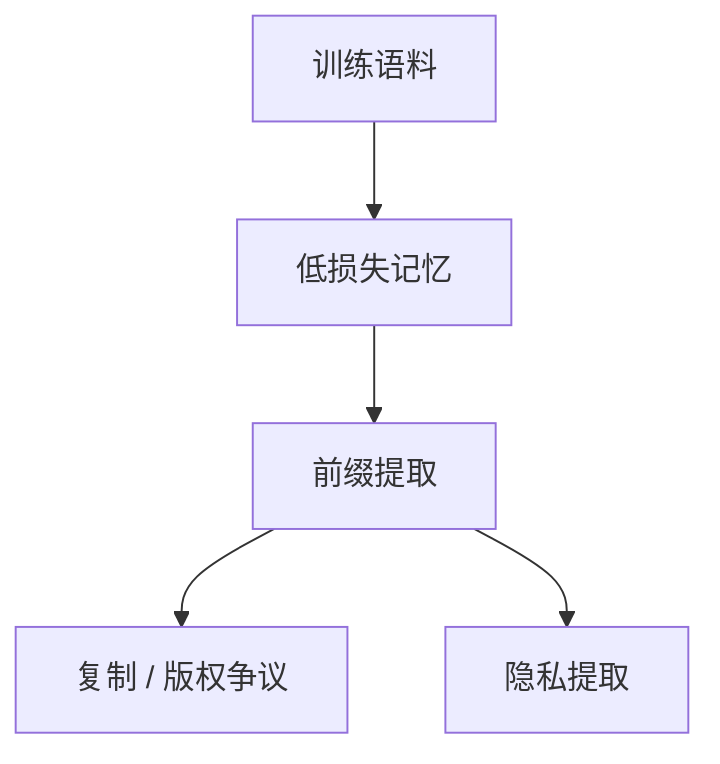

# 记忆化与版权

能复现训练里的长片段，是提取问题，也是版权问题。能力评测上的「答对」不能自动豁免。

<footer>—— Carlini 等对训练数据提取的工作；对照 [成员推断](/llm/membership-extraction)</footer>

[上一课](/llm/abstention-calibrated-refusal)处理不确定时不编。本课处理**太确定**：记忆化——生成与训练语料近乎逐字重叠。缺口不是再讲一遍去重，而是把「提取成功」从「泛化答对」里切开，并标明版权是法律问题、本栏只写技术可观测性。后课 DP-SGD 给的是训练期隐私预算，不是版权许可。

## 方法

技术观测：给定前缀，测量最长公共子串、n-gram 覆盖、相对语料的压缩比。Carlini 等人展示：较大模型、较多重复的样本、提示接近原文时，提取更容易。成员推断更弱，只猜「是否在集内」。产品侧：生成过滤器、许可语料、重复文档下调权，见 [网页去重](/llm/web-clean-dedup)。本课不写如何最大化提取。

代码与歌词是高频提取对象，因为重复率高、用户会给第一行当提示。新闻与书籍则更多走版权争议而非「能否提取」的实验室设定。

## 问题

主干安全课已有 [训练数据提取](/llm/membership-extraction)。补层要接对齐：记忆化可以表现为「诚实引用」的幻觉反面——引用是真的，因为在背。评测若只奖事实正确，会奖励背诵。版权持有人关心的是复制，不是事实真值。

## 机制

重复样本降低「下一 token」在该序列上的损失，等于把语料当查找表。去重不完全消除：近重复、模板、样例代码仍会进模型。对齐 SFT 若含版权材料，会把记忆从预训练搬到对话风格里。DP 噪声（下一课）压的是个体样本影响，对「极高频重复的公共文本」效果有限。

## 边界

本课不提供法律结论，不提供提取攻击步骤。下一课 DP-SGD 是隐私工具，不能当成版权合规。开源权重上的记忆化检测仍要用持有语料，没有语料就没有金标重叠率。

## 小结

- 记忆化：长片段可提取，与泛化答对不是同一指标。
- 版权关心复制；事实正确不自动豁免。
- 去重、许可、过滤是工程控制，DP 是另一条轴。
- 出处：Carlini 等；成员推断课。
