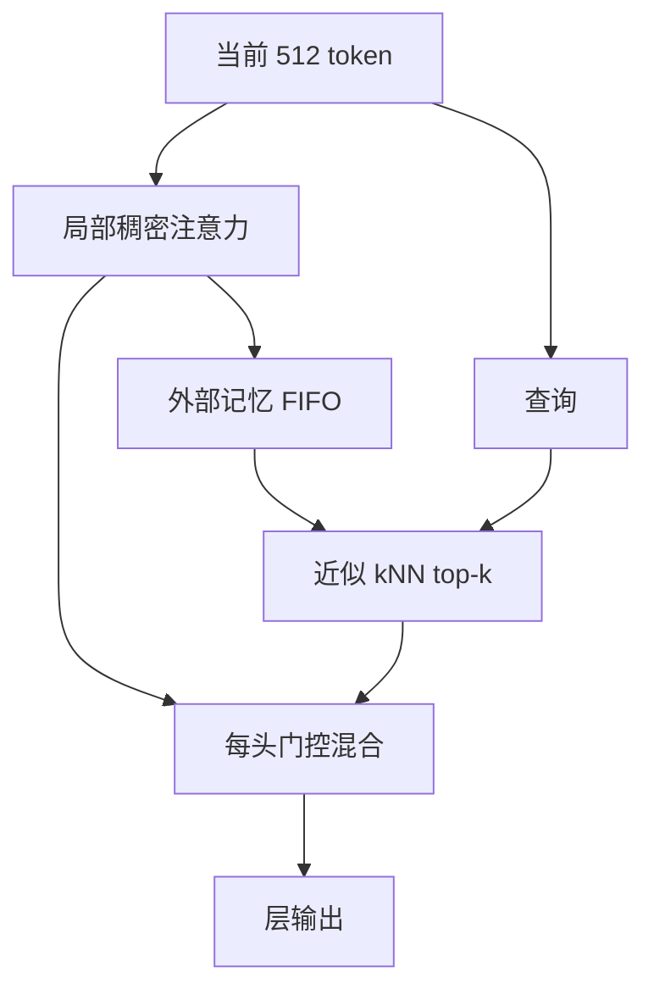

# Memorizing Transformers

    
不必把新知识写进权重；把过去的键值存进不可微的外部记忆，用近似 k 近邻取回，模型就能在推理时当场记住刚读到的定义。

    <footer>—— Wu、Rabe、Hutchins、Szegedy，Memorizing Transformers，ICLR 2022</footer>

Google 的 Yuhuai Wu、Markus N. Rabe、DeLesley Hutchins 与 Christian Szegedy 在 ICLR 2022 提出 Memorizing Transformer：解码器主体仍是局部稠密注意力，靠近顶部的一层额外对外部记忆做近似 $k$NN。记忆里是先前子序列的 $(k,v)$，梯度不回传到记忆，因此可以复用上一步已经算好的键值，把缓存做到 131k–262k token 仍装得进单卡 TPU。论文在 C4 长文档、arXiv、PG-19、GitHub、Isabelle 形式化定理上显示：记忆越大，困惑度越低；代码与数学上，测试时新出现的函数与引理定义会被检索到。本篇按这篇 2022 年原文写。它比 RoPE 延窗更早，问的是「注意力当检索」，而不是「相位出界」。

## 问题

Transformer 的有效上下文受稠密注意力长度限制，小说跨章指代、代码跨文件引用、证明引用早先引理，都需要看见很远的精确 token，而不是平均值。把事实存进权重要数十万步才能改完；若注意力能把定义写成键值、稍后用查询取回，则阅读即学习。已有长程方案或做池化（远距被平均），或做稀疏（子集不一定含定义），或像 Transformer-XL 只缓存上一段前缀。

Wu 等人要的是：远距仍然返回**精确**的值向量，而不是摘要；记忆大到 $10^5$ 量级时训练步时仍可接受。这两条一起，迫使记忆不可微——若对记忆反传，每一步都要用当前参数重算全部历史键值，规模立刻垮掉。

### 不可微是为了规模，不是为了偷懒

键值是参数的函数。可微记忆意味着历史必须用**当前** $\theta$ 重算，否则梯度对不上。不可微则允许把上一步局部上下文的 $(k,v)$ 追加进 FIFO，旧文档清空。分布会偏移：记忆里的键来自略旧的参数。论文把这当成可接受的代价，并用实验证明 $k$NN 仍有用。这与后来 Retrieval 增强（REALM、RAG）不同：那些检索的是静态文本片段；这里检索的是同一文档里模型自己写过的内部表示。

kNN 近似注意力，不替换 FFN。Lample 等人用 kNN 换前馈层，是另一条轴。本文的记忆里是过去 token 的键值，不是学出来的键库。

## 方法

长文档切成 512 token 的子序列，**按文档顺序**送入，不打乱，类似 XL。局部上下文用滑窗因果掩码，并缓存上一步的键值当 512 前缀，使每个 token 有 512 的稠密邻域。外部记忆每头保存先前 $M$ 对 $(k,v)$，容量满则丢最旧。

### kNN 增强层

堆叠中靠上的一层（实验里 12 层模型常用第 9 层）除局部稠密注意力外，用同一组查询对记忆做近似 kNN，返回每条查询自己的 top-$k$（常用 $k=32$）。对检索到的键做点积、softmax、加权值，与标准注意力相同，只是每条查询的键集合不同。局部结果 $V_c$ 与记忆结果 $V_m$ 用每头一个标量门混合：

$$
g=\sigma(b_g),\qquad V_a = V_m \odot g + V_c \odot (1-g).
$$

$b_g$ 可学习。实验观察到多数头最终几乎只看记忆。局部用 T5 相对位置偏置；检索到的记忆**不加**位置偏置——作者引用长程相对位置不重要、T5 也会把远距打进同一桶的观察。TPU 上的近似 kNN 约 90% recall；CPU/GPU 可用 Faiss 或 ScaNN。

训练时每个 batch 里不同文档各有一份记忆，文档边界清空。模型可在比训练更大的 $M$ 上推理：小记忆训出的权重，加大 $M$ 仍能降 PPL。记忆从 1536 增到 262144，质量单调变好。同尺寸下加 8k 记忆的增益，可以超过把模型放大 5 倍以上（原文图 1 的主张）。

## 机制

机制是把注意力拆成「邻域精确 softmax」与「全局内容寻址」。门控让头选择自己是局部句法头还是检索头。因为取回的是未压缩的值，函数体、引理陈述可以原样进入残差流，这是相对 Compressive Transformer 的关键差别。不可微导致记忆键略旧，但查询与键仍在同一层表示空间里，只要参数缓慢变化，近邻关系大致保持。近似 kNN 漏掉约 10% 真近邻，表现为偶发漏检，而不是系统性平均。

代码与 Isabelle 上的定性分析表明：当生成处需要一个刚定义的名字，检索到的键往往落在定义处。这被用来支持「测试时阅读即记忆」：权重不变，记忆里多了这一篇的 $(k,v)$，行为就变。C4 等通用网上文本增益较小，因为远距精确引用更少；结构化长依赖越强，记忆越值钱。

没有位置偏置的远距检索，模型分不清「定义在一万 token 前」还是「在八百 token 前」，只分内容相似。需要顺序敏感的任务时，应把块索引编码进键，或回到有相对偏置的方案。原文认为对书与代码这不是主矛盾。

## 边界与工程取舍

只增强一层，不是每层都 kNN，以控制延迟。记忆按头存，体积是 $M\times$ 头数 $\times$ 维。文档级 FIFO 不能跨语料共享成世界知识库——那是 RAG 的事；本文记忆是**当前长文档的工作记忆**。分布偏移在长时间训练后是否累积，原文用「仍有效」回答，没有给理论保证。decode 逐步追加键值时，近似索引要能动态插入，生产实现比训练时的块状 TPU 近似更麻烦。

与 2023–2024 延窗论文的关系：Memorizing Transformer 不修 RoPE，甚至主要不是 RoPE 模型；它修的是可见集。PI/YaRN 让相位能算到 32k，仍然对全部 32k 做二次注意力。要把窗口做到 256k 且只精确读少数位置，kNN 记忆与 Landmark 是更早的轴。不要把「262k 记忆」写成「262k 稠密上下文」——局部仍是 512+XL 前缀，远处只有 top-$k$ 条。

门控与 token 内容无关，只是每头一个偏置。作者提到改成内容门是 trivial 扩展。若某些头应随查询在局部与记忆之间切换，现公式做不到，这是 2022 年简化。

### 评测读法

应看 PPL 对 $M$ 的曲线是否单调，以及是否能把训练 $M$ 外推到更大推理 $M$。代码与定理任务上要有「定义在前文、使用在后文」的探针，否则降 PPL 可能只来自更好的局部 XL。与放大模型比参数效率时，把记忆容量的存储成本算进去：记忆不是免费的，只是不进梯度图。

## 小结

- Memorizing Transformers 在局部稠密层之外，用不可微外部记忆上的近似 kNN 扩展有效上下文。
- 梯度不回传记忆，从而复用历史键值，单设备可到 131k–262k 条。
- 每头标量门混合局部与检索；远距不加位置偏置。
- 记忆越大 PPL 越好，且可在更大记忆上零样本外推；代码与数学能用上测试时新定义。
- 远距是 top-$k$ 精确值，不是摘要，也不是满窗口 softmax。
- 出处：Wu、Rabe、Hutchins、Szegedy，*Memorizing Transformers*，ICLR 2022，arXiv:2203.08913。对照 Dai 等 Transformer-XL（2019）、Rae 等 Compressive Transformer（2020）、Mohtashami 等 Landmark Attention（2023）。
