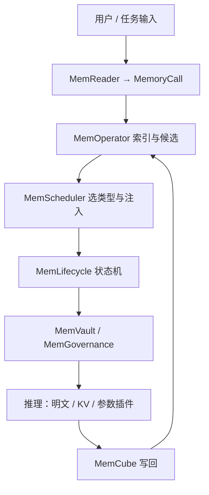

# MemOS 记忆操作系统

    
把明文、激活与参数三种记忆收成可调度的系统资源，而不是把 RAG 当成无生命周期的临时补丁。

    <footer>—— Li 等，MemOS: A Memory OS for AI System，arXiv:2507.03724</footer>

[MemGPT](/llm/memgpt) 把固定窗口当 RAM、外部库当磁盘，由模型经函数换页；那是**工具级**记忆管理。[A-MEM](/llm/amem-agent-memory) 让笔记结构自己演化，仍停在文本库。Li、Song、Xi、Xiong 等人的 **MemOS** 把问题再抬一层：明文记忆、激活记忆（KV / 隐状态）与参数记忆（权重、LoRA、编辑）本是异构对象，却长期没有统一的表示、调度与治理。系统把最小单元做成 **MemCube**——载荷加元数据——并按操作系统分层：接口、操作、基础设施。评测主场是 LoCoMo；对照 LangMem、Zep、OpenAI-Memory 与 Mem0。本篇写资源抽象与生命周期，不把「记忆操作系统」写成已替代注意力核。

## 问题

主流 LLM 把知识压进参数，更新贵、难解释；RAG 把知识留在库外，推理时临时拼进窗口，却没有版本、出处与过期策略。一次检索成功，不保证下次同一事实仍被同一路径召回；法规更新后新旧条文可能并存。作者把这四类缺口写清楚：长程依赖与窗口二次代价、知识演化缺少时间轴、个性化跨会话丢失、以及跨产品「记忆孤岛」。缺的不是再一个向量库，而是把记忆当成 CPU / 内存那样的**一等资源**。

论文把 LLM 记忆沿「显式 / 隐式 × 短时 / 长时」铺开：参数与适配器是隐式长时；KV 与隐状态是隐式短时；prompt 是显式短时；RAG / 图检索是显式长时。工具期（EasyEdit、Mem0、Letta）已提供增删改接口，但仍像系统调用没有操作系统：没有调度、分层、权限与异常处理。MemOS 自称进入「系统治理」阶段——这句话要以模块是否真正调度异构记忆来检验，不能只看产品名。

### 三种记忆为何必须能互相转化

明文适合可编辑事实与个性化；激活适合多轮连贯与低延迟复用；参数适合稳定能力（摘要专家、法务风格）。高频明文若永远走检索，prefill 会重复付钱；过时参数若不能卸回明文，就只能全量微调。因此需要策略驱动的路径：明文 → 激活（热 KV / 模板）、明文或激活 → 参数（蒸馏、适配器）、冷参数 → 明文（外置以便修订）。没有这条闭环，分层只是分类学。

MemOS 把 Memory3 的「参数与检索之间再加一层显式记忆」扩成系统：MemCube 可组合、可迁移、可融合。引用实验数字以 arXiv:2507.03724 的 LoCoMo 设定为准，不要把后续产品默认提示写回这篇表。

## 方法

MemCube 分载荷与元数据。元数据三类：描述性标识（时间戳、来源签名、语义类型）、治理属性（读写范围、TTL、优先级、合规标签）、行为指标（访问频率与近因、上下文指纹、版本链）。调度器据此决定热 / 冷、以及跨类型迁移。架构三层。**接口层**：MemReader 把自然语言解析成带时间窗与意图的 MemoryCall；Memory API 统一查询、写入、更新、迁移；Pipeline 把「检索 → 增强 → 更新 → 归档」串成可回滚的工作流。**操作层**：MemOperator 做标签、图与分层索引；MemScheduler 按任务选明文 / 激活 / 参数并决定注入顺序；MemLifecycle 跟踪 Generated → Activated → Merged → Archived（及过期）。**基础设施层**：MemGovernance 做 ACL 与审计，MemVault 管多后端仓库，MemLoader / Dumper 做导入导出，MemStore 做受控发布订阅。

评测用 GPT-4o-mini 为统一骨干，在 LoCoMo 上比 LLM-Judge。MemOS-0630 整体 Judge **73.31**，高于 Mem0 的 64.57、OpenAI-Memory 的 52.75、LangMem 的 55.76、Zep 的 41.62。时间推理一项 MemOS 为 **73.21**，Mem0 为 52.34，差距最大；多跳 64.30 对 Mem0 的 58.75。检索配置约 Top-K=20、记忆段约 1.5k–1.6k token。这是记忆系统对照，不是改 Transformer 层。

### 生命周期不是 LRU 的别名

Generated 是刚抽出的摘要；被后续任务引用才进入 Activated；语义重叠触发 Merged；长期不用进 Archived。Time Machine 允许把归档版本拉回做反事实，而不覆盖冻结的合规副本。医疗场景里诊疗摘要对医护全可见、对患者部分可见，靠 ACL 与脱敏，不是靠「再检索一次」。这与 MemGPT 的工作记忆 replace 不同：后者改窗口前缀，前者改可审计对象的状态。

## 机制

调度的机制是类型感知加载。连贯性重的多轮偏向 KV 路径，减少重复 prefill；程序性专家流偏向参数模块；即时事实走明文插入。行为指标让系统感知「这份记忆现在值多少」：高频明文可预变成激活模板；跨会话稳定的规则可蒸馏进 LoRA 式能力块；低热 KV 降级回明文进冷仓。版本链支持冲突消解与回滚，否则融合会把错误事实固化成参数。

与 [MemGPT](/llm/memgpt) / Letta 的差别在抽象层：Letta 管窗口放置与函数换页，MemOS 还声称调度 KV 与参数增量。工程上两者可叠——Letta 当进程内 RAM 管理，MemOS 当跨会话、跨类型的仓库——但那是集成，不是 2507.03724 的默认实验。与 A-MEM 的差别在演化对象：A-MEM 演化笔记元数据以改检索分布；MemOS 演化的是记忆形态本身。

Judge 分数依赖 GPT-4o-mini 与提示；F1 / ROUGE 上 MemOS 并非每一列都高于 Mem0（单跳 F1 45.55 对 47.26）。引用时分列，不要只报总体 73.31。

## 边界与工程取舍

### 操作系统类比的硬边界

传统 OS 的缺页由 MMU 保证；MemOS 的「该取哪块」仍是启发式调度加 LLM 解析。MemReader 抽错时间窗，后续全错。参数蒸馏不可逆地损失可编辑性；明文升 KV 会把隐私事实写进难以审计的缓存。多租户必须在 MemCube 上做隔离，而不能假定向量库天然分租户。论文主实验是对话 QA，不是把任意 LoRA 热插拔到生产集群。

短版本 arXiv:2505.22101 把同一套哲学收成 MAG（Memory-Augmented Generation）提纲；引用架构细节以 2507.03724 为准。代码与站点：github.com/MemTensor/MemOS、memos.openmem.net。不要把后续商业控制台的默认策略写回这篇表。

出处：Li, Song, Xi, Wang, Tang, Niu 等（MemTensor / 上交 / 高研院等），*MemOS: A Memory OS for AI System*，arXiv:2507.03724。LoCoMo 见 Maharana 等。基线含 Mem0、Zep、LangMem、OpenAI-Memory。

## 小结

- MemOS 把明文、激活、参数记忆统一成可调度资源，MemCube 是带治理元数据的最小单元。
- 三层：接口（Reader / API）、操作（Operator / Scheduler / Lifecycle）、基础设施（Governance / Vault）。
- 跨类型迁移把高频知识内化、把过时参数外置；生命周期可审计。
- LoCoMo 上 MemOS-0630 总体 Judge 73.31，时间推理相对 Mem0 优势最大。
- 「操作系统」管的是放置与治理，不是无限注意力。
- 出处：Li et al.，arXiv:2507.03724。
