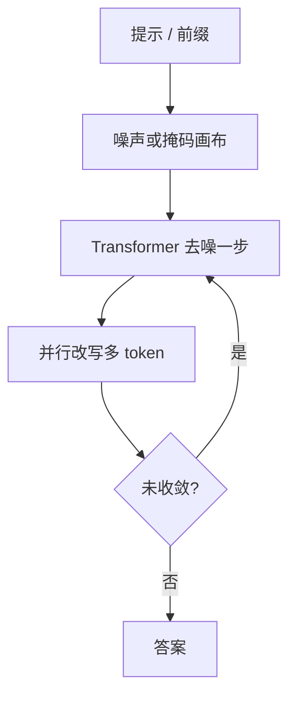

# Mercury 商用扩散 LM

    
当提示到来，答案不是从左到右弹出下一个 token，而是从噪声粗到细地改许多位置；Transformer 仍然是去噪网络，换掉的是因式分解与采样循环。

    <footer>—— Inception Labs，Introducing Mercury；Khanna et al., Mercury: Ultra-Fast Language Models Based on Diffusion，arXiv:2506.17298</footer>

2025 年 2 月 Inception Labs 把 **Mercury** 写成「第一套商用规模的扩散大语言模型（dLLM）」。相对 [LLaDA](/llm/llada)、[MDLM](/llm/mdlm) 一类研究检查点，Mercury 的产品主张是：在 NVIDIA H100 上达到每秒逾千 token 的吞吐，质量对标当时的速度档自回归模型，并提供 playground 与 API。技术报告聚焦编码产品 **Mercury Coder Mini / Small**；公司博文与后续产品页把同一家族扩展到聊天、推理档与 Edit 变体。本篇只引用官方介绍博文、技术报告与公开价目/模型页，**不编总参、层数或词表**。

## 问题

自回归生成每个 token 都要跑一遍网络，且必须等前一个 token 写完。速度档模型把宽度与 KV 压下去，仍受这条串行链限制； Groq / Cerebras 一类专用推理芯片用硬件换吞吐，算法仍是左到右。编码助手、补全、智能体环对延迟极敏感：用户多等 200ms 就会换模型。扩散在图像里已经证明「并行改整幅画」；离散文本上长期停在小模型困惑度，缺一套能当 API 卖的规模与服务栈。

Inception 要证明的产品命题是：dLLM 可以当自回归 LLM 的 **drop-in**：同一套提示、工具、RAG、SFT/RLHF 数据习惯，只把损失换成去噪目标，把采样换成粗到细的并行改写。若质量明显弱于 Haiku / GPT-4o mini 一档，速度没有客户；若不能走通用 GPU，速度故事会被专用芯片收走。

### 粗到细不是「一次前向打出整段」

扩散仍要多步。每一步 Transformer 看当前噪声序列（或掩码序列），并行预测许多位置，再按调度留下一部分、重噪其余。步数决定质量—延迟权衡。报告强调：相对先前小规模离散扩散，他们在数据与计算上做了能扩到万亿 token 量级的修改，但**没有公开**逐步超参、噪声表或网络宽度。能写进方法栏的是过程形状，不是可复现配方。

Artificial Analysis 在 H100 上测 Mini **1109** tok/s、Small **737** tok/s（约 1k 进 / 1k 出的编码负载）。对照表里 Gemini 2.0 Flash-Lite 约 201、Claude 3.5 Haiku 约 61、GPT-4o mini 约 59。吞吐是 API 墙钟，不是单核 FLOPs。

## 方法

前向把干净 token 序列逐步加噪到已知先验；反向从先验采样，用 $p_\theta(x\mid z_t)$ 去噪。报告把训练损失写成对噪声水平加权的重建交叉熵，并称方法扩展自离散扩散文献（报告引用含 Lou 等一类工作），细节留在「对数据与计算的修改」这一句。骨干明确是 **Transformer**：扩散约束的是训练与生成算法，不禁止用注意力实现去噪器。因此 FlashAttention、编译栈、现成并行策略可以借；不能借的是 KV cache 式逐步解码——可见集合每步都在变。

### Mercury Coder 公开表

报告 Table 1（部分为 AA 标注）：Mini HumanEval 88.0、MBPP 77.1、EvalPlus 78.6、MultiPL-E 74.1、LiveCodeBench 17.0、BigCodeBench 42.0；Small 对应 90.0 / 76.6 / 80.4 / 76.2 / 25.0 / 45.5。Fill-in-the-middle 是扩散的结构性长处：Mini 单行/随机跨度平均在报告 FIM 表里明显高于同档自回归速度模型。Copilot Arena 上 Mini 质量并列第二、速度最快——这是偏好与延迟的产品证据，不是 SWE-bench agent 脚手架。上下文：开箱最多 **32,768** token，用外推协议可到 128k；这是报告声明，不是百万级窗口。

### 服务与兼容

报告写：自研推理引擎做动态 batch 与分页采样，并暴露 OpenAI 兼容 API。算法加速与专用芯片正交，可叠加。微调与对齐把自回归损失换成去噪损失，仍可用 SFT / RLHF / DPO 习惯。企业路径含 API 与本地部署。后续公司产品页把 **Mercury 2** 标成推理 dLLM，**Mercury Edit 2** 走 FIM / next-edit 端点；价目公开例：Mercury 2 输入 $0.25 / 百万、输出 $0.75 / 百万，聊天上下文 128K。那是 2026 年价目快照，与 2025 年 Coder 报告不是同一检查点。引用时写产品名与日期。

## 机制

并行改写提高算术强度：一步里许多位置同时要算，GPU 不再为单个 token 的带宽墙空转。这与单用户本地解码最合拍；高 QPS 云上自回归可以靠大 batch 把算力喂饱，扩散的相对优势会收窄——Google 后来在 DiffusionGemma 博文里把同一几何讲得更直白。Mercury 报告把「最大利用通用 GPU」写成系统原因，并把自定义核留在专有引擎里，**没有**开源采样核。

质量机制来自双向上下文与可改写：填空、修错、格式闭合不必等左到右因果。代价是步数超参：步少则快但粗，步多则接近自回归延迟。公开材料没有给出默认 NFE。推理链可以短，因为「想」也可以并行改，而不必先吐一万个思维 token——这是博文对 agent / 推理的展望，不是已公开的 o 系列对照实验。

参数量未公开。不要把 Mini/Small 当成 7B/14B 的别名。对照表里的 Qwen 2.5 Coder 7B 是开权参照，不是 Mercury 的宽度声明。

### 和学术掩码扩散的距离

LLaDA 公开 8B、2.3T、损失公式与采样伪代码。Mercury 公开的是产品吞吐、编码榜与「Transformer + 去噪损失」。两者都是离散扩散家族，但 Mercury 不是 LLaDA 的商用包装：数据、步数、是否半自回归块，均未在报告里钉死。不要用 LLaDA 的 $1/t$ 加权去「补全」Mercury 的训练目标。

## 边界与工程取舍

无开源权重则不能复现核。32k 开箱窗口不够长代理仓库。LiveCodeBench 上 Mini 17.0 低于若干速度档闭源模型，编码故事不是全面碾压，主轴是 Pareto 上的速度。后续 Mercury 2 的「推理 dLLM」若只有产品页数字，应另开一篇，不要把 2025 年 Coder 表当成 2026 年推理档。API 兼容不等于 KV cache 语义兼容：流式输出可能是逐步揭开，而不是 token-by-token 因果。

出处：Stefano Ermon，*Introducing Mercury*，inceptionlabs.ai；Khanna 等，arXiv:2506.17298。价目以 docs.inceptionlabs.ai 当时页为准。

「第一套商用规模 dLLM」是公司自称。学术上更早的有 SEDD、MDLM、LLaDA；商用指可售 API / 本地部署与 H100 上千 tok/s 的产品定位。

## 小结

- Mercury 是 Inception 的商用扩散 LM：Transformer 去噪、并行粗到细生成，主打 H100 上千 tok/s。
- 公开最完整的是 Mercury Coder Mini/Small 的编码榜与 AA 吞吐；参数量未公开。
- 产品合同是 OpenAI 兼容 API、可 SFT/对齐；采样引擎专有。
- 后续 Mercury 2 / Edit 2 是同一家族的产品迭代，引用须写清名称与日期。
- 出处：官方博文与 arXiv:2506.17298。不编架构表。
