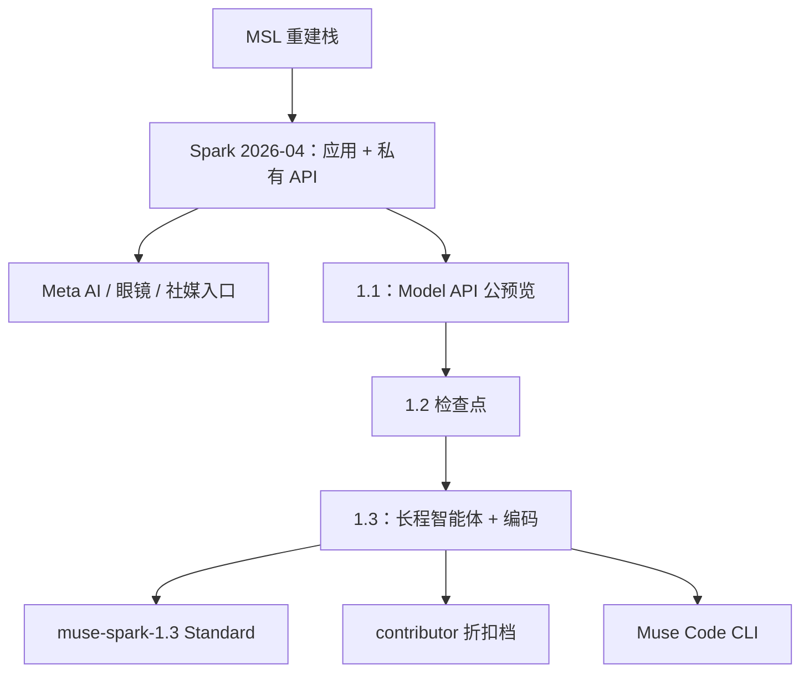

# Meta Muse

    
Muse Spark 是 Meta Superintelligence Labs 重建训练栈之后的第一级台阶：刻意偏小偏快，用来验证缩放轨迹，再决定下一颗更大的模型。

    <footer>—— Meta，Introducing Muse Spark，2026-04-08</footer>

Llama 开源世代之后，Meta 把旗舰叙事收到 **Muse**。2026 年 4 月 8 日 **Muse Spark** 作为 Meta Superintelligence Labs（MSL）的第一颗产品模型上线：原生多模态推理，支持工具、视觉思维链与多智能体编排，当天进入 meta.ai 与 Meta AI 应用。官方明确写它**按设计偏小、偏快**，是缩放阶梯上的早期数据点，更大模型已在训。参数量、层数、是否 MoE，在介绍博文里**公开信息有限**。随后 7 月 9 日 **Spark 1.1** 开 Meta Model API 公预览；9 月 2 日 **Spark 1.3** 把主场改到长程智能体与编码。本篇按 about.fb.com / 开发者文档能核对的产品与接口写，不编总参。

## 问题

Llama 4 一类开源权重解决的是可下载；消费级助手要解决的是「在 Instagram、WhatsApp、眼镜里看你看见的世界，并引用你已经在看的创作者内容」。MSL 用九个月重建栈，第一颗模型必须先在延迟与 multimodal 上站稳，再谈总榜超 Opus。Spark 的问题陈述因此是**产品基座**，不是「开源最大 MoE」。第二条是分发：Instant / Thinking（以及后来的 Contemplating）模式、子智能体并行、购物与健康、眼镜端侧感知，必须落在同一代名称下，又不能让开发者把应用默认档当成 API 的 1.3 max。

开源承诺停留在「希望开源未来版本」与 1.3 发布时「soon」——在权重未出现前，合法部署路径是 API 与应用，不是本地检查点。

### 代际是 Spark 小版本，不是 Muse 的稠密/稀疏表

**Spark（1.0）**：2026-04-08。官方：复杂科学/数学/健康问题可推理；多模态感知（拍货架识蛋白、对比商品）；视觉编码（提示生成网站与小游戏）；Instant 与 Thinking；可并行拉起多个子智能体。4 月只给选定伙伴私有 API。5 月 12 日更新：更快语音、眼镜、购物（Marketplace + 全网）、向 WhatsApp / Instagram / Facebook / Messenger / Threads 铺开。

**1.1**（2026-07-09）：智能体任务向的多模态推理，工具 / 电脑使用、编码、多模态理解加码；Meta Model API 公预览；应用里 Thinking 模式。另有同周 **Muse Image** 生图线——与 Spark 语言模型不是同一检查点。

**1.3**（2026-09-02）：开发者页写给长程智能体：跟踪上下文与先前结果、处理脏或冲突输入、含糊时提问、卡住时求助、重大动作前确认。编码减少无效轮次。原生感知视频、图像、文档；视觉推理走真实执行环境而非脚本步骤。API ID `muse-spark-1.3` 与折扣的 `muse-spark-1.3-contributor`。

第三方整理的 1.3 接口口径（应以当时 Meta 文档为准）：上下文 1,048,576 token；推理档含 minimal / low / medium / high / xhigh；Standard 价常见为每百万输入 1.25 / 输出 4.25 美元，Contributor 低一个数量级但允许用流量改进产品。1.2 若仍承担音频，换代时不要默认 1.3 覆盖全部模态。

## 方法

能写进方法的是**产品计算图**。Spark 被写成 natively multimodal reasoning：看图、看视频、看你的对话上下文，而不是等用户把世界打成字。Thinking / Contemplating 把测试时计算暴露成模式开关。子智能体并行是编排层：行程、比价、亲子活动可以同时跑，再汇总——这不证明底座内部是稀疏 MoE。健康路径与医师团队合作过常见问题（含部分图像与图表）；官方仍是信息助手，不是诊疗。

1.1 起 API 把工具调用、函数调用、开发者系统提示交给外部脚手架，安全评估因此以 API 表面为最宽攻击面（1.1 准备度报告把缓解后的残余风险收到框架允许区间后再放行）。1.3 的方法句是后训练偏置：少浪费 token、多问人、长程里承认卡住。这是行为，不是新注意力论文。

1.3 开发者页用 AutomationBench 等与 GPT-5.6 Sol、Opus 5 对照；页面上的数字随渲染变化，引用应截图或抄当时表格并写日期。Alexandr Wang 对媒体称 1.3 在编码上可对标 Fable 5.1、强于 GPT-5.6 Sol、并强于「当前中国模型」——这是访谈口径，不是模型卡里的层宽。Zuckerberg 称 Spark 开源权重「soon」；在仓库出现前，状态仍是**未开源**。

Contributor 档用提示与补全训练后代模型换低价。选档等于选数据条款，不是选一个更小的 Spark。Web search grounding 若另计费，应算进智能体账单。

## 机制

「小而快」约束的是服务延迟与眼镜 / 语音打断，不揭示总参。多模态感知把像素条件化进同一推理模型，使「相机对准世界」成为合法查询；眼镜端的价值是连续视觉流，不是更大的 SWE 分。Thinking 模式把测试时计算从默认直答里拆出，避免所有 Meta AI 用户为寒暄付思考 token。1.3 的澄清 / 求助 / 确认，是把长程 agent 的失败模式从「死循环烧 token」改成「把不确定性还给人」——机制上是拒答与工具策略，不是检索器升级。

社媒接地（Reels、帖子、本地内容）是产品差异，也是事实性与版权风险：时间线噪声会被一本正经地综合，引用创作者则是内容策略而非注意力公式。Muse Image 与 Spark 解耦，安全过滤属于图像栈。

### 不要把 Spark 写成 Llama 4 的别名

Llama 4 有可下载的 MoE 表与报告。Muse Spark 是另一条产品线：闭源、按小版本迭代、先铺十亿用户再谈权重。用 Scout / Maverick 的激活量填 Spark，没有根据。Hyperion 数据中心解释的是未来缩放预算，不是 4 月那颗「小模型」的并行图。

### Instant、Thinking 与 API 推理档不是同一开关

应用里的 Instant / Thinking 是消费级模式；1.3 API 的 minimal–xhigh 是开发者档。把 ChatGPT 式路由器、Gemini Deep Think 或 Grok 的 xhigh 直接写成 Muse 内部实现，都没有官方根据。评测 1.3 必须写档位，否则 AutomationBench 一行无法复现。

## 边界与工程取舍

参数、数据配比、专家表均未在介绍博文给出。1.0 的「小」与 1.3 的「最强 Spark」可能已不是同一容量——官方没有用参数证明跳跃，只用评测与产品语言。开源时间表口头有效、仓库无效。准备度结论按版本：1.1 报告不可直接贴到 1.3。音频、视频、PDF 的输入列表随文档变，集成钉型号页。健康回答需保留「非执业医疗」限定。评测必须标明 Standard vs Contributor、推理档、是否搜索接地。

不要发明 Muse 的 arXiv。不要把 1.3 max 预览写成全量 GA。

出处：Meta，*Introducing Muse Spark*（about.fb.com，2026-04-08，5 月更新）；*Introducing Muse Spark 1.1*（2026-07-09）；开发者文档 Muse Spark 1.3。参数量未公开。

## 小结

- Muse Spark（2026-04-08）是 MSL 第一颗闭源多模态推理产品模型，设计上偏小偏快，先铺 Meta AI 与眼镜。
- 1.1 打开 Model API；1.3（2026-09-02）主打长程智能体、编码与「卡住就问人」。
- 上下文公开口径为约 1M；总参与结构表公开信息有限；权重在写出本篇时仍未按 Llama 方式开源。
- Contributor 低价等于数据授权；Muse Image 是另一条模型。
- 出处：上述 Meta 新闻与开发者页。不编参数量。
