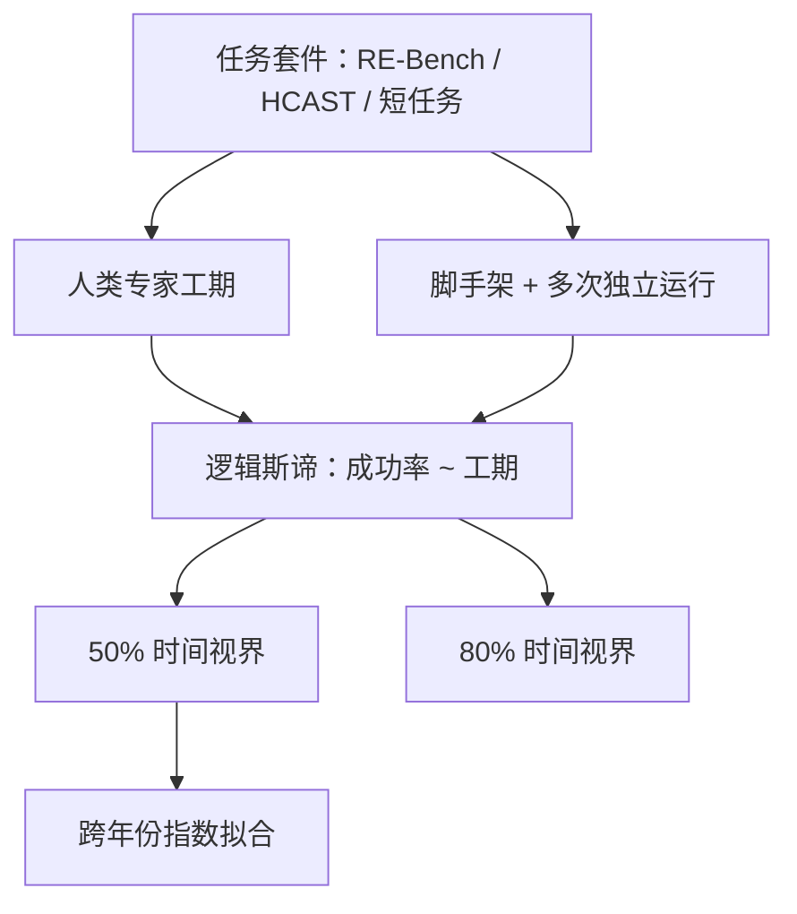

# METR Time Horizon

    
我们主张用「智能体能自主完成的任务有多长」来度量能力：以人类专家完成同一任务所需时间为轴，读出模型达到给定成功率的那一点。

    <footer>—— METR，Measuring AI Ability to Complete Long Software Tasks，arXiv:2503.14499，NeurIPS 2025</footer>

考试分数涨得很快，并不等于能替人做完一件事。METR 把自主能力收成一个可外推的标量：**50% 任务完成时间视界**（50%-task-completion time horizon）——在他们的软件任务集上，人类专家通常要花多久才能做完那些模型仍有一半把握做对的任务。2019 到 2025 年，这条曲线大致按指数上升，倍增周期约七个月；后继的 Time Horizon 1.1 任务集把长任务加厚，趋势仍在，只是近年拟合更陡。本篇写度量合同、拟合方式与外推边界，不把视界读成「模型自己连续跑了多少小时」。

## 问题

基准把能力压成正确率，却很难回答两个现实问题：今天的系统离「能独立做完一周的软件活」有多远？分数从 40% 涨到 70%，对应的真实工期变了多少？许多考试题难度分布很窄，或含一批几乎不可能的题，百分比因此难以跨年份比较。METR 观察到另一条经验规律：智能体往往不是缺单步知识，而是**串不起足够长的动作序列**——短任务近乎满分，数小时任务成功率掉到很低。于是他们把「任务对人类要多久」当成难度轴，把模型成功率当成该轴上的响应。

时间视界刻意不是墙钟。FAQ 写得很清楚：50% 视界是任务套件里、按人类专家工期度量的那个长度，使得我们预测模型成功概率为 50%。智能体做对同一任务通常比人快若干倍，因为一步能写更大块代码、少查资料；METR 不把这段推理时间当作指标，因为它随供应商与脚手架剧烈波动。

### 任务必须是不可 trivially 并行的一整块

一千道互不依赖的一小时数学题，不是一千小时任务，只是一小时任务做一千次。METR 要的是连贯、自包含、难以拆成独立碎片的工作：迭代调试复杂系统，每一步修丁都会露出下一步，而且下一步只有知道已经试过什么才有意义。软件工程、机器学习实验与网络安全构成主分布；跨域跟进发现其他领域也有指数趋势，但绝对视界可以差几个数量级——能力相对人类是「锯齿状」的。

人类基线是低上下文承包商，不是已经熟悉该仓库的在职工程师。METR 承认工期估计偏长：人与智能体拿到的说明与工具相近，却缺少真实岗位里的隐性知识。把「两小时视界」读成「能做完老员工两小时的活」，会越过评测合同。

## 方法

先给每道题标人类专家工期：多数任务请有相关背景的人实际做完，对成功完成时间取几何平均；少数人用专家估计或质检耗时。人类基线者多为软件、机器学习或安全方向的专业人士，平均约五年相关经验。任务设计成自包含、成功标准可自动判定，以便人和模型面对同一套说明。

对每个智能体，用人类工期预测成功概率，拟合一条逻辑斯谛曲线。50%（或 80%）视界就是曲线与该成功率相交处对应的工期。原始论文把任务合成为 RE-Bench（研究工程）、HCAST 子集，以及一批更短的新任务（SWAA）；发布时 Claude 3.7 Sonnet 的 50% 视界大约五十分钟。80% 视界趋势相近，但大约短五倍——同一套拟合，只是读更高可靠性的交点。每个任务通常跑六次独立尝试，有 token 与时间上限；跑完后检查是否出现 reward hacking、预算是否够用，再进入分析流水线。一次完整评测在日历上往往要一到两周。

### Time Horizon 1.1 改了什么

2026 年 1 月的 TH1.1 把套件从 170 题扩到 228 题：新增 73 道通过质检的 HCAST 任务，删 15 道，改 53 道（说明含糊、易被刷分或评分函数有误）。八小时以上的长任务从 14 增至 31。评测基础设施从自研 Vivaria 迁到英国 AISI 的开源框架 Inspect。十四个模型的新点估计大多落在旧置信区间内；长任务变多之后，近年模型的区间收窄——例如 Opus 4.5 的上界相对点估计从 4.4 倍降到 2.3 倍，但区间仍宽。混合趋势（早期模型沿用 TH1）倍增仍约 196 天；仅看 2023 年之后，TH1.1 给出 131 天，TH1 为 165 天；2024 年起分别为 89 天与 109 天。METR 自己的解释是：新任务来自略有不同的难度分布，因此估的是略有不同的量。

## 机制

把成功率写成工期的光滑函数，是在承认离散题集只是样本。逻辑斯谛把「短则几乎总成功、长则几乎总失败」收成一个拐点；视界就是这个拐点在时间轴上的读数。指数外推成立的经验前提是：跨年份、跨模型，这个拐点在对数时间上近似走直线。论文比较了线性与双曲线拟合，指数明显更好；逻辑斯谛作为时间趋势则不合适——尚未看到增长放缓，只用左半段去估渐近线会极不稳定。

驱动视界变长的，据论文主要是更高的可靠性与从错误中改道的能力，加上更好的逻辑推理与工具使用，而不是单点知识的突然涌现。这解释了为何考试型基准已经超人类，日常自动化却仍脆：模型能做专家要几小时的**某些**题，但只能**可靠**完成几分钟量级的题。SWE-Bench Verified 上用独立收集的人类时间估计做探索性复制，也看到指数趋势，倍增甚至短于三个月；METR 提醒其中一部分来自操作化——熟悉代码库的时间未计入任务时间，短任务被系统性压短，斜率会被抬高。

灵敏度分析里，把数据随机扰动一万次，一个月视界的到达年份分布仍然相对集中：度量若整体偏一个数量级，到达时间大约只移动两年。真正大的不确定性来自趋势是否延续，以及外部效度——套件比真实劳动「更干净」。

### 脚手架与刷分检查是度量的一部分

「跑一个模型」其实是模型加 ReAct、Triframe、Claude Code、Codex 一类脚手架。先在小 dev set 上 elicitation，再上独立 test set。TH1.1 附录比较 Vivaria 与 Inspect：部分模型（如 GPT-4o、o3）在旧脚手架上平均分更高，说明提示与工具循环会移动点估计。跑完还要筛 reward hacking；成功靠改评分脚本拿到的高分不计入能力。视界因此不是「裸模型」，而是「经过引出、并剔除明显刷分之后的智能体」。

## 边界与工程取舍

八小时视界不等于能自动化所有岗位。任务是低上下文、可算法打分的软件类工作；真实岗位充满与人协作和无法脚本化的成功标准。论文发现更「脏」的任务上智能体更差；后续工作表明，改成整体性（holistic）打分后表现会再掉一截。当前套件对超过约十六小时的测量不可靠，长任务里只有少数有真实人类基线，其余是估计。METR 也声明：他们没有、也不能承诺覆盖每一次前沿发布。

外推「五年内能做许多人要一个月的软件任务」依赖趋势延续与外部效度。若只用 2024–2025 的更快斜率，一个月视界会提前约两年半到达。这不是预测市场，而是度量装置给出的条件句。跨域博客表明科学推理、数学、机器人、计算机使用等方向的改善速率大体相近，但绝对水平不同，不能把软件视界直接抄到所有经济任务上。

出处：Kwa 等 / METR，*Measuring AI Ability to Complete Long Software Tasks*，arXiv:2503.14499，NeurIPS 2025；配套博客 2025-03-19；实时看板 metr.org/time-horizons；TH1.1 发布 2026-01-29。HCAST 见 Rein（2025）。引用时写清 TH1 还是 TH1.1，以及 50% 还是 80%。

## 小结

- 50% 时间视界：人类专家工期轴上，模型预测成功率为一半的那个长度；不是智能体自己跑了多久。
- 2019–2025 年软件套件上大约每七个月倍增；TH1.1 加厚长任务后，近年拟合更陡，但仍在旧置信区间附近。
- 拟合用逻辑斯谛读交点；跨年趋势用指数。80% 视界形态相似、数值大约短五倍。
- 任务须是连贯、可自动打分的软件/研究工程/安全题；不可把可并行的重复劳动加总成长任务。
- 外部效度受低上下文、干净成功标准与脚手架引出限制；脏任务与整体性打分会降低表现。
- 出处：METR 时间视界论文与看板；TH1.1 任务与 Inspect 迁移见 2026-01-29 发布说明。
