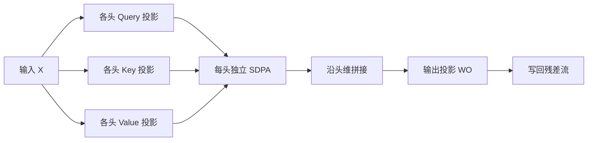

# Multi-Head Attention

多头注意力让模型同时关注来自不同表示子空间、不同位置上的信息，而不是把全部容量压进一次平均后的打分。

<footer>—— Vaswani et al., Attention Is All You Need, NeurIPS 2017</footer>

单头缩放点积注意力已经能对全序列做内容寻址，但它只有一套查询、键、值投影。一套投影意味着一次加权平均：不同关系——句法对齐、指代、位置邻近——必须挤进同一组分数里互相干扰。Vaswani 等人给出的对策不是把单头做得更宽，而是把表示切成若干头，每头在更低维的子空间里独立做 SDPA，再拼回去。多头注意力（Multi-Head Attention, MHA）因此是 Transformer 层的默认注意力形态；因果掩码、交叉注意力、后来的分组查询，都是在这套「分头—独立打分—拼接」骨架上改连接方式或 KV 共享策略。

## 问题

单头注意力的输出是

$$
\mathrm{softmax}\left(\frac{(XW^Q)(XW^K)^\top}{\sqrt{d_k}}\right)(XW^V).
$$

无论 $d_k$ 有多大，softmax 沿键维只产生一组权重。若某头需要同时「看主语」和「看标点」，两个模式的键方向并不正交时，分数会被拉成折中。加宽单头只能增加值向量的容量，不能增加「有几套独立的路由」。这和混合专家里「多门」的动机类似：路由本身需要并行的几条通道，而不是一条更粗的通道。

另一个实际约束是计算预算。若保持总维度 $d_{\mathrm{model}}$ 不变，把全部宽度交给一个头，矩阵乘的形状是 $n \times d$ 对 $d \times n$；切成 $h$ 个头、每头 $d_k=d_{\mathrm{model}}/h$，各头的乘可以看成一次更大的批量矩阵乘，总浮点量和单头满宽几乎同阶。多头因此不是「用更多算力换质量」，而是「用同样量级的算力换多套路由」。

### 平均路由会抹掉子空间

可以把单头理解成：先把所有位置投到同一个打分几何里，再做一次凸组合。凸组合是压缩。压缩之前如果没有分岔，模型只能学习一种「什么算相似」。多头把分岔提前到投影矩阵 $W_i^Q, W_i^K, W_i^V$ 上，让不同头可以学到不可通约的相似关系。经验上常见一头偏局部、一头偏稀疏散布，这不是设计时写死的，而是多套投影提供了分化的自由度。

头与头之间没有正交约束。训练完全可以让两头学到几乎一样的模式，尤其在过参数或数据不足时。多头给出的是容量，不是分工的保证。后文的 MQA 和 GQA 之所以敢合并 KV 头，部分原因就是观测到许多 KV 头高度相关，独立存储它们的收益递减。

## 方法

设模型宽 $d_{\mathrm{model}}$，头数 $h$，每头键值维 $d_k=d_v=d_{\mathrm{model}}/h$。对输入 $X \in \mathbb{R}^{n \times d_{\mathrm{model}}}$，

$$
\mathrm{head}_i = \mathrm{Attention}(XW_i^Q, XW_i^K, XW_i^V),
$$

其中 $W_i^Q, W_i^K \in \mathbb{R}^{d_{\mathrm{model}} \times d_k}$，$W_i^V \in \mathbb{R}^{d_{\mathrm{model}} \times d_v}$，$\mathrm{Attention}$ 即缩放点积注意力。输出为

$$
\mathrm{MultiHead}(X) = \mathrm{Concat}(\mathrm{head}_1,\ldots,\mathrm{head}_h) W^O,
$$

$W^O \in \mathbb{R}^{h d_v \times d_{\mathrm{model}}}$ 把拼接结果投回残差流的宽度。原论文取 $h=8$、$d_{\mathrm{model}}=512$，故 $d_k=d_v=64$。缩放因子仍是 $1/\sqrt{d_k}$，按头内维度而不是按 $d_{\mathrm{model}}$ 来除。

### 投影、拼头与输出矩阵

实现上很少真的循环 $h$ 次。通常把 $h$ 组投影融合成三张大矩阵，一次算出 $Q,K,V \in \mathbb{R}^{n \times h \times d_k}$，在头维上做批量化的 $QK^\top$，softmax 之后再与 $V$ 乘。拼头只是把头维与通道维合并，再乘 $W^O$。$W^O$ 不是装饰：它允许各头的子空间在写回残差之前互相线性混合，也是残差流里唯一「看见所有头」的地方。

## 机制

多头的表达力来自分拆后的几何，而不是来自更多次 softmax。每头的分数矩阵形状仍是 $n \times n$，但键空间只有 $d_k$ 维。低维空间里点积更尖锐，也更容易被 $1/\sqrt{d_k}$ 校准。若有人把 $d_k$ 取得很大却只保留一头，分数会重新变钝，多头的「多套路由」也一并消失。

梯度路径是分开的。第 $i$ 头的 $W_i^Q$ 只通过该头的分数影响输出，再经 $W^O$ 的对应列块写回。这使某些头可以在特定层变得几乎恒等或几乎死掉，而不拖垮其余头——这也是后来剪头、合并 KV 头的经验基础。训练初期各头尚无分工，输出投影会把它们当成随机特征混合；随着损失下降，分工才在数据里被选择出来。

$d_k=d_{\mathrm{model}}/h$ 是原论文为了保持总计算量提出的约定，不是定理。可以把头数与头宽解耦：头很多但 $d_k$ 很小，路由细、值表达弱；头少但 $d_k$ 很大，路由粗、值表达强。现代大模型常把 $d_k$ 固定在 64 或 128，再用头数去对齐 $d_{\mathrm{model}}$。

### 与单头满宽的计算对照

单头使用 $d_k=d_{\mathrm{model}}$ 时，一次 $QK^\top$ 的代价是 $O(n^2 d_{\mathrm{model}})$；MHA 是 $h$ 次 $O(n^2 d_k)$，而 $h d_k=d_{\mathrm{model}}$，渐近相同。真正多出来的是投影矩阵的参数：每层有 $4$ 张 $d_{\mathrm{model}}\times d_{\mathrm{model}}$ 量级的矩阵（$Q,K,V,O$）。参数增加换来的是 $h$ 套独立权重，不是更长的上下文窗口。上下文窗口仍由序列长度和掩码决定。

## 边界与工程取舍

MHA 的 KV 缓存随头数线性增长。解码时每生成一个 token，都要写出 $h$ 组键值并在下一步读回全部历史。头数从 8 涨到 64 或 128 时，质量往往还在提升，但显存带宽先撑不住。这正是 MQA、GQA、MLA 要动的地方：它们保留多套查询路由，压缩或共享键值存储。讨论那些方法时，对照物始终是「完整 MHA」——每头独立的 $K,V$。

头数也不是越大越好。头过多而数据不够时，会出现大量冗余头，训练噪声上升。有的工作在推理前做头重要性剪枝，说明分工并不均匀。位置编码（正弦、RoPE）通常加在拼头之前的 $Q,K$ 上，每头共享同一套位置几何；位置与内容的纠缠是另一篇文章的主题，这里只需记住：多头并不自动提供位置归纳偏置。

把注意力图画成「第 3 头在看括号」是事后解释。头的编号没有语义，跨层、跨随机种子都不可对齐。工程上更可靠的信号是 KV 头之间的余弦相似度、剪头后的困惑度变化，而不是单张可视化。

## 小结

- 多头注意力把表示投影到 $h$ 个低维子空间，各头独立做缩放点积注意力，拼接后再经 $W^O$ 写回。
- 动机是增加并行路由的套数，而不是增加单次加权平均的宽度；总浮点量与单头满宽同阶。
- 每头维度取 $d_{\mathrm{model}}/h$ 是计算预算约定；缩放因子按 $d_k$ 而不是按模型宽来除。
- $W^O$ 负责把头间信息混回残差流，是各头唯一的交汇点。
- KV 缓存随头数线性膨胀，这是后续共享或压缩 KV 头的直接压力来源。
- 头之间无正交保证，冗余头、可合并的 KV 头在大模型里是常见现象。
- 出处：Vaswani et al., *Attention Is All You Need*, NeurIPS 2017。
