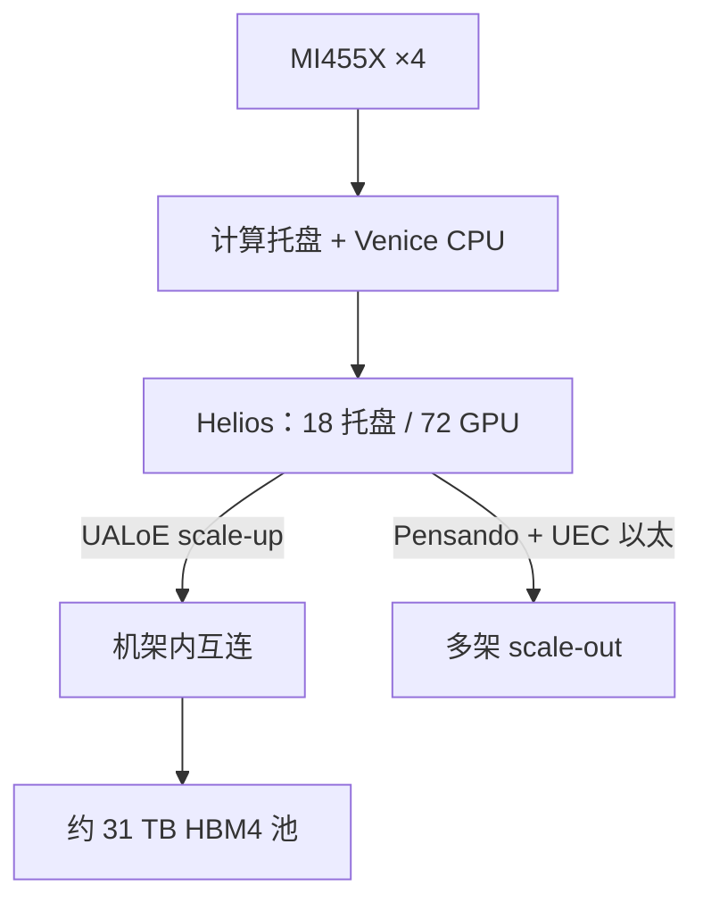

# AMD MI400 与 Helios 机架

    
Helios 把 72 颗 MI455X、18 颗 EPYC Venice 与 Pensando 网络收成一台机架级加速器：峰值约 2.9 EFLOPS FP4、31 TB HBM4，scale-up 走 UALink over Ethernet。

    <footer>—— AMD Advancing AI 2026 新闻稿与 Instinct MI455X / Helios 产品页</footer>

[MI350](/llm/amd-mi350) 的量子还是 8 卡节点。MI400 系列把设计目标改成 **机架**：一张逻辑加速器是 72 GPU，而不是八张 OAM 再靠以太网拼起来。[Helios](https://www.amd.com/en/products/rackscale-solutions/helios.html) 在 2026 年 7 月 Advancing AI 上作为量产中的机架级方案发布，计算芯是 **Instinct MI455X**（第 5 代 CDNA），CPU 是第 6 代 EPYC「Venice」，网络是 Pensando Vulcano，软件是 ROCm。本篇按官方产品页与新闻稿对齐单卡与整架规格，厂商对 Vera Rubin NVL72 的百分比对比一律带回脚注，不当成独立实测。

## 问题

万亿参数 MoE 与长上下文推理把「节点内全互连、节点间过订阅以太网」这条缝撕开：专家路由与 KV 交换的突发比 8 卡域宽。NVIDIA 用 NVL72 把 72 GPU 收成一块 NVLink 域；AMD 若仍只卖 8 卡 UBB，集合要么切窄，要么掉到 scale-out。Helios 要回答的是：能否用开放机架标准（OCP Open Rack Wide）加 **UALoE**（UALink over Ethernet）做成同等量子的 scale-up，而不是再发明一套专有背板名称。

第二问是内存代数。MI350 停在 [HBM3E](/llm/hbm3e)；MI455X 换成 **12 栈 HBM4**、单卡 **432 GB**、带宽 **23.3 TB/s**。容量与带宽同时跳档，decode 与单卡驻留模型的上限才一起动。HPC 另有 **MI430X** 档（新闻稿写硬件 FP64 最高约 288 TFLOPS），不要和 AI 工厂的 MI455X 混成一张 BOM。

### MI455X 单卡公开规格

产品页（2026-07-23）：架构 CDNA 5，工艺 **TSMC 2nm | 3nm FinFET**，**256** 个 Work Group Processor，晶体管 **3200 亿**，峰值时钟 2400 MHz。矩阵峰值：OCP MXFP4 **40.3 PFLOPS**，MXFP6 / MXFP8 / OCP FP8 **20.1 PFLOPS**；FP16 矩阵 5 PFLOPS（结构化稀疏 10.1）；向量 FP16/FP32 约 315 TFLOPS；FP64 矩阵/向量约 5 TFLOPS。内存：432 GB HBM4，12 栈，**23.3 TB/s**，L2 **192 MB**。形态 Enhanced Accelerator Module，直接液冷。Scale-up：UALoE 双向峰值 **3.6 TB/s**；scale-out：UALink 双向峰值 **600 GB/s**。主机侧 PCIe Gen6 与 Infinity Fabric 相干带宽在技术报道里常见 256 GB/s 量级，规划以当时白皮书为准。

相对 MI355X：容量 288→432 GB（1.5×），带宽 8→23.3 TB/s（约 2.9×），MXFP4 峰值从约 10 PFLOPS 量级到 40.3。新闻稿另有「相对 MI355X 最高约 34× token 吞吐」——那是选定负载的系统对比，不是 4× 矩阵峰值的线性外推。

Helios 新闻稿把整架写成最多约 2.9 EFLOPS 峰值 FP4、1.4 EFLOPS 峰值 FP8、31 TB HBM4、1.7 PB/s 内存带宽。72 × 432 GB = 31.1 TB，与 31 TB 一致；72 × 40.3 PFLOPS ≈ 2.90 EFLOPS，与 2.9 一致。这是峰值乘积，不是可达到的 MFU。

## 方法

整架积木：18 个 ORW 对齐的 4 GPU 计算托盘，共 72 GPU；每托盘一颗 Venice SP7 与 Pensando 网卡（产品叙述里每 GPU 可配多张 Vulcano 800）。Scale-up 平面是 UALoE，目标是单跳、机架内全互连语义；scale-out 平面是对齐 Ultra Ethernet Consortium 的以太网，Pensando NIC 做注入。ROCm 提供 PyTorch / JAX / vLLM / SGLang / Triton 的 Day-0 路径。开放标准是 Helios 相对 NVL72 的产品差异：机架尺寸走 Meta 提交的 Open Rack Wide，互连协议走 UALink 家族，而不是 NVLink 商标。

部署从单架扩到多架时，计算托盘保持同构，集群增长靠 scale-out NIC 与以太网结构，而不是把 72 再焊成 144 的第二套专有交换。新闻稿写「从单架到吉瓦级」，那是机房规划语言；用户可见的硬量子仍是 72 GPU 一块 scale-up 域。

### 与 NVL72 的厂商对比怎么引用

AMD 新闻稿相对「领先竞品方案」（脚注指向 Vera Rubin NVL72 公开规格）声称：峰值 FP4 约 +15%，HBM 容量约 +50%，HBM 带宽约 +6%，scale-out 带宽约 +50%，以及建模的 tokens per dollar 最多约 +30%（Kimi K2 Thinking、32K/8K、高中低交互点）。这些数字全部带 Performance Labs 日期与「厂商配置可能不同」。工程上只把它们当作**规格表对拍**，验收仍跑自己的模型、自己的 ROCm 版本、自己的电价。不要把 +30% $/token 写进财报级规划。

机械上 Helios 是双宽 ORW、液冷托盘；服务性（托盘重量、盲插针数）以白皮书为准。软件上 CUDA 生态仍是默认工具链，ROCm 的负担在内核覆盖与集合性能，不在 HBM 容量——容量已经按产品页领先一截。

## 机制

把机架当成服务器，改变的是并行轴的物理落点。72 路张量并行或宽专家并行可以留在 UALoE 域内，梯度与跨架流水才走以太网。这与 [NVL72](/llm/vera-rubin-nvl72) 的几何相同，协议不同：UALoE 把 UALink 语义跑在以太物理上，拥塞管理、ECN、以及「像一块内存还是像一台交换机」的编程模型，要以 ROCm / UALink 文档为准，不能从 NVLink SHARP 直接翻译。

HBM4 12 栈把单卡带宽推到 23.3 TB/s，整架 1.7 PB/s 是 72 卡加总。Decode 是否接近这条屋顶线，取决于 KV 布局与是否把热数据留在 192 MB L2 / WGP 本地存储。CDNA 5 的 WGP、Wave32、Tensor Data Mover 等微架构细节见 Hot Chips / 产品白皮书；本篇不把未在 MI455X 产品页出现的每 SIMD 寄存器数抄成规格。FP64 仅 5 TFLOPS 量级说明 MI455X 不是 MI430X：买错 SKU，科学计算峰值会差两个数量级。

「72 GPU 共享 31 TB」是容量加总与互连可达性，不是 cache-coherent 的单一指针空间保证。CPU–GPU 相干（Venice 经 Infinity Fabric）覆盖的是托盘内主机内存与 GPU 的协同，不是 72 卡 HBM 的透明 DSM。程序员仍应按分片与集合通信来写。

### 开放标准的真实成本

ORW + UALink + UEC 降低的是多供应商机房的机械与协议锁定；它不降低「集合算法是否在你的框架里跑满 3.6 TB/s」的软件成本。缺一轮通信重叠，Helios 会退化成 18 台四卡服务器。安全（机架级 defense-in-depth）是新闻稿条款，多租时比峰值更硬。出货窗口官方写 2026 下半年规模部署；在芯片未到架前，用 MI350 8 卡域做算法验证可以，把 NCCL 假设直接换成 UALoE 不行。

## 边界与工程取舍

不要把 MI430X 的 FP64 写进 LLM 机架。不要把新闻稿 34× token 吞吐当成每卡 GEMM 加速比。不要假设 UALoE 与 NVLink 6 的集合原语一一对应。不要用 72 × 单卡 MFU 估计整架 MFU——scale-up 域的效率取决于通信与计算重叠。未来 Helios 50 / MI500 只在路线图出现时再写，本篇不填未交付规格。

对拍 [Vera Rubin 六芯片](/llm/rubin-six-chips) 时，记住两边都是「整架共设计」：GPU、CPU、scale-up、scale-out NIC。差别在协议开放性与 SKU 拆分（AMD 把 HPC 做成 MI430X），不在「要不要做机架」。ROCm 与 CUDA 的内核覆盖差，会比 15% 峰值 FP4 更早出现在真实 tokens/s 里；验收应先看集合通信是否走满 UALoE，再看矩阵单元是否吃到 MXFP4。

出处：AMD Instinct MI455X 产品页；AAI 2026 Helios 新闻稿（含 MI400-003/007/023/025 脚注）；Helios 产品页的 ORW / UALoE 描述。墙钟与 $/token 以自测为准。

## 小结

- MI400 旗舰卡 MI455X：CDNA 5，432 GB HBM4 @ 23.3 TB/s，峰值 MXFP4 40.3 PFLOPS。
- Helios：72× MI455X + Venice + Pensando，约 2.9 EFLOPS FP4、31 TB HBM4，UALoE scale-up。
- 机架量子从 8 卡节点升到 72 GPU；节点间以太网不再承担宽 TP/EP。
- 对 NVL72 的 +15% / +50% 等是 AMD 规格对拍，必须带脚注。
- HPC 走 MI430X，不要与 AI 工厂 BOM 混用。
- 出处：AMD 2026-07 产品页与 AAI 新闻稿；上一代对照 [MI350](/llm/amd-mi350)，竞品机架对照 [NVL72](/llm/vera-rubin-nvl72)。
