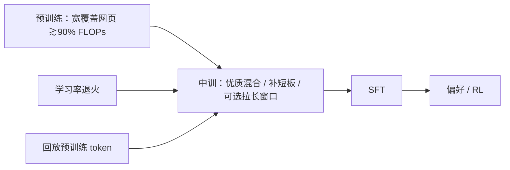

# Midtraining

预训练的后 5%–10% FLOPs 不再当成同一锅网页汤：换成更高质量、补短板、或拉长上下文的混合，并常常伴随学习率退火。这是课程阶段，不是另一次从零预训练。

<footer>—— OLMo Team 采用 Abdin et al. 与 OpenAI 2024 的 mid-training 说法，见 *2 OLMo 2 Furious*，arXiv:2501.00656；长上下文实例见 Abdin 等 Phi-4，arXiv:2412.08905</footer>

经典配方是「大规模预训练 → 指令微调」。近年底座在接 SFT 之前多出一段 **midtraining（中训）**：数据更干净或更偏领域，学习率从预训练峰值降下来，有时把窗口从 4K 拉到 16K / 32K。OLMo 2 把第二阶段明确叫做 mid-training，约占训练 FLOPs 的 5%–10%，用 Dolmino Mix 上采样优质网页、非网页源与补数学的合成数据，并用 micro-annealing 先试数据源再决定是否进入正式退火。Phi-4 的中训把上下文从 4K 接到 16K，约 250B token，长数据约占 30%、预训练回放约 70%，RoPE 基频提到 250K，学习率降到预训练峰值的十分之一。名称来自 Phi-3.5 / Phi-4 与 OpenAI 2024 的用法；谱系上接近 Gururangan 等「不要停预训练」的领域自适应，但对象是通用底座的课程，而不是单一下游语料。本篇把 midtraining 写成**阶段**，不把退火学习率、长上下文延伸、合成补丁当成三篇论文的同一公式。

## 问题

万亿级网页预训练边际递减：噪声 token 仍占步数，短板（数学、多语、长依赖）在均匀混合里得不到足够密度。若把高质量数据从第一步就灌满，模型还没学到宽覆盖的表面统计，就过拟合窄域。若全部留给 SFT，监督信号太稀，补不回底座缺口。中训插在两者之间：骨干已会语言，再用短而密的阶段打补丁，并常把优化器从「高原」转入余弦尾部。

第二个问题是实验成本。为试一种数学混合而重跑 5T 不可行。OLMo 2 的 micro-annealing 用小规模退火评估数据源，把「这一锅值不值得」从完整重训里拆出来。长上下文同理：Phi-4 消融发现**天然长文档**优于把短样本 pad 成假长序列；于是中训的数据工程是筛 >8K、上采样 ≥16K，而不是只改 RoPE。

### 名称混用：退火、续训、中训

Annealing 多指学习率降到零的日程尾部，数据可以不变。Continued pretraining 常指在新领域上接着训（Gururangan 2020）。Midtraining 在 OLMo 2 / Phi 里同时改**数据混合与日程**，有时还改**窗口**。三者可重叠：OLMo 2 的第二阶段就是带新混合的退火。写报告应拆开：改了哪些分布、LR 峰值降了几倍、上下文是否变、占多少 FLOPs。

OLMo 2 脚注写明术语取自 Abdin et al. 2024a 与 OpenAI 2024。不要把 2020 年领域续训论文改名为 midtraining，也不要给 OpenAI 未公开的内部混合编造配比。

## 方法

典型三件套，可只做子集。

**数据。** 提高高质量网页、书、代码、学术的密度；加入合成推理或指令风格（仍是下一 token，不是 SFT 对话格式——若已经是对话，阶段界线就挪到后训练）。OLMo 2：Dolmino Mix 1124，含合成数学以补短板。Phi-4：长上下文子集 + 70% 回放以防遗忘。回放比例是遗忘与新能力的旋钮。

**优化。** 峰值学习率降一档（Phi-4 为 10×），余弦或线性收到 0。权重衰减与全局 batch 可保持，但 token/step 若因更长窗口变，等效噪声尺度会变。不要沿用预训练 warmup。

**窗口。** 中训是目前最常见的「4K→16K」放置处：先在短窗把容量训满，再在较短 token 预算上教长依赖。Phi-4 跟随 Meta 把 RoPE 基频提到 250K；OLMo 2 主报告默认仍 4K，长窗是另一条线，不要写成 OLMo 2 已经 16K 中训。

### 与后训练的接口

中训结束的检查点仍是基座：没有聊天模板保证。OLMo 2 再接 Tulu 3 式 SFT → DPO → RLVR。Phi-4 再接 SFT 与偏好。若把指令数据提前灌进中训，能减轻 SFT 负担，也可能污染基座评测（MMLU 涨、续写风格变助理腔）。是否允许，属于配方，应在数据卡声明。PRISM 一类后续工作把中训与 RL 的交互单独拿出来测，说明界线仍在研究中。

评测要在中训前后用同一套基座任务（OLMES、学业多选、数学）。只报 SFT 后分数，无法知道补丁发生在中训还是指令阶段。长上下文任务必须用天然长评测，不能用拼接短文当成功标准——与 Phi-4 的训练消融同一逻辑。

## 机制

课程学习把非平稳分布排成先易后难或先宽后窄。中训是「先宽覆盖、后高信噪」。信息瓶颈看法：前期学表层共现，后期用干净数据挤掉噪声方向。梯度噪声尺度随数据质量变：同样 batch，干净数据的梯度更对齐，可以用更小学习率走到更低损失而不抖。长窗口中训则是把注意力与 RoPE 的可行长度从「从未见过」变成「见过 30% 真长样本」；70% 短回放防止短任务灾难遗忘。

Blakeney 等 2024、Ibrahim 等 2024 讨论预训练数据课程；Llama 3、DBRX、OLMo-0424 已展示分阶段混合。Midtraining 把「最后一段课程」命名并常与退火绑定，不是 2024 年才发明分阶段。

### 和 SFT 遗忘、和只拉长 RoPE

SFT 遗忘是监督分布替换无监督续写。中训仍是无监督（或弱监督合成），对基座任务通常更温和。只改 RoPE 基频、不喂长数据，是位置外推，不是中训。只喂长数据、不回放，短任务会掉——Phi-4 与 ProLong 都强调短长混合。合成长 QA 可作增强，不能替代天然长书与仓库级代码（Phi-4 消融）。

## 边界与工程取舍

FLOPs 占比 5%–10% 是 OLMo 2 的叙述，不是定理。过短则补丁贴不上，过长则退化成「第二段预训练」且遗忘风险上升。数据许可证：中训若混入更严的来源，会收紧整个底座的再分发条件。micro-annealing 的小规模结论在满预算上可能反转，只能降实验成本，不能替代最终一次。

不要把 midtraining 写成视觉或 MoE 专有。不要给未公开的 GPT 中训写配比。窗口与 RoPE 必须和推理配置一致：中训 16K、服务 128K 仍要另做延伸。检查点选择：中训末与退火零点可能不是同一文件；下游应用以报告指定的 Base 为准。

出处：OLMo Team, *2 OLMo 2 Furious*，arXiv:2501.00656；Abdin et al., Phi-4 Technical Report，arXiv:2412.08905；Phi-3.5 对多语与长上下文中训的用法；Gururangan et al., Don't Stop Pretraining, 2020；综述：*Mid-Training of Large Language Models: A Survey*，arXiv:2510.06826。OpenAI 2024 仅作为术语来源引用，不编造内部数据。

## 小结

- Midtraining 是预训练与后训练之间的课程阶段：更高质量或补短板的数据、常伴学习率退火，可选延长上下文。
- OLMo 2：约 5%–10% FLOPs、Dolmino Mix、micro-annealing 选源。
- Phi-4：4K→16K、约 250B token、30% 长 / 70% 回放、RoPE 250K、LR 降 10×。
- 与纯退火、与领域续训、与 SFT 都可区分；报告应拆数据、LR、窗口、FLOPs。
- 天然长数据优于假拼接；短回放防止遗忘。
- 出处：OLMo 2，arXiv:2501.00656；Phi-4，arXiv:2412.08905。
