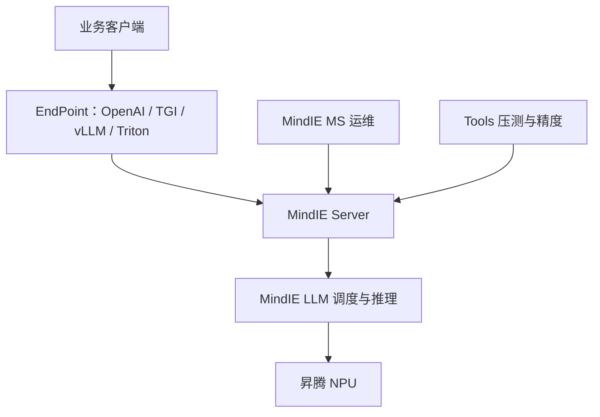

# MindIE / 昇腾推理

MindIE Service 面向通用模型做推理服务化：用可扩展平台对接主流框架接口，把大模型跑在昇腾上，而不是把 CUDA 引擎原样搬过来。

<footer>—— 华为昇腾社区，MindIE Service 开发文档</footer>

MindIE（Mind Inference Engine）是华为在昇腾硬件上的高性能推理框架。模型应用层可以走 MindIE LLM（含 MindSpore Transformers 一类承载），服务化层走 MindIE Service：对外提供 RESTful，对内接到昇腾推理加速引擎。昇腾社区文档把它的服务组件写成 Tools、Client、Management Service 与 Server；Server 里的 EndPoint 明确兼容 Triton、OpenAI、TGI、vLLM 的请求接口。本篇写这套**服务化与硬件绑定**的形状，不写具体芯片的未公开指令吞吐，也不把某一版 Atlas 服务器的 QPS 当成论文。CUDA 生态里的 TGI / LMDeploy / vLLM 解决的是「如何在 GPU 上连续批」；MindIE 还要多回答一句：客户已经按 OpenAI 或 TGI 写好的客户端，如何在 NPU 上不改协议地接住。

## 问题

推理引擎若只暴露私有 protobuf，业务侧要为每一种硬件写适配器。反过来，若只把开源 GPU 引擎「编译到昇腾」而不提供服务框架，运维面（探针、多实例、模型更新、负载均衡）仍是空的。昇腾上的约束与 NVIDIA 不同：编程栈走 CANN 与对应算子库，内存与集合通信的原语不是 NCCL 那一套名字，模型并行的可运行拓扑以厂商文档为准。问题因而分成两层——**协议层**要兼容已有客户端，**引擎层**要在 NPU 上做调度、量化与多并发。

第二层问题是产品切分。文本生成、视觉生成、以及「在昇腾上加速开源 vLLM」不是同一个二进制。MindIE 2.x 的导读把大语言模型场景写成：既可以用开源 vLLM 加 MindIE Turbo 一类加速插件，也可以走 MindIE LLM 做文本生成全流程；多模态另有 MindIE SD 做视图生成。把这些当成同一个「昇腾推理」开关，会在选型时把文生图的 SLA 套到对话模型上。

### 兼容接口不是同一套内核

EndPoint 能收 `/v1/chat/completions`，只说明 HTTP 皮对齐了 [OpenAI 兼容协议](/llm/openai-compat-api)；能收 TGI 的 `/generate_stream`，只说明 SSE 形状接近 [TGI](/llm/tgi)。KV 分页、连续批、量化核仍然是 MindIE LLM 或 Turbo 插件里的实现。协议兼容让客户端少改，不保证延迟分布与 GPU 引擎相同，也不保证每一个可选字段（logprobs、工具调用、vision part）都已实现。

昇腾文档按版本号组织（如 MindIE 1.0 与 2.3）。接口路径、组件改名（Service / Motor）以你安装的那一版开发指南为准。本篇用社区公开的架构描述，不把旧版 `config.json` 字段写成跨版本契约。

## 方法

MindIE Server 用配置文件（常见为 `config.json`）描述监听地址、HTTPS、模型权重路径、后端类型、`maxSeqLen`、NPU 设备列表与实例数。部署 MindFormers 时，文档要求 `modelWeightPath` 指向含 tokenizer 的模型目录，`backendType` 取对应后端（例如 MindSpore 路径下的 `ms`）。启动后，客户端用 curl 或自有 HTTP 栈打 EndPoint。业务接口按兼容目标分列：TGI 风格的 `/` 与 `/generate`、`/generate_stream`；OpenAI 的 `/v1/chat/completions`、`/v1/completions`；原生 `/infer`、`/infer_token`；Triton 风格的 `/v2/models/.../infer` 与 `generate_stream`。另有 tokenizer 计数、健康探针、优雅退出、Prometheus 格式指标等运维面。

MindIE LLM 承担大模型推理与多并发调度，是「引擎」而不是「反向代理」。MindIE MS（管理服务）做 Pod 与实例级管理、监控、模型更新、故障重调度与负载均衡——这层在 GPU 开源栈里往往交给 Kubernetes 加自研路由。Tools 提供性能测试、精度测试与可视化。Client 实现与 Server 对齐的通信协议，给应用侧一个完整对接面，而不是只丢一份 OpenAPI 片段。

### 两条文本路径：原生 LLM 与 vLLM 插件

导读区分「MindIE 文本生成」与「使用 vLLM 开源推理引擎」。前者：权重与调度都在 MindIE LLM 里，服务化全流程由 MindIE 加速。后者：团队已经按 vLLM 的 API 与调度概念运维，通过 MindIE Turbo 一类插件在 Atlas 推理服务器上加速，而不是重写业务网关。两条路径可以共存于同一硬件世代，但不能假设 KV 布局、环境变量与量化开关通用。选哪条，看现有工具链绑的是 OpenAI 网关还是 vLLM 的引擎语义。

多机、长序列、量化在 LLM 开发指南里作为独立特性出现。它们依赖昇腾的集合通信与内存规划，数值与拓扑要以对应版本的「多机 / 长序列 / 量化」章节为准，不要从 NVIDIA 的 TP 口诀直接换卡名。

## 机制

协议适配发生在 EndPoint：同一套内部请求对象，被翻译成不同 URL 与字段。TGI 与 vLLM 都可能使用 `/generate`，文档写明用请求参数区分——这是兼容层的典型税：路径撞名时必须靠 body 判别，网关若只按 URL 做限流，会把两种语义合成一条桶。原生 `/infer_token` 跳过服务端分词，把已经编码的 token 送进引擎，适合自己做 [tokenizer](/llm/serving-tokenizer-cost) 的网关；`/v1/tokenizer` 则把计数暴露成独立 RPC，避免业务用错误词表估算上下文。

调度在 MindIE LLM：多并发请求共享 NPU，连续批与 KV 管理的具体算法以该组件文档为准。与 GPU 引擎相同的约束仍然成立——prefill 与 decode 争用同一块计算资源，取消必须释放 KV，见 [sse-cancel](/llm/sse-cancel)。NPU 友好算子、图模式、是否能 CUDA Graph 式捕获，属于 CANN 与后端实现，不在本篇展开；服务化只要求：引擎能把「一步 decode」暴露给 EndPoint 去推 SSE。

Atlas 800I 一类服务器是公开产品形态，用来说明「MindIE 跑在哪类机器上」。不要把某次内部 benchmark 的 token/s 写进这篇；厂商白皮书与社区文档才是可引用的规格来源。

### 管理面与故障

MS 把模型更新、实例扩缩和故障重调度收进平台，意味着 KV 与适配器状态不能假设「进程永生」。滚动升级会丢掉页缓存，[KV 感知路由](/llm/kv-aware-routing) 若把哈希打到正在抽空的 Pod，会把冷启动当成尾延迟。昇腾集群的亲和性（哪几张 NPU 组成一个 TP 组）应由平台配置钉死，而不是让 Kubernetes 随机抽卡后在运行时拼接通信域。

## 边界与工程取舍

MindIE 的边界首先是硬件：没有昇腾，这套二进制没有意义。其次是特性差集：OpenAI 工具调用、多模态 part、logprobs、speculative decoding，每一项都要在当前版本的 API 表里打勾，不能从「兼容 OpenAI」四个字推导已实现。第三是生态位置：它既是原生栈，又提供对 vLLM 的加速插件，团队必须写明自己走哪条，否则监控指标（vLLM 的与 MindIE 的）会对不上。

精度测试被放进 Tools，说明昇腾部署把「能出字」和「与 GPU 参考 logits 可对齐」分成两件事。量化、图编译、混合精度都可能引入误差；上线应以官方精度指南的允许阈值为准，而不是用一段主观聊天当验收。安全与内容过滤同样不在推理核里，服务化框架不自动带上封闭 API 的完整护栏。

引用停留在华为昇腾社区的 MindIE Service / LLM 开发文档与 MindSpore Transformers 的 MindIE 部署说明。不要给 MindIE 编造 arXiv；它是产品文档，不是会议论文。

## 小结

- MindIE 是昇腾上的推理引擎与服务化框架，不是 CUDA 引擎的改名。
- EndPoint 兼容 Triton / OpenAI / TGI / vLLM 的 HTTP 形状；内核仍是 MindIE LLM 或 Turbo 插件。
- 文本有原生 LLM 与 vLLM+加速插件两条路径，视觉生成走独立套件。
- 配置文件描述设备、长度上限与后端；运维面由 MS、Tools、探针与指标补齐。
- 版本间组件名与字段会变，以安装版本的开发指南为准。
- 出处：华为昇腾 MindIE 开发文档、MindIE Service 接口说明。
