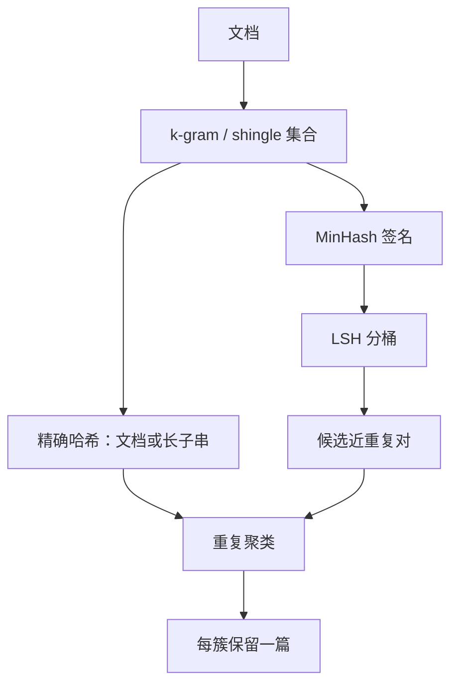

# MinHash / 精确去重

用少量最小哈希值估计集合的 Jaccard 相似度，就可以在网页量级上找出「几乎相同」的文档，而不必两两比原文。

<footer>—— Broder, On the resemblance and containment of documents, 1997</footer>

精确去重消灭字节级或规范化后完全相同的文档；近重复去重消灭改了标题、换了广告、微调了几句的转载。网页语料里后者远多于前者。两两算编辑距离不可行，需要一种把文档变成短指纹、又对「集合重叠」敏感的方法。Broder 的 MinHash 用最小哈希估计 Jaccard 相似度，后来成为大规模网页近重复检测的标准件。Lee 等人把它和精确子串去重一起接到语言模型训练集上，证明去重不只是省磁盘，还会改变记忆与评测。

## 问题

设两篇文档的特征集合为 $A,B$（通常是 $k$-gram 或 shingle）。Jaccard 相似度为

$$
J(A,B)=\frac{|A\cap B|}{|A\cup B|}.
$$

$J=1$ 表示特征完全相同，$J=0$ 表示没有共享 shingle。转载新闻往往 $J$ 很高但原文不完全相等：精确哈希（SHA、md5、规范化后的字节哈希）会漏掉它们。若在 $N$ 篇文档上两两算 $J$，是 $O(N^2)$ 次集合运算，Common Crawl 量级做不到。

需要的是：常数或对数级大小的签名，使「签名相似」以高概率对应「$J$ 超过阈值」，并且能用倒排或 LSH 桶避免全对比较。MinHash 回答签名怎么造；局部敏感哈希回答候选对怎么取。Lee 等人还强调另一条精确路径：长子串完全匹配——不必近似，但要处理「子串」而不是整篇文档。

### 精确与近似要分开记账

精确去重的假阳性极低：哈希碰撞可忽略时，删掉的就是真重复。近重复有阈值：把 $J>0.8$ 当重复，会误伤主题相近但独立撰写的文章，也会放过 $J=0.6$ 的改写垃圾。报告「做了 MinHash」而不写 $k$、签名数、阈值与聚类规则，等于没做可复现的去重。评测集泄漏常用 n-gram 重叠而不是整篇 Jaccard。训练集内部去重与「对 benchmark 去污」是两个任务：前者减记忆与浪费，后者减高估。Lee 等人两条都做了，工程上不该只做便宜的那一条。

## 方法

MinHash 的经典构造：为 $m$ 个独立哈希函数 $h_1,\ldots,h_m$，定义签名

$$
\mathrm{MH}_i(A)=\min_{a\in A} h_i(a).
$$

对任意 $i$，$\mathrm{Pr}[\mathrm{MH}_i(A)=\mathrm{MH}_i(B)]=J(A,B)$。用 $m$ 个最小值的吻合比例估计 $J$。$m$ 越大方差越小，存储与比较成本线性增加。实践中常再做 b 个 band：每个 band 里若干哈希一致才进同一 LSH 桶，只有共桶的文档才算精确 $J$ 或直接当近重复。

精确去重则对规范化文本（小写、空白折叠、去 HTML）算文档哈希，或对滑动窗口的长 $k$-gram 建全局集合。Lee 等人的精确路径针对足够长的重复子串：一篇文档若包含已见过的长片段，则整篇或该片段被丢弃。这能抓住「中间插入一句」但仍大段复制的情况，而文档级 md5 会漏掉。

### 聚类与保留策略

候选对要收成连通分量或并查集聚类。一簇里保留哪一篇会改数据分布：保留最长、保留最早抓取、保留权威域名，结果不同。保留最长会偏向聚合页；保留新闻源域名会压论坛。去重因此再次变成配比决策。实现上还要决定：整篇丢弃，还是只剪重复段落。段落级更费、更保信息，但也更可能把文档剪成碎片。

MinHash 估计的是 shingle 集合重叠，不是语义相似。两篇独立写的「巴黎旅游攻略」可能 Jaccard 中等；一篇把另一篇同义词替换后 Jaccard 仍可能很高。语义去重需要嵌入，成本高一个数量级，且假阳性模式不同。预训练第一刀几乎总是字面近重复，而不是主题聚类。

## 机制

MinHash 的无偏性来自「最小哈希相等当且仅当两个集合在该哈希下的最小元素是交集里的同一个」这一对称性。它不试图理解语言，只压缩集合。因此对词序不敏感：打乱句子后 shingle 会变，但若 $k$ 较小，局部重叠仍在。$k$ 太大，对小改动过于敏感，近重复召回下降；$k$ 太小，常见功能词 shingle 让无关文档也变近。英语网页常用单词 5-gram 或字符 $k$-gram；中文无空格时必须先分词或改用字符 shingle。

LSH 的 band 结构控制召回-精度：band 多、每 band 哈希少，则较低 $J$ 也可能共桶，召回高、候选爆炸；相反则只抓几乎复制的文档。计算预算应花在「签名 + 桶」上，而不是事后对所有候选跑全量 Jaccard——候选一旦上亿，精确 Jaccard 也会拖垮管线。

### 与记忆、泄漏的关系

Lee 等人观察到：去重后，模型对训练集里剩下的唯一文档记忆下降，对与训练集重叠的评测项准确率也会更诚实。重复相当于把某些序列的有效权重放大，优化器在那些序列上过拟合，像极了没有声明的上采样。MinHash 删除近重复，是在还没有显式配比定律之前，先把「意外上采样」关掉。它不替代 Xie 等人后来的配比优化，但若跳过去重直接做配比，配比估计会被复制文档污染。

## 边界与工程取舍

MinHash 对模板化短文档不稳定：shingle 少，方差大，两条短菜单可能随机撞成近重复，也可能检不出来。应对是：太短的文档走精确哈希或直接丢弃，不进 MinHash。多语言混布时，不要用同一套英文单词 $k$-gram；脚本混合页（中英夹杂）的集合大小和语言识别结果会一起漂。

分布式实现要注意哈希函数必须全局一致，否则各分片签名不可比。签名宽度、band 数、阈值应与语料年代一起写进数据卡片：同一套参数在 2019 年的 Crawl 与 2024 年充满生成文本的 Crawl 上，近重复密度差一个数量级。生成式垃圾往往互相改写，Jaccard 处于中高区间，正是 MinHash 该抓的对象；若阈值过高，它们会漏网并在后续质量分类器里继续互相增强。

精确去重很便宜，却不能省略。大量镜像站是字节级复制，md5 就能去掉。先精确、后近似，是为了让 MinHash 的候选集变小。反过来只用 MinHash 也能碰到精确复制，但浪费签名计算。

去重不是越多越好。百科条目之间共享定义句、法律法规共享条款、开源许可证全文重复，一律按高 Jaccard 删除会系统性伤害某些领域。应对是白名单域、或对许可证/样板段单独剥离，而不是全局把阈值调到 0.99 假装没有误伤。

## 小结

- 精确哈希消灭字节级复制；MinHash 估计 Jaccard，用于近重复。
- Broder 的最小哈希使 $\mathrm{Pr}(\text{签名吻合})=J$，再配合 LSH 避免 $O(N^2)$。
- $k$-gram 粒度、签名数、band 与聚类保留策略都是配比决策，不是中性预处理。
- Lee 等人表明去重降低记忆并减少评测泄漏，应同时做语料内部与对 benchmark 去污。
- MinHash 抓字面重叠，不抓语义重复；短文档与多语言需要单独规则。
- 先精确后近似，并对许可证、引用句设置例外，以免误杀高价值共享文本。
- 出处：Broder，文档相似与包含，1997；Lee et al.，*Deduplicating Training Data Makes Language Models Better*；网页管线对照 Raffel C4 与 Penedo RefinedWeb / FineWeb。
