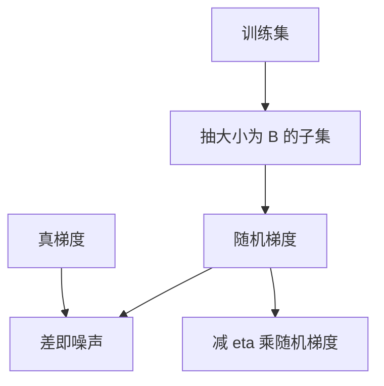

# 小批量噪声

用一小撮样本估计梯度，每步都在真梯度附近抖动；这份抖动既是计算上的妥协，也是逃离尖谷的一种来源。

<footer>—— 据 Robbins &amp; Monro, A Stochastic Approximation Method, Annals of Mathematical Statistics, 1951；Bottou, Stochastic Gradient Descent Tricks, 2012 整理</footer>

[梯度下降与学习率](/llm/sgd-learning-rate)写出 $\theta\leftarrow\theta-\eta\nabla L$。本课不重谈 $\eta$ 的量纲。缺口是：训练集上的真梯度太贵，一步只能用 $B$ 条样本的平均来代替。这个估计有偏差（若抽样有偏）和方差（即使无偏）。本课把方差叫作小批量噪声，并说明它如何与 $\eta$、$B$ 纠缠。动量是下一课。

## 问题

全训练集的 $L$ 是所有样本损失的平均。一次反向要扫过全部数据，大语料上不可行。随机抽取大小为 $B$ 的子集 $\mathcal{B}$，用 $g_{\mathcal{B}}=\nabla\frac{1}{B}\sum_{i\in\mathcal{B}}\ell_i$ 代替 $\nabla L$。当抽样均匀且 $\ell_i$ 的梯度存在时，$g_{\mathcal{B}}$ 无偏，$\mathbb{E}[g_{\mathcal{B}}]=\nabla L$，但 $\mathrm{Var}(g_{\mathcal{B}})$ 大约随 $1/B$ 下降。缺口不是新的损失，而是承认每步走的不是最陡方向，而是最陡方向加噪声。

$B=1$ 噪声最大，硬件也最吃不饱；$B$ 大到接近全数据，噪声消失，但一步的计算变贵，同样墙钟时间内更新次数变少。实践中的 $B$ 是噪声、并行度和有效更新次数的折中。把 $B$ 只当成「显存能装多少」会丢掉这条统计。

### 小批量不是「少看一点数据所以更正则」这么直接

噪声可以阻止精确卡进尖锐极小，有时看起来像正则。但噪声的分布由数据异质性决定，不是按权重衰减那样可控的罚项。增大 $B$ 减噪声，若不同时改 $\eta$，有效步长的随机部分变了，训练曲线不能直接与小 $B$ 对比。线性缩放规则（$B$ 加倍则 $\eta$ 加倍）是一种补偿，不是定理；大 $B$ 时它常失效。不要把「batch 大所以泛化差」写成因果而不提 $\eta$。

下一词损失里，一个批量是 $B$ 条序列，有效 token 数还要乘长度并扣掉填充。名义 batch 与「梯度平均用了多少独立位置」不是一回事。报 $B$ 时应声明是序列数还是 token 数。

## 方法

每步：抽样 $\mathcal{B}$，前向算出平均损失，反向得到 $g_{\mathcal{B}}$，更新 $\theta\leftarrow\theta-\eta g_{\mathcal{B}}$。抽样应尽量独立：打乱后再顺序切块，避免同一类样本长期相邻造成有偏的局部梯度。分布漂移、过采样稀有类，都是在改 $\mathbb{E}[g_{\mathcal{B}}]$，属于有偏估计，要单独声明。

噪声尺度粗略是 $\sigma/\sqrt{B}$，$\sigma$ 由样本梯度的离散程度决定。更长的序列、更不平衡的标签，往往更大的 $\sigma$。把 $\eta$ 调小可以压住每步的随机位移 $\eta\sigma/\sqrt{B}$，但确定性部分 $\eta\nabla L$ 也一起变小。这是后课要同时看验证曲线的原因：训练损失在降，可能只是噪声在平均意义上仍指向下坡。

## 机制

无偏噪声在凸问题上仍能收敛，只要 $\eta$ 适当衰减——这是 Robbins–Monro 的背景。深度网络非凸，噪声的作用更含糊：它能帮助离开鞍点附近的平原，也能让已经很好的方向一步走丢。经验上，中等噪声配合中等 $\eta$ 往往比「无噪声的大步」更稳，但这不是本课能证的定理。

硬件偏好大 $B$，因为矩阵乘要喂满。统计偏好不要过大的 $B$，以免一步太贵、一天内更新太少。梯度累积（连续若干小批的梯度相加再更新）是在假造更大的 $B$，噪声下降，更新变稀。它与「真的大 batch」在噪声上同类，在归一化层的统计量上不一定同类——那是后课 LayerNorm / 批统计的边界，本课只谈梯度估计。

## 边界

本课不引入动量缓冲，也不谈 Adam 的二阶矩。下一课[动量与自适应学习率](/llm/momentum-adaptive-lr)用历史梯度改写有效步长。验证集还没出场。后课默认：说到 SGD，指的是小批量估计；比较不同 $B$ 必须同时交代 $\eta$ 与一步所含的 token 数。

## 小结

- 小批量梯度无偏但有方差，方差大致随 $1/B$ 下降。
- 噪声不是显式正则；它与 $\eta$、$B$ 的耦合会改泛化曲线。
- 名义 batch 与有效 token 数要分开报。
- 梯度累积减噪声、减更新频率，是在假造大 $B$。
- 出处：Robbins &amp; Monro, 1951；Bottou, 2012。
