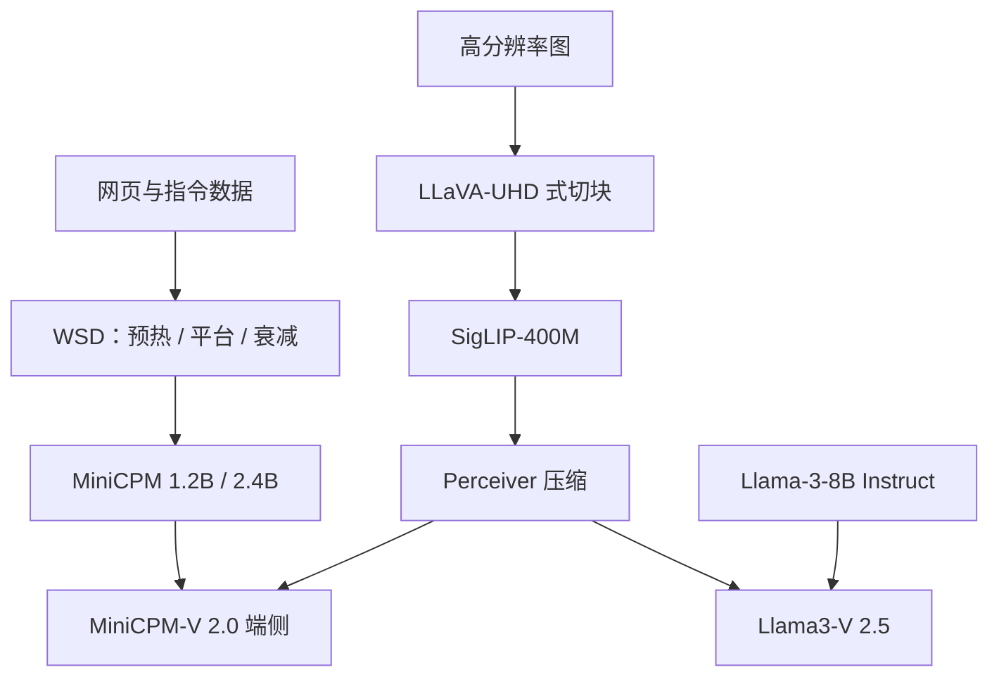

# MiniCPM / MiniCPM-V

MiniCPM 要证明：在 1B–2B 非嵌入参数上，用可扩展的训练策略也能打到 7B–13B 的实用能力；MiniCPM-V 再把这一档容量接到手机能跑的多模态上。

<footer>—— Hu 等，MiniCPM，2024；Yao 等，MiniCPM-V，2024</footer>

面壁智能（ModelBest）与清华大学等合作的 MiniCPM，把「小模型」当成一等实验对象，而不是大模型压缩后的边角料。2024 年 4 月的技术报告给出 **1.2B 与 2.4B 非嵌入参数** 的稠密语言模型，配套风洞式超参搜索和 Warmup-Stable-Decay（WSD）学习率；随后 MiniCPM-V 把 SigLIP 与 perceiver 接到同一条端侧叙事上，2.5 档换用 Llama-3-8B 指令模型，宣称在 OpenCompass 上超过当时对照的 GPT-4V-1106。本篇把文本小模型与视觉系列写成一条产品线：先解决「小参数如何把数据吃完」，再解决「高分辨率如何压进手机内存」。

## 问题

Chinchilla 式算力最优把数据量钉在参数的约 20 倍；若小模型按这个比例早停，知识与指令都不够用。反过来，用余弦学习率把终点写死，想多训一截就要从头再来。MiniCPM 要问的是：在 **不预先规定总 token 数** 的前提下，能否让小模型持续吃数据，并在任意稳定阶段做一次衰减，得到不差于余弦终点的损失。这直接决定端侧模型能不能靠「同一检查点退火」做领域适应，而不是为每个垂直再训一个 7B。

多模态侧的约束更硬。云端 MLLM 用几百到上千视觉 token 换 OCR；手机既放不下 7B×长视觉前缀，也耗不起对应的 decode 带宽。MiniCPM-V 的问题因此是：在保留任意长宽比与约 180 万像素感知的同时，把视觉序列压到端侧可接受的长度。

### 小模型的第三轴是可连续训练

报告用大量小规模风洞实验选宽深比与学习率，再把同一套超参往 1B/2B 上搬。WSD 把训练分成预热、**高学习率平台**、衰减三段：平台期可以无限续训，衰减期损失会陡降，逼近「若用余弦、终点恰好在此刻」的包络。于是数据轴上的标度律可以用线性成本测量——对同一稳定检查点做不同长度的衰减，而不必为每个 $D$ 重训。报告由此主张：相对 Hoffmann 等人的 Chinchilla 比，可达到的最优数据/参数比可以高得多。这是训练策略主张，不是说 2.4B 已经推翻 Kaplan 曲线。

「1.2B / 2.4B」计的是非嵌入参数。大词表时嵌入占比不低，对端侧显存仍要按全模型算。不要把非嵌入参数理解成磁盘上的检查点更小一号。

## 方法

文本系列是解码器 Transformer，公开家族还包括 MiniCPM-DPO、MiniCPM-MoE、MiniCPM-128K。核心可复述的方法学是 WSD，而不是新的注意力核。记预热终点为 $W$、平台终点为 $T$、峰值学习率 $\eta$，则

$$
\mathrm{WSD}(s)=\begin{cases}
(s/W)\,\eta, & s\lt W,\\
\eta, & W\le s\le T,\\
f(s-T)\,\eta, & s\gt T,
\end{cases}
$$

$f$ 为递减到 0 附近的衰减。衰减前的检查点可以继续用 $\eta$ 往前走，再另开一次衰减，对应「先通用预训练、再领域退火」而不丢平台期学到的统计。

### MiniCPM-V：自适应切块加 perceiver

视觉报告以 MiniCPM-Llama3-V 2.5 为旗舰叙述。结构三件套：SigLIP SoViT-400M/14 编码器、一层交叉注意力的 perceiver resampler、语言模型。高分辨率走 LLaVA-UHD 式**自适应视觉编码**：按原图与 ViT 预训练边长估计应切几片，每片更接近 SigLIP 见过的分辨率与长宽比，再编码、压缩、拼接。2.0 与 2.5 支持约 **1.8M 像素**（例如 1344×1344）与任意长宽比；1.0 仍是约 0.2M 像素的固定 448×448。perceiver 把每片（及全局）压成短前缀，使端侧内存不随像素线性爆炸——这与 InternVL2「每格 256 token」的账单策略不同，见 [视觉 token 压缩](/llm/vision-token-compression)。

版本不要混：V 1.0 / 2.0 接 MiniCPM-2B；2.5 接 Llama-3-Instruct 8B，对齐侧用 RLAIF-V；2.0 用过 RLHF-V。多语依赖「多语 LLM + 相对少的多语图文」，报告写 30+ 语言。手机部署叙事包含量化、编译与 NPU，以当时开源 APK / 推理栈为准，本文不编帧率。

## 机制

WSD 的机制是把「学表示」和「把权重收进低损失盆地」分开。高学习率平台保持可塑，损失不一定最低；一衰减，优化器才把已经形成的方向收紧。因此衰减曲线上的陡降不是数据突然变好，而是学习率日程的相位变化。连续训练时，小模型可以在远超 Chinchilla 的 token 上仍有增益，代价是重复数据与过拟合风险——报告用小模型包络说明「还能降」，没有声称 2.4B 应训到无限。

视觉侧，切块负责细节，perceiver 负责账单。LLM 只看见压缩后的查询，细字若在 resampler 里被平均掉，OCR 仍会失败；所以 1.8M 像素是**编码器输入**的覆盖，不等于 LLM 看到了 1.8M 个像素级 token。2.5 换 8B 语言骨干，世界知识与多语跟上，端侧代价从「2B 可进手机」变成「8B 需更强 NPU 或量化」。OpenCompass 超过某次 GPT-4V 快照，是综合榜设定下的结果，不是逐项文档理解支配所有闭源系统。

「GPT-4V 级别」是 MiniCPM-V 论文标题里的产品句。引用时应写明对照的是 GPT-4V-1106 与当时 OpenCompass 11 项，而不是未注明版本的 GPT-4o。端侧能跑取决于量化与运行时，不是 8B 权重的字面含义。

### 和 Phi、InternVL2 的分工

[Phi](/llm/phi) 用教材式合成数据拧样本效率；MiniCPM 文本线更强调 **WSD 与风洞超参**，让小模型把更多真实 token 训完。两者都可以「小打大」，机制不同。InternVL2 用大视觉塔加大 LLM 追云端多模态；MiniCPM-V 把压缩放在 perceiver，优先延迟与内存。选端侧 OCR 助手看 MiniCPM-V 2.0/2.5；选 70B 级图文推理看 InternVL2 大档。

## 边界与工程取舍

WSD 的衰减长度与 $f$ 的形状是超参，报告用小模型说明现象，2.4B 生产配方的精确步数以开源训练脚本为准，不要把附录里的 0.036B 曲线当成 2.4B 的日程。MiniCPM-MoE 与 128K 变体证明底座可扩展，但不自动继承 V 系列的切块代码。

许可与底座：2.5 受 Llama 3 社区许可约束；2.0 随 MiniCPM 自身条款。不要把 Apache 与 Llama 条款混写。后续 MiniCPM-V 2.6 等换 Qwen2、加视频，以当时仓库说明为准，不属于 2408.01800 正文的主体。幻觉方面，RLAIF-V 降的是对象幻觉基准上的率，不是事实性保证。

真实编号：Hu 等 *MiniCPM: Unveiling the Potential of Small Language Models with Scalable Training Strategies*，arXiv:2404.06395；Yao 等 *MiniCPM-V: A GPT-4V Level MLLM on Your Phone*，arXiv:2408.01800。LLaVA-UHD 是自适应切块的引用对象，不要把 MiniCPM-V 写成自创了一种与 UHD 无关的新网格算法。

## 小结

- MiniCPM 是面壁的 1.2B/2.4B 级小语言模型，卖点是风洞超参与 WSD 连续训练，而不是新注意力。
- WSD 把高学习率平台与衰减拆开，便于续训、领域退火，以及更便宜地测数据标度。
- MiniCPM-V 用 SigLIP + perceiver + 自适应切块，在约 1.8M 像素上做端侧多模态；2.5 换 Llama-3 8B。
- 「小打大」成立的范围是报告里的对照与 OpenCompass 设定；手机可跑取决于量化栈。
- 出处：arXiv:2404.06395；arXiv:2408.01800；OpenBMB MiniCPM / MiniCPM-V 仓库与模型卡。
