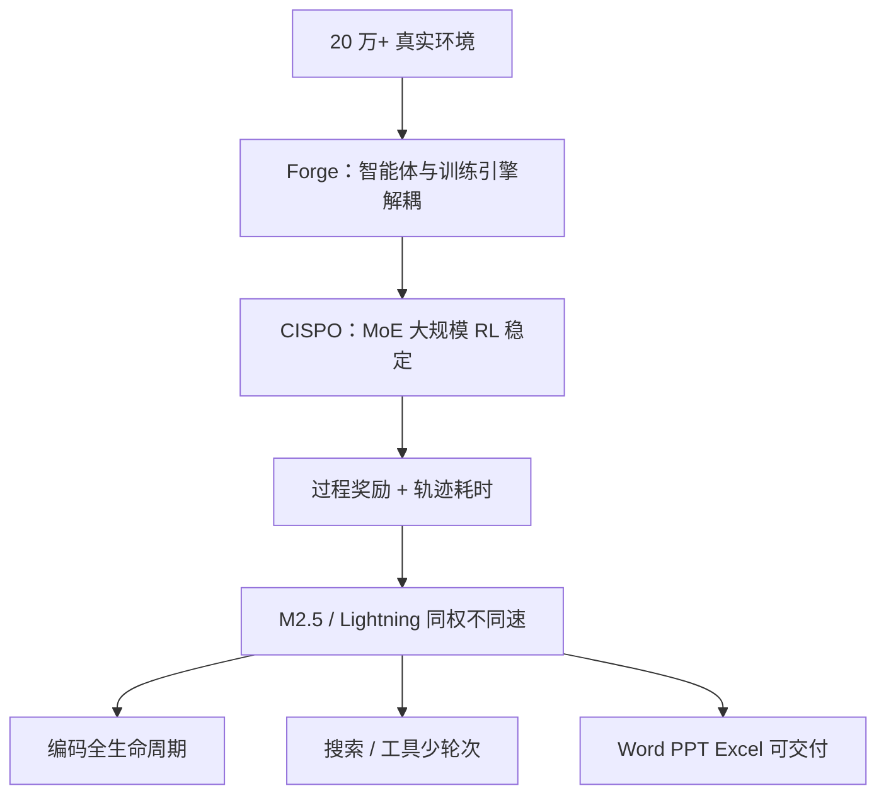

# MiniMax M-2.5

    
在数十万真实环境里做强化学习之后，M2.5 把编码、工具搜索与办公交付当成同一套经济任务；100 token/s 连续跑一小时大约 1 美元，用来把智能体账单从「先问价」里拿掉。

    <footer>—— MiniMax，MiniMax M2.5: Built for Real-World Productivity，2026-02-12</footer>

[MiniMax-M1](/llm/minimax-m1) 用混合注意力与 CISPO 证明长思维 RL 可训。M2 系列把主轴换成**高稀疏 MoE 上的智能体**。2026 年 2 月 12 日的 **MiniMax-M2.5** 是该系列在约三个半月内的第三颗：官方新闻强调 SWE-Bench Verified **80.2%**、Multi-SWE-Bench **51.3%**、带上下文管理的 BrowseComp **76.3%**，以及相对 M2.1 在 SWE 评测上 **37%** 的端到端加速。价格叙事是「智能便宜到不必计量」：Lightning 档约 100 TPS、每百万输入 0.30 / 输出 2.40 美元；标准档约 50 TPS、价减半。本篇以这篇新闻为主；系列骨干规格见 M2 技术报告（社区引用 arXiv:2605.26494 的约 **229.9B / 9.8B 激活**），M2.5 正文没有重开层表。

## 问题

M1 解决的是长生成在混合核上的 FLOPs；到 2026 年初，用户要的是能当同事：修多语言仓库、在陌生脚手架里调工具、交出可送审的 Word / PPT / Excel，而且墙钟要对齐截止日期。只加 SWE 分数会训练出会刷基准、不会做 0-to-1 系统设计的模型。M2.5 把问题收成：在**同一套激活很小的 MoE** 上，用大规模真实环境 RL 把架构师式规划、搜索轮次效率、办公交付同时拉起来，并把服务做成 50/100 TPS 两档同能力。

第二个问题是泛化。官方特意在 Droid 与 OpenCode 上测 SWE-Bench Verified（79.7 / 76.1），对标 Opus 4.6，用来证明不是只拟合 Claude Code 一种 harness。

### 同能力两档：Lightning 与 Standard

新闻写 M2.5 与 M2.5-Lightning **能力相同、速度与价格不同**。Lightning 约 100 TPS，标准约 50 TPS；二者都支持缓存。按输出价，官方称约为当时 Opus / Gemini 3 Pro / GPT-5 的十分之一到二十分之一。100 TPS 连续一小时约 **1 美元**，50 TPS 约 **0.30 美元**。这是产品算术，不是架构分支——不要把 Lightning 写成更小 MoE。

SWE-Bench Verified 官方脚手架写明：内部基建、Claude Code、覆盖默认系统提示、四次平均。Droid / OpenCode 用默认提示。换 harness 则 80.2% 不可比。每任务平均约 3.52M token，相对 M2.1 的 3.72M；墙钟从 31.3 分钟到 22.8 分钟。

## 方法

编码：RL 覆盖十余种语言（Go、C/C++、TS、Rust、Kotlin、Python、Java、JS、PHP、Lua、Dart、Ruby 等）与 **超过 20 万**真实环境，范围从 0-to-1 设计、环境搭建、1-to-10 开发、到 90-to-100 的评审测试，平台含 Web / Android / iOS / Windows 与后端 API、库表，而不只是前端 demo。训练中冒出 **先写 spec 再写代码** 的架构师倾向。内部把 VIBE 升级为更难的 VIBE-Pro。搜索与工具：BrowseComp、WideSearch，以及自建 **RISE**（专家级真实检索题，Playwright 浏览器套件）。相对 M2.1，多任务上大约 **少 20% 轮次** 打出更高分——路径更短，不是更长的思维链自我欣赏。

办公：与金融、法律、社科从业者共建需求与数据。内部 **GDPval-MM** 对交付物质量与轨迹专业性做成对比较，并盯全程 token 成本；官方称平均胜率 **59.0%**。另有 MEWC（Excel 竞赛题）与金融建模内部集。

### Forge、CISPO 与过程奖励

**Forge** 是自研 agent-native RL 框架：中间层把训练–推理引擎与智能体解耦，任意 agent 可接入，用来优化跨脚手架泛化。异步调度在吞吐与 off-policy 程度之间折中；训练样本的树结构合并宣称约 **40×** 训练加速。算法上继续用他们提出的 **CISPO** 稳住 MoE（见 [M1](/llm/minimax-m1) 对重要性权重裁剪的讨论）。长上下文 rollout 的信用分配用**过程奖励**盯生成质量；并用轨迹耗时对齐「既要聪明又要快」。更完整的 RL 缩放说明，新闻答应另文展开——本篇不编那篇未引用论文的公式。

M2 系列骨干在技术报告里写为约 62 层、229.9B 总量、9.8B 激活、256 专家 sigmoid 门 top-8。M2.5 新闻以 RL 与产品为主；把该表当作系列默认可以，但应标明出处是系列报告而非 M2.5 新闻正文。

## 机制

9.8B 量级激活决定单 token FLOPs，使 100 TPS 的价能落在每小时 1 美元附近；229B 总量决定专家容量与装载。CISPO 不把低概率反思 token 在第一次更新后裁死，长程智能体才还能改主意。过程奖励对抗「轨迹又长又错仍拿结局分」。把完成时间写进奖励，模型才会学并行工具调用——SWE 墙钟降 37% 的直接来源之一。

Office Skills 在 MiniMax Agent 的 MAX 模式里按文件类型加载，再与行业 SOP 拼成可复用 Expert（官方称用户已建超 1 万）。这是产品层的程序化技能，不是 MoE 里多出来的「Excel 专家」。公司内部宣称约 30% 任务由 M2.5 自主完成、新提交代码约 80% 由模型生成——这是部署统计，不是基准。

### 和改进速率

从 10 月末到 2 月，M2 → M2.1 → M2.5，官方用 SWE-Bench Verified 的斜率对比 Claude / GPT / Gemini 家族。机制解释是 RL 环境数量（「公司里大多数任务都做成了环境」）与 Forge 吞吐，而不是换注意力公式。M1 的 Lightning Attention 混合核与 M2 的全注意力 MoE 不是同一对象；不要把 M1 的 1M 窗口默认抄到 M2.5——NVIDIA 模型卡一类第三方页写过约 196K 上下文，**以 MiniMax 当时模型卡为准**。

## 边界与工程取舍

新闻里大量分数来自内部集（VIBE-Pro、RISE、GDPval-MM、金融建模）。内部集有设计者偏差；对外引用应优先 SWE / BrowseComp 并抄脚手架脚注。Terminal Bench 2 改了部分 Dockerfile、统一超时与空响应重试，与别人的 2.0 表不可直接比。BrowseComp 在用量超窗口 30% 时丢弃全部历史，管理策略是分数的一部分。权重开源与否、MIT 还是 Modified-MIT，以仓库 LICENSE 为准（M2.5 常见 MIT / modified-mit 表述，后续 M2.7 许可更紧）。

不要把「1 美元/小时」理解成含工具、搜索与缓存未命中的全包价。不要编 M2.5 独有的层宽。后续 M2.7 是另一检查点。

出处：MiniMax，*MiniMax M2.5: Built for Real-World Productivity*（2026-02-12）。系列结构见表述于 M2 技术报告时再引用 arXiv:2605.26494。

## 小结

- M2.5（2026-02-12）是 M2 系智能体旗舰：编码 / 搜索 / 办公，SWE-Verified 80.2%，BrowseComp（带管理）76.3%。
- Lightning 与 Standard 同能力不同 TPS 与价；100 TPS 连续一小时约 1 美元。
- Forge + CISPO + 过程奖励 + 耗时对齐，是公开的 RL 方法句；层表在系列报告而非本则新闻。
- 评测必须写 harness、是否改题面、上下文丢弃策略。
- 出处：minimax.io 新闻；骨干规格引用系列报告。
