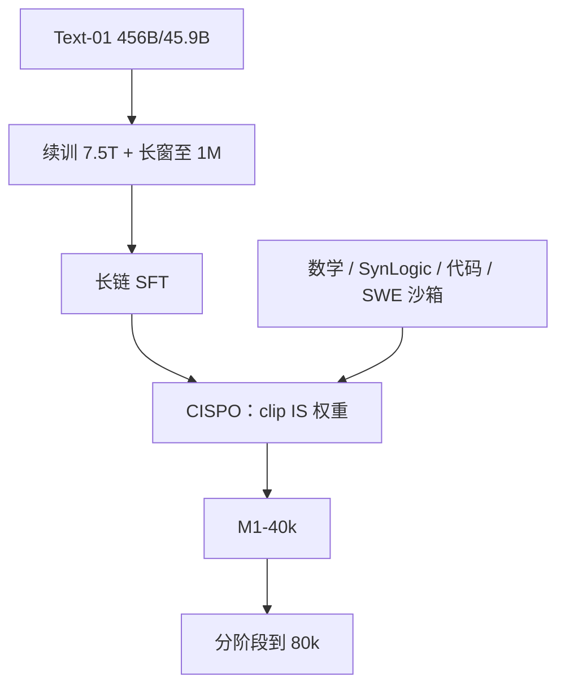

# MiniMax-M1

    
混合注意力把测试时计算从二次里解放出来；CISPO 裁的是重要性权重而不是 token 更新，让低概率的反思词继续进梯度。

    <footer>—— MiniMax，MiniMax-M1: Scaling Test-Time Compute Efficiently with Lightning Attention，arXiv:2506.13585</footer>

[MiniMax-Text-01](/llm/minimax-text01) 已经把 Lightning Attention 与 456B/45.9B MoE 做成可下载基座。**MiniMax-M1** 是在该骨干上续训再大规模 RL 的推理模型：原生 **1M** 上下文，放出 40K 与 80K 两档思维预算。相对 [DeepSeek-R1](/llm/deepseek-r1) 与 R1-0528，它要证明的不是又一个 GRPO 检查点，而是**长生成在混合注意力上可训练**，以及一套叫 CISPO 的裁剪改写。本篇按 2506.13585 写续训、算法与沙箱奖励，不重写 Text-01 的 7+1 层表。

## 问题

推理模型把测试时计算当成缩放轴：生成越长，竞赛与代理任务越好。纯 softmax Transformer 上，前填与 RL rollout 的 FLOPs 随长度二次涨。R1 类模型把思维拉到数万 token 时，墙钟被注意力打穿；再叠软件工程轨迹（仓库级输入），1M 上下文几乎不可训。需要一种已经在基座上验证过的线性核，把 64K–100K 生成的相对 FLOPs 压下来，才谈得上「开源权重里的长思维 RL」。

第二条缺口是算法。作者在混合架构的 zero-RL 里发现：PPO / [GRPO](/llm/grpo) 的 **token 级 clip** 会把「However / Wait / Aha」一类低概率分叉词在第一次 on-policy 更新后裁掉，后续 off-policy 步再也看不到它们。长链的反思依赖这些词；[DAPO](/llm/dapo) 把上裁剪抬到 $1+\varepsilon_{\mathrm{high}}$，在他们 16 轮 off-policy 的设置里仍不够。

### 开源权重里几乎没有混合注意力的大规模 RL

报告称 M1 是当时**首个**开源的大规模混合注意力推理模型。闭源里腾讯混元 T1 用过 Mamba，细节很少。Text-01 证明了榜上能打，没有证明在 RL 的训练/推理核不一致时奖励还能涨。M1 的工程问题因此是双重的：算法要保住探索 token，内核要把训练对数概率与推理对数概率对齐。

「相对 R1 在 100K 生成长度上约 25% FLOPs」是报告的理论曲线，对照对象是当时的 DeepSeek-R1 注意力账，不是 0528 的实测延迟。服务 SLA 仍受 softmax 那 1/8 层与 MoE 通信限制。

## 方法

**数据与冷启动。** 从 Text-01 继续预训练 **7.5T** token：提高解析召回，**不用合成**抽取自然 QA，语义去重，STEM / 代码 / 书 / 推理约占 **70%**。学习率先 $8\times 10^{-5}$ 恒定 2.5T，再 5T 衰减到 $8\times 10^{-6}$。长窗分四段从 32K 推到 **1M**，避免混合核上过猛拉长导致梯度爆炸。随后 SFT 注入带反思的长链，数学与代码约占 60%，作为 RL 的行为先验。

**CISPO。** 组相对优势仍用 GRPO 的均值–方差；损失改成 token 级（与 DAPO 相同）。不 clip 策略比率本身，而 clip **stop-gradient 后的重要性权重**，再乘 $\hat A\log\pi$：

$$
\hat r_{i,t}=\mathrm{clip}\bigl(r_{i,t}(\theta),\,1-\varepsilon^{\mathrm{IS}}_{\mathrm{low}},\,1+\varepsilon^{\mathrm{IS}}_{\mathrm{high}}\bigr),\qquad
\mathcal{J}_{\mathrm{CISPO}}\propto \sum_{i,t}\mathrm{sg}(\hat r_{i,t})\,\hat A_{i,t}\log\pi_\theta(o_{i,t}\mid \cdot).
$$

实验里下界放得很宽，主要调 $\varepsilon^{\mathrm{IS}}_{\mathrm{high}}$。不加 KL。沿用 DAPO 的动态采样与超长惩罚。在 Qwen2.5-32B 的对照上，CISPO 达到 DAPO 同水平约只需一半步数。

**混合核上的 RL 修补。** 训练核与推理核的 token 概率一度错开（相关约 0.9x），奖励不涨；把 LM head 提到 **FP32** 后相关到约 0.99。AdamW 因梯度跨 $10^{-18}$–$10^{-5}$ 且相邻步弱相关，改为 $\beta_2=0.95$、$\epsilon=10^{-15}$（默认 VeRL 的 $10^{-8}$ 会不收敛）。若连续 3000 个 token 概率都 $>0.99$，提前截断，打断重复环。

### 可验证环境与 40K→80K

可验证域：竞赛数学约 50K（pass@10 严格在 $(0,0.9)$）、SynLogic 合成的 41 类逻辑约 53K、竞赛编程约 30K，以及从 GitHub issue/PR 搭的 SWE 沙箱（测试执行当奖励）。不可验证域约 25K，用生成式奖励模型；对长链的长度偏置做在线监测，避免 GenRM 奖励冗长。课程：先规则奖励，再混入通用任务。

40K 跑通后，用该策略筛更难题，分阶段把生成窗扩到 48K … **80K**。后期负样本先顶满窗口，token-level 损失会在后半段堆过大负梯度；对策是重复检测、样本级与 token 级损失并用、降低梯度裁剪与 $\varepsilon^{\mathrm{IS}}_{\mathrm{high}}$。完整 RL：512×H800、约三周、租卡约 **53.47 万美元**。权重在 GitHub / Hugging Face，vLLM 与 Transformers 可跑。

## 机制

Lightning 层把通道混合做成对长度近线性，softmax 层保留针检索。RL 的 rollout 是长度税最高的一段，线性核直接变成**可负担的测试时缩放**。CISPO 的机制相反：PPO clip 在比率过大时把该 token 的梯度**丢掉**；把 clip 移到 IS 权重上，低概率分叉词仍贡献 $\log\pi$ 梯度，只是权重被截断，熵不至于塌成「只会说稳妥词」。这与 DAPO 的 Clip-Higher 同病：都在救探索，但 CISPO 不依赖「放宽上剪仍可能被 clip 掉」。

报告对照表把 DS-R1 写成 R1-0528 的输入 128K / 输出 64K，M1-80k 为输入 1M / 输出 80K。比的是窗口产品规格，不是同一套评测 harness 下的 FLOPs 实测。

### 沙箱奖励把「推理」从竞赛里拉出来

数学与 Codeforces 仍是规则核对；SWE 环境用真实测试失败/通过，迫使策略学习定位、补丁与回归，而不是只写竞赛函数。这是相对 R1 公开叙述最清楚的任务差分。GenRM 段承认长度黑客：离线对抗不够，必须在 RL 过程中看策略是否靠变长刷分。课程先可验证后开放，避免写作 RM 过早污染数学探索。

## 边界与工程取舍

数学与 LiveCodeBench 上 M1-80k 低于 R1-0528（报告表：AIME 2025 76.9 vs 87.5；LiveCodeBench 65.0 vs 73.1），强项在 SWE-bench Verified（约 56 vs Qwen3-235B 的 34.4）、工具（TAU-Bench）与长上下文（OpenAI-MRCR 128k / 1M）。不要用「开源推理 SOTA」一句话抹平这张表。40k 是 80k 训练的中间相，不是另套数据。

混合核的训练/推理不一致是真实失败模式：小稠密 softmax 模型上可能看不到，M1 上会让奖励曲线假死。复现 CISPO 却仍用 PPO clip，救不了他们记录的分叉词问题。SynLogic 在 80K 阶段要降采样，否则重复模式会毁长窗 RL。

CISPO 因 clip IS 权重，梯度相对无偏 REINFORCE **略有偏**。作者接受这笔偏差，换「所有 token 都在」。不要把它写成对 GRPO 的无偏修正——那是 [Dr. GRPO](/llm/dr-grpo) 的叙事。

### 何时不必上 M1

短上下文聊天、没有 1M 输入，混合注意力的服务栈成本可能高于纯 Transformer 生态。只要竞赛数学、要 0528 的 AIME，选错检查点。没有 SWE 沙箱却想「复现 M1」，只能复现 CISPO 的数学消融，复现不了软件工程那段奖励。

## 小结

- M1 在 Text-01 的 Lightning + MoE 上续训 7.5T，再 CISPO RL；原生 1M 输入，放出 40K / 80K 思维档。
- CISPO 裁重要性权重、保留全部 token 梯度；对照 Qwen2.5-32B 上相对 DAPO 约 2× 步数效率。
- 混合核 RL 要修 LM head 精度、Adam $\epsilon$ 与重复截断，否则奖励不涨。
- 数据含数学、41 类逻辑、竞赛代码与 SWE 执行奖励；长窗阶段需降采样合成逻辑。
- 竞赛弱于 R1-0528，长上下文与工具更强；完整 RL 约 512×H800 三周。
- 出处：MiniMax，*MiniMax-M1*，arXiv:2506.13585；基座见 *MiniMax-01*，arXiv:2501.08313。
