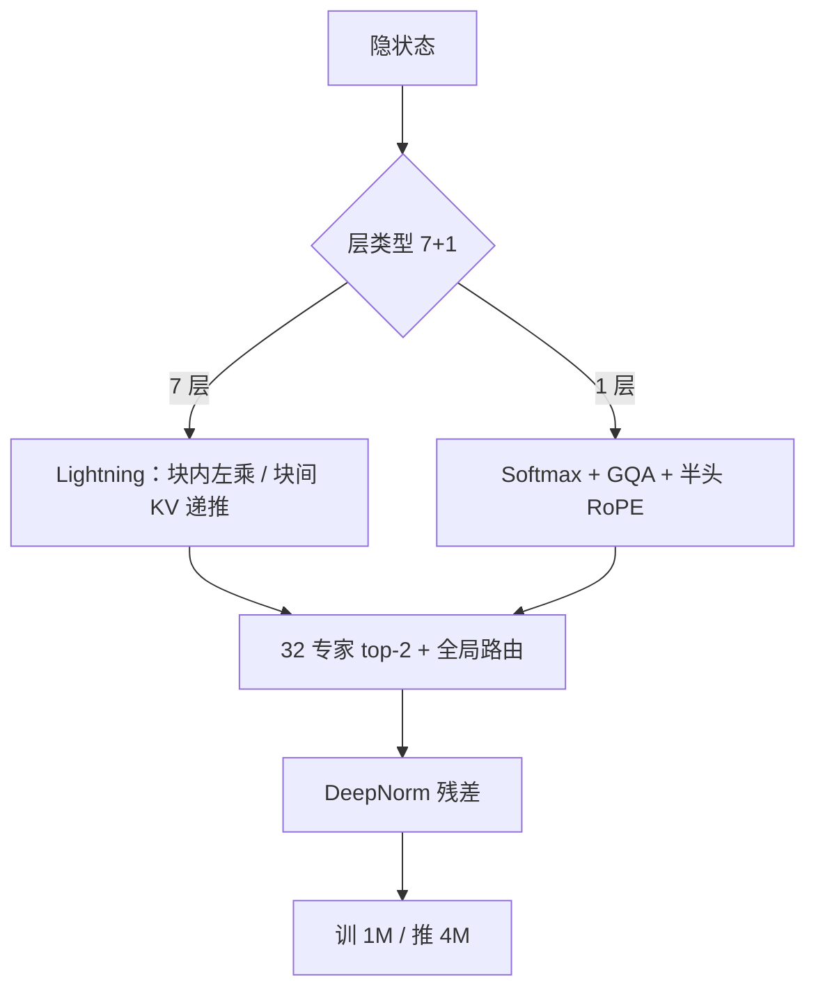

# MiniMax-Text-01 / MoE

每七层 Lightning Attention 跟一层 softmax 注意力；再叠 32 专家 MoE，总参 4560 亿、每 token 激活 459 亿，训练窗口到 100 万、推理可外推到 400 万。

<footer>—— MiniMax，MiniMax-01: Scaling Foundation Models with Lightning Attention，arXiv:2501.08313</footer>

线性注意力在论文里出现了很多年，商业级稠密 / MoE 模型却几乎不用：因果语言建模里的 cumsum 不好并行，检索型任务上又怕短程精度。2025 年 1 月 MiniMax 把 **MiniMax-Text-01** 写成第一档主要依赖线性注意力、却仍在常规榜上对标 GPT-4o / Claude 3.5 Sonnet 的开源权重模型。配套 VL-01 用 512B 图文 token 续训，本篇只写文本骨干与 MoE。

## 问题

把上下文从 128K 再乘十几倍，softmax 注意力的 $n^2$ 比 GPU 峰值涨得快。I/O 友好的 FlashAttention 把 8K–128K 做进了产品，但百万 token 前填延迟仍按二次走。稀疏窗、SSM、线性 RNN 在中小规模有数，缺的是「千亿总参、可服务、长上下文掉点慢」的存在性证明。

约束是机架而不是理论：8 卡、640GB、8-bit 量化下要能跑超过 1M token。总参因此被钉在 **456B**，激活 **45.9B**，32 专家。若整网都用线性核，针检索会弱；若整网 softmax，1M 训不起。需要一个可实现的混合比。

### 7+1 混合，softmax 层才用 GQA

80 层。每 7 个 TransNormer 式 Lightning 层后接 1 个 Transformer 式 softmax 层。注意力 64 头、头宽 128；softmax 层用 [GQA](/llm/gqa) 组大小 8。RoPE 只加在头宽的一半上，基频 10000。隐宽 6144。MoE 替换 FFN：32 专家、**top-2**，专家 FFN 隐宽 9216。DeepNorm 稳定残差。Lightning 是 TransNormer 的 I/O 友好实现：块内走左乘（带因果掩码的 $QK^\top V$），块间走右乘递推 $KV_t=KV_{t-1}+k_tv_t^\top$，避开整段 cumsum。

「线性复杂度」指通道混合在 $n$ 上是 $O(nd^2)$ 而不是 $O(n^2d)$。softmax 那 1/8 层仍是二次。服务延迟曲线介于纯线性与纯 Transformer 之间；不要按 80 层全线性去报前填 SLA。

## 方法

MoE 用 token-drop：每个专家有容量上限，超额丢弃。负载用 GShard 式辅助损失，再加 **global router**：在专家并行组之间 allgather 各专家待处理 token 数，减少一组过载、另一组空转。相对「2B 激活 / 24B 总参」的 MoE 与 7B 稠密的 isoFLOP 对照，报告称同计算预算下 MoE 在 HellaSwag 等下游更好，用来证明稀疏 FFN 值得叠在线性注意力上。

长上下文不是一上来 1M。三阶段把窗口扩到训练 1M；推理宣称可到 4M。并行栈为线性注意力重写：MoE 用专家并行加 **Expert Tensor Parallel** 降 all-to-all；变长 ring attention；LASP+ 做线性核的序列并行。推理 CUDA 核在 H20 上端到端 MFU 宣称超过 75%。预训练强调清洗、基于奖励的质量加权、配比，以及重复感知的测试。对齐用多阶段、多奖励维，尤其照顾长上下文与真实场景。

$$
\mathbf{O}=\mathrm{Norm}\big(\mathbf{Q}(\mathbf{K}^\top\mathbf{V})\big)
$$

因果情形下右乘要变成带掩码的递推；Lightning 的分块把短块内二次与块间线性拼起来，使训练可并行、复杂度仍随 $n$ 线性主导。

## 机制

线性核把「当前 query 对历史的混合」收成对压缩状态 $K^\top V$ 的读取，历史长度进常数大小的矩阵而不是 $n\times n$ 表。块内左乘保留短程精确因果，避免纯递推在块内失去并行。每隔七层插入的 softmax 层重新引入内容寻址：针、引用、精确复制走这里。7:1 是报告用实验挑的配比，不是理论最优；更稀的 softmax 会伤检索，更密则前填账单回到 Transformer。

MoE 把宽度从激活里解开：45.9B 激活要能进 8 卡 8-bit 的 1M 服务，456B 总量提供专家专项。top-2 比 Llama 4 Maverick 的 $k=1$ 更细，路由通信也更贵，因此才需要 ETP 与全局路由。token-drop 换吞吐，代价是过载专家上的梯度被丢——全局路由是为把丢弃率从「局部 batch 噪声」降下去。

RoPE 只旋一半头宽，是长上下文里常见的折中：留若干通道不背相位，减轻外推卷绕。不要按「每层全头 RoPE、基频 1M」去套 YaRN 配方。

### 和纯 Transformer 长上下文、和 SSM

FlashAttention 长窗模型在 32K–256K 仍是默认质量锚；MiniMax-01 的卖点是超过 200K 之后 RULER 掉点更慢、前填延迟更接近线性。它不是「softmax 已死」：那 10 层 softmax 是精度锚。Mamba 一类 SSM 把状态写进时不变或输入相关的递归，MiniMax 仍用注意力接口（QKV + 门控），内核与 MoE 通信栈可以复用更多 Transformer 工程。不要把 Lightning 写成 FlashAttention 的别名。

## 边界与工程取舍

开源权重在 GitHub `MiniMax-AI/MiniMax-01`。线性核 + 变长 ring + ETP 不是 vLLM 默认路径，要用他们的推理栈或自己接核，否则 1M 只存在于配置文件。8-bit 1M 的「单机 8 卡」是设计约束，不是消费级笔记本故事。VL-01 的 512B 续训与四阶段视觉课程不在 Text-01 的下一词损失里。

### 1M 训练窗口不是配置里改一个数字

三阶段扩窗要把优化器、并行切分与数据长度一起改。变长 ring 减少计算冗余，LASP+ 把线性核的序列并行吃满；softmax 那一层仍要按二次通信付费。若只把 `max_position_embeddings` 写成 1M、内核仍是 FlashAttention 满核，前填会先于质量掉点爆掉。4M 推理是外推主张，中间每一档要自己测针与 NLL。token-drop 使训练与 dropless 实现的数值对不齐。辅助损失系数与容量因子以发布配置为准，正文没有写成可逐项复现的超参表。

对标 GPT-4o / Claude 3.5 是报告自测加内部真实场景集；第三方 Arena 不是论文主表。RULER 上超过 200K 的优势，不能用来证明 8K 短聊天也全面超过同激活量的稠密模型——短窗上 softmax 层占比固定，线性核的吞吐优势还没展开。开源权重给的是可跑通的检查点，不是把 H20 上 75% MFU 的内核自动装进每一套推理框架。VL-01 的 512B 图文续训与四阶段视觉课程要另文写，不要并进 Text-01 的下一词损失。

出处 arXiv:2501.08313。不要把后续 MiniMax-M 系列或未开源的内部线性核变体写进 Text-01。45.9B 激活决定算力，456B 决定装载；按激活量买 GPU 会低估专家驻留。

## 小结

- MiniMax-Text-01 为 456B 总参 / 45.9B 激活的 32 专家 top-2 MoE，80 层 7+1 混合注意力。
- Lightning Attention 用分块把线性核做成可并行训练；softmax 层保留精确检索，并用 GQA。
- 训练上下文 1M，推理宣称 4M；并行含 ETP、varlen ring、LASP+。
- 设计钉在 8 卡 640GB 8-bit 服务 1M，而不是再堆稠密 70B。
- 出处：MiniMax，*MiniMax-01: Scaling Foundation Models with Lightning Attention*，arXiv:2501.08313，2025。
