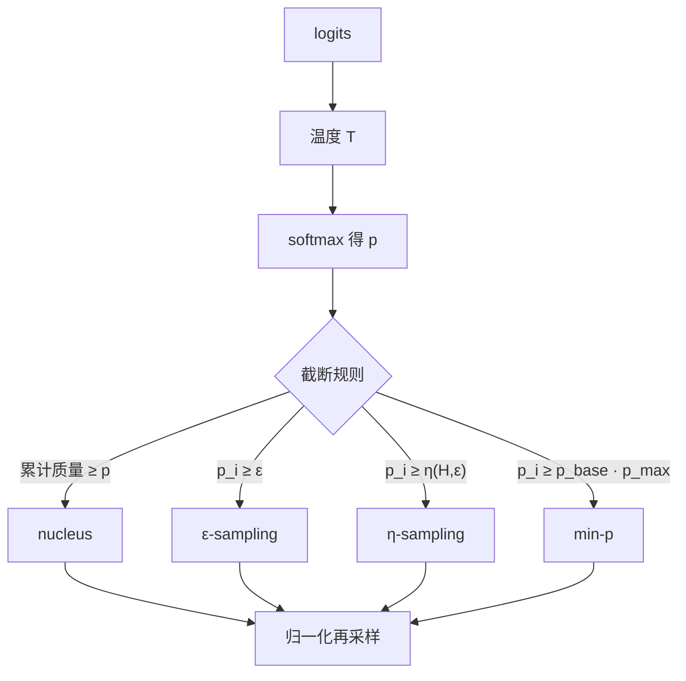

# Min-p / Typical / η-sampling

    
截断采样可以看成对语言模型过度平滑的反向操作：先丢掉过小的原子概率，再在剩下的支撑上归一化，比固定核质量更能跟上每一步的置信度。

    <footer>—— Hewitt, Manning & Liang, Truncation Sampling as Language Model Desmoothing, 2022；Min-p 见 Nguyen et al., 2024</footer>

开放生成里，下一步的条件分布很少是「一个高峰加均匀噪声」。模型有时几乎确定下一个词，有时在几个近义续写之间摊平。Holtzman 的 nucleus 用累计质量 $p$ 切核，截断宽度不看峰有多尖。Hewitt 等人把截断写成去平滑：绝对地板 $\varepsilon$ 与随熵浮动的 $\eta$ 都是在删掉「模型自己也不信」的原子。Nguyen 等人的 min-$p$ 把地板改成与当前最大概率成比例。三者同属截断族，不是另一种束搜索。信息论上按熵距离取核的做法见 [Locally Typical Sampling](/llm/locally-typical)；本篇只写相对峰高与相对熵的截断。

## 问题

语言模型在词表上给出的 $p(\cdot\mid x_{<t})$ 被训练成处处为正。长尾里有大量语法尚可、语义无关的 token，它们的对数概率并不低到能被温度单独压死。Holtzman 等人已经说明：贪心与束会退化成重复，从未经截断的分布里采样又会抽到长尾胡话。Nucleus 的对策是取最小集合使其概率和达到 $p$，再归一化。这一集合的基数随分布形状变：高峰时可能只剩两三个 token，平坦时可能上百。它不保证「比最大项小两个数量级的质量被切掉」——若头部有十个近乎等概率的词，核会把它们全留下，这是合理的；若头部一个 $0.92$、其余碎成几千份，核仍可能为凑满 $p$ 而吞进许多碎块。

绝对地板更直白：概率低于 $\varepsilon$ 的 token 直接丢掉。困难在于 $\varepsilon$ 是跨步共享的标量。模型自信时 $p_{\max}$ 接近 $1$，$\varepsilon=10^{-4}$ 几乎只切真正的噪声；犹豫时 $p_{\max}$ 只有 $0.15$，同一个 $\varepsilon$ 可能把所有候选取消，或几乎切不到。需要一种随当前分布自适应的地板，而不是再调一个与 nucleus 平行的全局 $p$。

### 平滑、温度与截断不是同一旋钮

温度 $T$ 把 $\mathrm{softmax}(z/T)$ 的锋利程度整体拉开或压平，不删除支撑。Nucleus 与 top-$k$ 删除支撑再归一化，改变的是样本空间。Hewitt 等人的论点是：训练目标与标签平滑、词表过大，都会把质量摊到不该出现的 token 上；截断是在推理时把这层平滑Undo 掉。$\varepsilon$ 与 $\eta$ 针对原子概率，$\min$-$p$ 针对相对峰高。把温度调到 $1.2$ 再叠一层固定 $p=0.9$ 的核，解决不了「这一步很尖、下一步很平」的逐步差异。自适应地板要回答的正是这个逐步差异。

Nucleus 不是 typical 的别名。Nucleus 按概率从大到小累加；typical 按与熵的距离排序。$\eta$ 与 min-$p$ 都不排序累加，只设一条水平线。三条线切出来的集合可以相交，但包含关系不成立。

## 方法

记当前步 $p_i=p(v_i\mid x_{<t})$，$p_{\max}=\max_i p_i$，熵 $H=-\sum_i p_i\log p_i$（约定 $0\log 0=0$）。

$\varepsilon$-sampling 的支撑是 $\{i:p_i\ge\varepsilon\}$，细节与去平滑解释见 [Epsilon sampling](/llm/epsilon-sampling)。$\eta$-sampling 把地板改成

$$
\eta=\min\bigl(\varepsilon,\,\sqrt{\varepsilon}\,\mathrm{e}^{-H}\bigr),
$$

再取 $\{i:p_i\ge\eta\}$。熵高时 $\mathrm{e}^{-H}$ 小，地板下降，避免把平坦分布切空；熵低时地板被 $\varepsilon$ 卡住，避免高峰旁的碎质量混进来。实现上先算熵与 $\eta$，再掩码、再归一化、再采样。

Min-$p$ 不显式用熵。超参 $p_{\mathrm{base}}\in(0,1)$ 给出相对地板

$$
\tau = p_{\mathrm{base}}\cdot p_{\max},
$$

支撑为 $\{i:p_i\ge\tau\}$。$p_{\max}=0.9$、$p_{\mathrm{base}}=0.1$ 时 $\tau=0.09$，只留与冠军同量级的候选项；$p_{\max}=0.2$ 时 $\tau=0.02$，低置信度步留下更宽的核。Nguyen 等人强调它在高温下仍能保持连贯：温度把分布拉平后，$p_{\max}$ 下降，门槛跟着下降，创造空间不被固定 nucleus 一次切死。

### 与 nucleus、top-$k$ 的切法对照

Nucleus 排序后累加到质量 $p$，集合大小由质量预算决定。Top-$k$ 集合大小固定，不管峰有多尖。Min-$p$ 与 $\eta$ 的集合大小都是数据依赖的，但判据不同：前者比的是「相对冠军」，后者比的是「相对 $\varepsilon$ 与平均信息量」。高峰且长尾细碎时，min-$p$ 通常比 nucleus 更狠；多峰近平局时，min-$p$ 的 $\tau$ 低，接近少截断，nucleus 仍按 $p$ 收核。Top-$a$ 用 $p_{\max}$ 的平方做地板，形状更陡，见 [Top-a](/llm/top-a-sampling)。

工程上这些截断都是 logits 处理器：在 softmax 之后或等价地对低于门槛的 logit 置 $-\infty$。与温度的顺序要固定：先温度再截断，或先截断再温度，对应两种分布，评测必须写明。与 [重复惩罚](/llm/repetition-penalty) 叠用时，惩罚先改 logit，再进入 $p_{\max}$ 或熵的估计，否则门槛看到的不是采样真正使用的分布。

## 机制

去平滑的直觉是：模型把本该是零的概率做成很小的正数，截断把这些正数打回零。$\varepsilon$ 是与位置无关的绝对噪声地板。$\eta$ 承认「噪声」应随这一步有多不确定而变：高熵意味着模型认为许多 token 都合理，地板应当降低，以免误杀；低熵意味着模型已经把质量集中，地板应当至少保持 $\varepsilon$，以免长尾回流。指数 $\mathrm{e}^{-H}$ 来自把平均概率尺度 $\mathrm{e}^{-H}$ 与 $\varepsilon$ 做几何折中，Hewitt 文中的 $\sqrt{\varepsilon}$ 是一条经实验固定的配合系数，不是信息论定理里的唯一选择。

Min-$p$ 用 $p_{\max}$ 当置信度代理。尖峰时 $p_{\max}$ 大，相对门槛高，行为接近「几乎贪心但允许近义词」；平坦时 $p_{\max}$ 小，相对门槛低，行为接近温度采样。它不需要额外的熵扫描，只多一次求最大——在词表 $10^5$ 量级上与 softmax 相比可忽略。与 typical 的差别在于：typical 会丢掉过尖的头部（信息量低于熵太多的那些「太可预测」的 token），min-$p$ 与 $\eta$ 都保留头部，只砍尾巴。若任务要避免套话，应看 Meister 的局部典型集，而不是把 min-$p$ 调得更小。

### 高温与自适应地板

固定 nucleus 在 $T>1$ 时常常要么仍然过窄（核质量不够覆盖被温度摊开的头部），要么为了覆盖而把 $p$ 调到接近 $1$，等于放弃截断。Min-$p$ 的卖点是同一 $p_{\mathrm{base}}$ 在高温下自动放宽。这不是免费的多样性：放宽之后长尾会回来，胡话率仍随 $T$ 上升，只是上升得比「高温 + 固定 $p=0.9$」更可控。$\eta$ 同样在高熵时放宽，但驱动信号是熵而不是 $p_{\max}$。双峰分布可以有中等熵、却有很高的 $p_{\max}$（若一峰略高），此时 min-$p$ 与 $\eta$ 的支撑会分叉——这是调参时要对着具体模型看的现象，不是实现 bug。

$p_{\mathrm{base}}$ 不是 nucleus 的 $p$。$0.1$ 的 min-$p$ 在 $p_{\max}=0.8$ 时门槛是 $0.08$，可能只留数个 token；nucleus $p=0.1$ 几乎总是过窄。不要把社区博客里的「0.1」跨算法抄参数。

## 边界与工程取舍

自适应截断改变的是每步支撑，不提供序列级的重复控制，也不提供结构约束。停用与文法仍要另接 [stop sequences](/llm/stop-sequences) 与约束解码。投机解码若要保持目标分布，草稿与目标必须使用同一套截断；只在目标上做 min-$p$、草稿上做 nucleus，接受率与无损证明都会坏，见 [投机采样](/llm/speculative-sampling)。

$\eta$ 依赖熵，需要对有效支撑求和，数值上应在截断前用原来的 $p$ 算 $H$，不要用已经掩码的分布再算一遍门槛，否则门槛与定义不一致。极小概率的 token 对熵贡献弱，但 $\log$ 要用稳定实现。词表含大量从未出现的字节级碎片时，$\varepsilon$ 与 min-$p$ 通常比 top-$k$ 更稳，因为 $k$ 很难同时适合中文单字与英文 BPE 碎片。

服务默认值不要三套齐开。Min-$p$ 与 nucleus 同时生效时，最终支撑是交集，有效核可能被切空，实现必须处理「支撑为空则回退到 $\arg\max$」这类退化。评测开放生成质量时，把 $T$、min-$p$、$p$、$\varepsilon$ 写成协议的一部分，否则「同一个模型更会讲故事」无法复现。

出处以 Hewitt et al. 2022 的 $\varepsilon$/$\eta$ 与 Nguyen et al. 2024 的 min-$p$ 为准。Hugging Face `typical_p` 实现的是 Meister 的局部典型采样，不要在本篇参数表里把 `typical_p` 当成 $\eta$。

## 小结

- Nucleus 按累计质量切核；$\varepsilon$ 按绝对概率切尾；$\eta$ 让地板随熵变；min-$p$ 让地板随 $p_{\max}$ 变。
- 四者都是逐步截断再归一化，目标是去掉过度平滑的长尾，而不是近似 MAP。
- $\eta=\min(\varepsilon,\sqrt{\varepsilon}\,\mathrm{e}^{-H})$ 在高熵时放宽、低熵时至少保持 $\varepsilon$。
- Min-$p$ 用 $\tau=p_{\mathrm{base}}p_{\max}$，高温下门槛随峰值下降，比固定核质量更跟得上置信度。
- Typical 按与熵的距离取核，可能丢掉过可预测的头部，与只砍尾巴的 min-$p$/$\eta$ 不是同一集合。
- 与温度、重复惩罚、投机校验叠用时，必须以同一分布估计门槛，避免空支撑与无损证明失效。
- 出处：Hewitt et al., *Truncation Sampling as Language Model Desmoothing*, 2022；Nguyen et al., *Turning Up the Heat: Min-P Sampling*, 2024。Nucleus 对照见 Holtzman et al., ICLR 2020。
