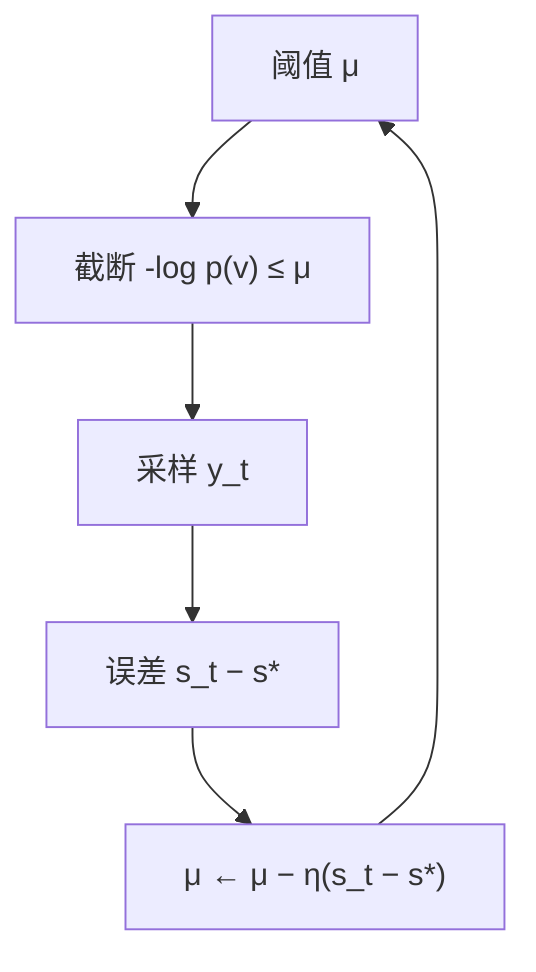

# Mirostat 困惑度控制

    
把目标惊奇度当作设定值，用每步实际信息量做误差，自适应地收紧或放宽截断：生成过程本身变成一个控制困惑度的回路。

    <footer>—— Basu, Ramachandran, Keskar & Devlekar, Mirostat: A Neural Text Decoding Algorithm that Directly Controls Perplexity, 2021</footer>

Nucleus 与温度给出的是逐步形状，不给出序列的平均信息量。同一 $p=0.9$ 在尖峰步几乎贪心，在平坦步仍很宽，整段文本的交叉熵会随模型状态漂。Basu 等人的 Mirostat 把解码写成反馈控制：选定目标惊奇度 $s_*$（因而目标困惑度 $2^{s_*}$），每步根据当前估计截断词表、采样，再用观测到的 $-\log p(y_t)$ 去修正截断阈值。它直接打 Holtzman 指出的退化——重复会把惊奇度压得过低，回路会放宽或改门槛把惊奇度拉回设定值。本篇写这个回路与 top-$k$ / nucleus 的差别，以及它不能当校准器的边界。

## 问题

困惑度是 $\exp$ 或 $2$ 为底的平均负对数概率，衡量模型对样本有多「意外」。开放生成里，人写的续写落在一个中等惊奇带：太低是套话与循环，太高是胡话。Holtzman 的 nucleus 用核质量近似这个带，但质量预算不是惊奇度预算——核里可以全是高概率重复，平均惊奇仍然过低。温度全局改变锋利程度，同样没有逐步误差反馈。若想让 *写出的那一条* 的平均 $-\log p$ 靠近某个常数，需要根据已经发生的误差改下一步的支撑或温度。

控制问题由此成立：被控量是逐步惊奇 $s_t=-\log_2 p(y_t\mid x_{<t})$ 或其滑动均值，执行器是截断阈值（或等价的 $k$），设定值是 $s_*$。难点是 $p$ 每步都在变，执行器与被控量之间没有固定线性增益，普通 PID 的积分项会在模型进入新话题时过冲。Mirostat 用很短的记忆和显式的阈值更新，而不是在整段上解约束优化。

### 惊奇度、熵与 typical

当前分布的熵 $H_t$ 是 *期望* 惊奇；采样结果的 $-\log p(y_t)$ 是 *实现* 惊奇。Nucleus 不看这两者的差。Meister 的 [局部典型采样](/llm/locally-typical) 每步把支撑取在 $|-\log p(v)-H_t|$ 小的那些 token 上，追求逐步典型，也不保证序列平均收敛到预设 $s_*$。Mirostat 的设定值可以高于或低于当前熵：若 $s_*$ 高于典型熵，回路会倾向更宽、更意外的 token；若低于，会倾向更可预测。它与 typical 都反对「只要头部质量」，但一个是闭环设定值，一个是开环几何。

这里的困惑度是解码器对 *自己样本* 的交叉熵，不是验证集上的模型选择指标。把 Mirostat 的 $s_*$ 调到接近验证 PPL，并不意味生成质量接近验证数据，只意味着样本的自信息量被钉住。

## 方法

Mirostat 1 维护对幂律尾指数的估计，据此解出一个 top-$k$，使在该 $k$ 下采样的期望惊奇接近 $s_*$，再更新指数。实现更常见的是 Mirostat 2：直接维护一个最大惊奇阈值 $\mu$。每步将词表截成

$$
\{v: -\log_2 p(v\mid x_{<t}) \le \mu\},
$$

归一化后采样得到 $y_t$，观测 $s_t=-\log_2 p(y_t\mid x_{<t})$（在截断前的 $p$ 或截断后的条件分布上计算，实现必须固定一种），再

$$
\mu \leftarrow \mu - \eta\,(s_t - s_*),
$$

其中 $\eta$ 是学习率。惊奇高于设定则降低 $\mu$、下一步更狠地切尾；低于设定则提高 $\mu$、允许更意外的 token。$\mu$ 有上下界，以免一步把支撑切空或放开到全词表。$s_*$ 常用 $3$–$6$ bit 量级，对应困惑度大约 $8$–$64$，需按模型与语言扫。

采样仍可叠温度，但温度会改变 $p$ 因而改变 $s_t$ 的尺度，应把 $T$ 视为回路的一部分而不是事后装饰。与 nucleus 同时开时，有效支撑是交集，控制器看到的误差不再对应它所假设的执行器，闭环会失谐。

## 机制

重复圈的逐步 $p(y_t)$ 极高，$s_t$ 接近 $0$。误差 $s_t-s_*$ 为负，更新使 $\mu$ 上升，下一步允许信息量更大的 token，有机会跳出圈。胡话步 $s_t$ 很大，$\mu$ 下降，尾巴被切掉。这是相对 Holtzman 退化的直接对策：被控量正是退化时塌掉的那个量。它不看隐状态是否塌缩，若模型用近义词维持低惊奇，字面不重复，$s_t$ 仍低，回路会继续抬 $\mu$，直到抽出更意外的续写——主观上像突然换话题。

### 控制增益与稳态误差

$\eta$ 过大则 $\mu$ 振荡，文本在套话与跳跃之间抖；过小则需要很多 token 才离开重复，开头几句仍会退化。没有积分项时，若模型熵长期低于 $s_*$，稳态会停在「$\mu$ 顶到上限、仍然不够意外」，表现为放开截断仍平庸。若熵长期高于 $s_*$，$\mu$ 打到下限，退化成近贪心。因此 $s_*$ 必须落在该模型在该任务上的熵可达区间内，不能按「越大越有创意」线性外推。这与温度一样，是模型相关的设定，不是通用创意旋钮。

截断前还是截断后计算 $s_t$，改变误差定义。用截断前的 $p(y_t)$，被控量是模型原始惊奇，阈值与 nucleus 更可比；用截断后的条件概率，重复项在小核里的 $p$ 会被放大，$s_t$ 变小，回路会更积极地抬 $\mu$。论文与 Hugging Face 实现若不一致，应以你锁定的实现为准写评测，不要混表。

Mirostat 的 $k$ 或 $\mu$ 每步都变，不能把它的「平均 $k$」拿去和固定 top-$k$ 比公平。对照实验应报达到的平均惊奇是否真的靠近 $s_*$，而不是只报 BLEU。

## 边界与工程取舍

### 结构任务与投机状态不要混用开环默认

闭环不提供事实性，也不提供多样性覆盖。Best-of-N 仍然要独立采样多条；Mirostat 一条轨迹的方差被压在惊奇轴上，其它语义轴照样可以崩。代码与 JSON 需要的是结构而不是设定困惑度，应关 Mirostat、开约束解码。低熵的确定续写（闭合括号、固定键名）会被 $s_*$ 强迫插入意外 token，这是任务不匹配，不是调小 $\eta$ 能彻底修好的。

投机解码要保持目标分布，就不能在目标侧单独跑一个依赖历史误差的 $\mu$——草稿无法在不知道 $\mu$ 的情况下给出正确的 $q$，而 $\mu$ 又依赖已接受样本。要么双方共享同一控制器状态并承认 $p$ 是 *时变截断后的* 分布，要么把 Mirostat 视为有偏采样器、放弃无损宣传。服务上 $\mu$ 是每条序列的状态，连续批必须按序列存储，不能一个 batch 一个阈值。

不要把验证集困惑度当 $s_*$ 的神谕。验证 PPL 是数据分布上的平均，生成轨迹是模型自己的分布，两者没有义务重合。调参应对着重复率、人工连贯性、以及实测平均 $s_t$ 是否跟上 $s_*$。与 [min-$p$](/llm/minp-typical) 相比，min-$p$ 开环跟 $p_{\max}$，Mirostat 闭环跟累计惊奇；同时开时两个执行器抢支撑，行为难以解释。

出处是 Basu et al., *Mirostat*, 2021。CTRL 的重复惩罚与 Holtzman nucleus 是开环基线，不要把它们的超参写成 Mirostat 的 $s_*$。

## 小结

- Mirostat 用目标惊奇度 $s_*$ 做设定值，以逐步 $-\log p(y_t)$ 为误差，自适应截断阈值 $\mu$ 或 $k$。
- 它直接控制样本的自信息量，从而对抗重复导致的过低困惑度，而不是固定核质量。
- 与局部典型采样的差别：typical 开环靠近当前熵；Mirostat 闭环靠近预设 $s_*$。
- $\eta$ 过大会振荡，过小则开头仍退化；$s_*$ 必须落在模型熵的可达区间。
- 结构确定的任务不适合把困惑度当目标；投机无损需共享控制器状态。
- 评测应核对实现的平均惊奇是否真接近设定值，不能只报下游分数。
- 出处：Basu, Ramachandran, Keskar & Devlekar, *Mirostat: A Neural Text Decoding Algorithm that Directly Controls Perplexity*, 2021。退化对照见 Holtzman et al., ICLR 2020。
