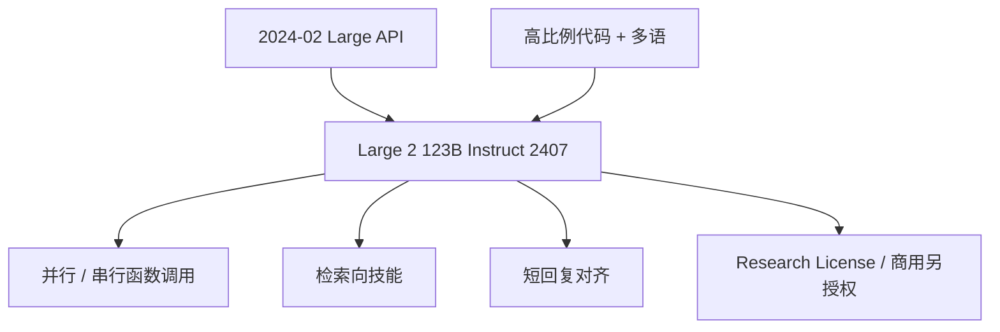

# Mistral Large

Mistral Large 2 做成 1230 亿参数、128K 窗口，目标是单节点高吞吐的长上下文应用；研究用途走 Mistral Research License，自托管商用要另购商业许可。

<footer>—— Mistral AI，*Large Enough*，2024 年 7 月 24 日</footer>

Mistral 的旗舰不是 Mixtral 那条稀疏线。2024 年 2 月先以 API 形式推出第一代 Mistral Large；同年 7 月 24 日博客 *Large Enough* 发布 **Mistral Large 2**（`mistral-large-2407`）：**稠密 123B**，Instruct 权重可下载，上下文 **128K**。官方把它放在「性能 / 服务成本」帕累托上，对照 GPT-4o、Claude 3 Opus、Llama 3 405B 的代码与推理，同时强调生成要短、要少幻觉、不会就承认。本篇以 Large 2 为主、第一代为前史，不把 Mixtral 8x22B 的 MoE 写成 Large，也不编造 Large 的 arXiv。

## 问题

开源生态在 2024 年中已经有 70B 级 Llama 3 与各种 12B 本地模型，缺的是「比 70B 明显更强、又不必上 405B 集群」的稠密旗舰，并且要能在**单节点**上跑长上下文——博客原话是 123B 的体量允许单节点大吞吐。对企业，还要把并行 / 串行 [函数调用](/llm/function-calling) 和检索当成训练目标，而不是提示词彩蛋。

第二代相对第一代 Large 的产品问题更具体：代码与数学是否拉到与当时闭源旗舰同一张图上；多语是否从「会一点」变成 MMLU 多语表上可报的一组；指令是否缩短回复。第一代以 API 为主，参数表未在同期博客写成可逐项核对的公开卡；讨论规格时应以 Large 2 的 123B 为准，不要给 2 月那一版编造一个「官方参数量」。

### 稠密 123B 而不是更大的 MoE

同一公司已有 Mixtral 8x7B / 8x22B。Large 2 明确走稠密，为的是服务形态简单：没有专家并行、没有每 token 路由抖动，量化与 Tensor 并行按一张稠密表来。代价是 123B 权重必须常驻（或流水线），不像 8x22B 那样「激活更小、总参更大」。博客把「单节点」当作设计约束，含义是：这一档不要做成必须跨多机专家并行才能 decode 的 MoE。

许可与 NeMo / 7B 不同。Large 2 是 Mistral Research License（研究与非商用）；自托管商用要 Mistral Commercial License。平台 API 另计费。不要把 Apache 2.0 写进 Large 2 模型卡。

## 方法

Large 2 支持「数十种」自然语言，博客点名法、德、西、意、葡、阿、印地、俄、中、日、韩等，以及 80+ 编程语言（Python、Java、C/C++、JavaScript、Bash 等）。预训练叙述强调**代码占比很高**，经验来自 [Codestral](/llm/codestral) 22B 与 Codestral Mamba；推理与数学上要求模型在没有把握时承认，而不是编造。函数调用训练了**并行与串行**两种：一轮多个工具，或观察结果后再调下一个。

### 官方强调的评测读法

博客给出预训练档 **MMLU 84.0%**，作为开源权重在性能/成本图上的点。代码、MultiPL-E、GSM8K、MATH、MT-Bench、WildBench、Arena-Hard 用同一套内部流水线画图，并注明部分对照来自「纸面数字」。读这些图时要当成 Mistral 自己的设定，而不是 LMSYS 官方 Arena。另一张图专门比 MT-Bench 上的**平均回复长度**：业务场景要短回复省钱，所以对齐时压长度，避免「越长越高分」的刷榜。

平台策略：通用模型收敛到 NeMo 与 Large，专用模型保留 Codestral 与 Embed。Fine-tune 在 la Plateforme 上对 Large / NeMo / Codestral 开放。云上经 Azure、Bedrock、Vertex AI、watsonx 等托管 API 提供。权重在 Hugging Face 的 Instruct 2407 仓库。

## 机制

123B 稠密的机制就是容量：世界知识与多语 MMLU 吃参数，代码吃预训练混合。128K 使合同、仓库、多文档 QA 能进同一前向，但 prefill 成本按长度二次涨，单节点「高吞吐」成立的前提是批处理与前缀缓存，而不是每个请求都从空 KV 跑满 128K。「减少幻觉」在博客里写成谨慎微调与拒答，这是后训练风格，不是检索模块内置；没有外挂文档时，模型仍可能自信地错。

函数调用把工具模式训进分布：并行调用降低多跳延迟，串行调用表达依赖。两者都要求网关忠实执行 JSON 并回传 tool 角色。模型承认「不知道」会降低某些开放问答的华丽程度，换来企业场景更少的假引文——这与 Command R 的显式 citation 不同：Large 2 强调谨慎，Cohere 强调 span 接地。

「与 GPT-4o / Opus / 405B 相当」是博客在代码与推理图上的对照句。MMLU 84.0% 是预训练档数字。不要把每一项视觉、实时知识、工具基准都说成已经持平 405B。

### 和 NeMo、Mixtral 怎么分工

[NeMo](/llm/mistral-nemo) 12B Apache，做默认可商用自托管；Large 2 做质量上限与代理引擎，许可更紧。Mixtral 用稀疏激活换容量，服务栈不同。选档时先问许可证，再问是否要 MoE 内核。后续 24.11 等 Large 点更新是版本号迭代，应以当时博客为准，不在本篇把 2407 与后续点混成一张架构表。

## 边界与工程取舍

没有公开的层数 / 头数 / 数据配比附录。Tokenizer 与 Tekken 是否全系共用，以仓库配置为准，不要从 NeMo 博客反推 Large 一定同词表。知识截止未写。第一代 Large 的 API 行为不能当 2407 权重的回归基线。自托管 123B 的 BF16 需要多卡张量并行；量化后与博客图上的排名可能变。

不要把 Large 写成视觉模型——[Pixtral](/llm/pixtral) 是 Nemo 上的视觉，Pixtral Large 是更晚的旗舰视觉，另文处理。不要伪造 arXiv。

单节点叙事对硬件的含义是：123B 用张量并行铺在一台 8 卡机器上 decode，而不是用专家并行跨机。长上下文时 KV 才是第二堵墙，128K 满窗会把「单节点高吞吐」吃回成「单请求低并发」。前缀缓存、会话复用、检索切块仍然必要。短回复对齐会让某些开放评测显得「不够能聊」；若产品要长文，应在自有偏好数据上再调，而不是抱怨 2407 没有 Arena 风格的注水长度。云托管 API 与自托管权重的内容过滤、日志与数据保留策略不同，合规上不能互相替代。

引用：Mistral AI *Au Large* / 第一代发布（2024-02）只作为 API 前史；规格与许可以 *Large Enough*（2024-07-24）为准。权重名 `Mistral-Large-Instruct-2407`。

## 小结

- Mistral Large 2（2024-07-24）是稠密 123B、128K Instruct 权重，定位单节点长上下文旗舰。
- 训练侧重代码、多语、谨慎拒答、并行与串行函数调用，并对齐短回复。
- 许可是 Research License，不是 Apache；商用自托管需商业许可。
- 第一代 Large 以 API 为主，不要给它编造公开参数量。
- 出处：Mistral AI，*Large Enough*，2024 年 7 月 24 日。
