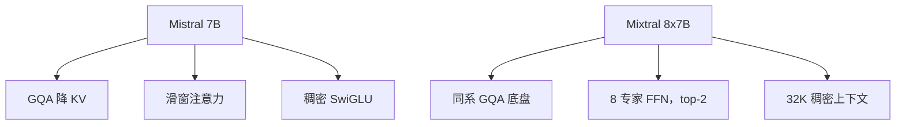

# Mistral 与 Mixtral

    
Mistral 7B 用分组查询加速解码，用滑动窗口控制任意长度上的注意力代价；Mixtral 在同一底盘上把前馈换成稀疏专家。

    <footer>—— Jiang et al., Mistral 7B, 2023；Jiang et al., Mixtral of Experts, 2024</footer>

Mistral AI 在 2023 年底用 7B 稠密模型把开源档的性价比重新标定：公开报告写明 [GQA](/llm/gqa) 加 [滑动窗口注意力](/llm/sliding-window-attention)，Apache 2.0。几个月后的 Mixtral 8x7B 把同一套注意力底盘留下，只把每层 FFN 换成 8 个专家、每 token 路由 top-2，总参约 47B、激活约 13B。本篇把稠密 7B 与稀疏 Mixtral 写成一条产品线：先解决 KV 与长序列代价，再解决「同等激活下把容量做大」。8x7B 与 8x22B 的路由细节在 [Mixtral 专文](/llm/mixtral)；这里管家族关系。

## 问题

Llama 2 7B/13B 在 2023 年是开源默认参照。Mistral 7B 的主张不是更深更宽，而是在 7B 预算内把推理两项税交掉：多头 KV 太大，全注意力随长度二次涨。GQA 降缓存，滑窗把一层的可见集钉在最近 $W$ 个 token。若只做这两项，模型仍是稠密 FFN，容量与计算绑死——要逼近 70B 的知识密度，7B 不够。Mixtral 的问题因此是：能否在几乎不增加每 token FLOPs 的前提下，把 FFN 参数乘起来，让路由在不同 token 上选不同专家。

### 稠密效率与稀疏容量是两笔账

滑窗加 GQA 改变的是注意力税：缓存字节、decode 带宽、长序列 prefill。MoE 改变的是 FFN 税：总参数可到 47B 量级，激活仍接近一个 13B 稠密模型。两笔账不要加在一起写成「Mixtral 又快又大」而不指出快的是激活、大的是磁盘与显存。服务上 Mixtral 必须把 8 份专家都放进内存（或接受专家缓存缺失），即使每步只算两份。

Mistral 7B 的滑窗在论文里与环形 KV 缓冲一起出现：缓存上界是窗口，不是生成长度。Mixtral 8x7B 报告写的是 32K **稠密**上下文，注意力侧不再以「每层都滑窗」为卖点。家族共享 GQA 与 SwiGLU，不共享「永远滑窗」这一条。读权重配置，不要假设 Mixtral 仍是 4096 窗。

## 方法

Mistral 7B（arXiv:2310.06825）为解码器 Transformer，分组查询加速推理，滑动窗口处理更长序列。窗口 $W=4096$，层叠后纸面感受野约为层数乘窗口；论文同时给出 Instruct 微调版，并强调 Apache 2.0。GQA 使 KV 头少于查询头，decode 时可加大 batch。滑窗训练与推理必须同一套掩码，否则窗口外的依赖在训练里存在、在服务里消失。

Mixtral 8x7B（arXiv:2401.04088）「与 Mistral 7B 相同，除了每层由 8 个前馈块组成」。每个 token、每一层，路由器选两个专家，输出为二者加权和。专家函数是 SwiGLU。门控取线性打分后的 top-2，再在这两维上 softmax：

$$
G(x)=\mathrm{softmax}(\mathrm{TopK}(x W_g)),\qquad k=2.
$$

未入选专家的门为 0，不必计算。注意力与嵌入仍每 token 全算，所以「13B 激活」不是 13B 稠密模型的逐层复制，而是 FFN 稀疏、其余稠密。预训练上下文 32K；Instruct 版用 SFT 加 DPO。

## 机制

滑窗把单层注意力从 $\Theta(n^2)$ 变成 $\Theta(n W)$。远距离靠隐状态接力，不是靠一层内的直接边；这与 Gemma 2「隔层全局」不同，也与 Mixtral 32K 全上下文不同。GQA 不改变分数公式，只让多组查询共享键值，质量损失通常小于 MQA。两者叠加，使 7B 在当时能打过更大的 Llama 2 稠密档——报告中的对照是 Llama 2 13B 全榜、Llama 1 34B 的数学与代码子集，数字以论文表格为准，不要口头升级成「全面超过 70B」。

Mixtral 的稀疏性只发生在 FFN。路由是 token-choice：每个位置独立 top-2，专家集合随时间步变化，所以序列在 8 个专家上的轨迹是组合式的，而不是整句锁死两个专家。论文观察到专家并不按人类可解释的语言或领域干净裂开，路由更常与位置、句法相关。负载仍可能不均，需要容量与实现层的 Megablocks 一类稀疏 GEMM，而不是假设 8 专家天然均衡。激活 13B 决定 FLOPs；47B 决定把权重装进 GPU 的门槛。

### 许可与生态为何重要

两代都走 Apache 2.0，和当时一众「可研究不可商用」的权重形成对照。vLLM 合入 MoE 核、云上用 SkyPilot 拉端点，是报告自己写进可复现路径的部分。家族策略因此是：稠密 7B 做可单卡的默认底座，稀疏 8x7B 做同许可下的容量升级，而不是另起一套词表与注意力。

「8x7B」不是 56B。共享的注意力、嵌入、归一化只算一次，8 个 FFN 也不等于 8 个完整 7B。以论文的 47B 总参、13B 激活为准。口语里的乘法只是命名。

## 边界与工程取舍

### 滑窗文档与稀疏服务不要互相顶替

Mistral 7B 的滑窗在超长文档上弱于满注意力：针测、文首约束、跨窗口指代会掉。把推理窗口改大而训练仍是 4096，属于分布偏移。Mixtral 则把内存墙从「7B 放得下」变成「47B 专家库放得下」；单卡量化可跑，但专家并行、热专家缓存、All-to-All 是另一套运维。8 选 2 组合只有 28 种无序对，细粒度 MoE（DeepSeek、DBRX）后来用更多更小专家换组合数，Mixtral 的优点是实现简单、许可干净。稠密 7B 适合本地补全与低并发聊天；稀疏 8x7B 适合同一套分词与模板下把知识容量抬一档，前提是你愿意为八份 FFN 付显存。两者都不是「把窗口改成 128K 就自动变成长文档模型」——长度能力写在训练掩码和上下文目标里，不写在品牌名里。

不要把 Mistral Large 等封闭 API 写进这篇的架构表。8x22B 没有与 8x7B 同日的长篇 arXiv 论文，规模数字以官方博客为准，细节见专文。评测对照停留在各自报告当时的 Llama 2、GPT-3.5 等，后续 Llama 3 的数字不能倒填回去。

Instruct 用 DPO 不等于基座已经会聊天。部署基座做补全、部署 Instruct 做对话，不要混用分词模板。Apache 2.0 覆盖权重再分发，仍要遵守使用方自己的数据合规，许可不是免责声明。

## 小结

- Mistral 7B：GQA + 滑窗（$W=4096$）的稠密 7B，Apache 2.0。
- Mixtral 8x7B：同系架构，FFN 改为 8 专家 top-2，约 47B 总参、13B 激活，32K 上下文。
- 注意力税与 FFN 容量税要分开算；Mixtral 快的是激活，大的是权重显存。
- 专家不必按语种专项化；路由是 token 级 top-2 加权和。
- 8x22B 与更细的路由写法见 Mixtral 专文。
- 出处：Jiang et al., *Mistral 7B*，arXiv:2310.06825，2023；*Mixtral of Experts*，arXiv:2401.04088，2024。
