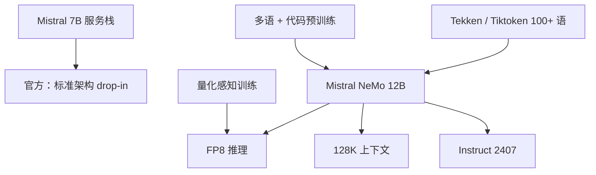

# Mistral NeMo

Mistral NeMo 是与 NVIDIA 合作的 12B 模型，上下文到 128K，走标准架构以便作为 Mistral 7B 的替换；量化感知训练使 FP8 推理不掉点。

<footer>—— Mistral AI，Mistral NeMo 发布博客，2024 年 7 月 18 日</footer>

2024 年 7 月 18 日，Mistral AI 与 NVIDIA 联合放出 **Mistral NeMo**：稠密 12B，Apache 2.0，Base 与 Instruct 都在 Hugging Face。官方把它写成尺寸档里的推理、知识与代码「当时最强之一」，并强调**标准架构**、可作为任何已部署 Mistral 7B 系统的 drop-in。真正写进博客、可核对的增量有三件：128K 窗口、面向 100+ 语言的 **Tekken** 分词器、量化感知训练后的 FP8。本篇只依据该博客与随后 Pixtral 论文对 Nemo 解码器的引用，不编造一篇 NeMo 专有 arXiv，也不把第三方评测站的层表当成官方论文。

## 问题

Mistral 7B 用 [GQA](/llm/gqa) 与滑窗把 7B 做成 2023 年底的默认底座，但窗口与多语压缩都开始不够：IDE 里的仓库级上下文、客服里的长会话、非拉丁文字的 token 税，都会把有效上下文吃短。上 70B 又失去「一张消费卡 / 单节点高并发」的位置。NeMo 要填的档位是：**12B 左右、许可仍是 Apache、上下文到 128K、并且推理栈不用为新注意力核分叉。**

NVIDIA 合作把第二条约束写死：权重要能进 NIM 容器与 TensorRT-LLM，FP8 必须在训练里见过，而不是只在推理时后训练量化。否则企业拿到的是「开源 12B」而不是「能在 H100 上按 FP8 部署的 12B」。

### 标准架构意味着什么、不意味着什么

博客原句是 relies on standard architecture，easy to use，drop-in replacement for Mistral 7B。这保证的是：解码器 Transformer、可沿用 mistral-inference / 常见服务引擎，而不是保证「每一层仍是 4096 滑窗」。后续 Pixtral 论文把 12B 多模态解码器建在 Nemo 上，并给出解码器形状表（$d=5120$，40 层，GQA 等）——那是 Pixtral 文本对 Nemo 的引用，读者应把它当交叉核对，而不是把 Pixtral 视觉模块算进 NeMo。第三方站点写「NeMo 靠滑窗撑 128K」与官方「标准架构 + 128K」并不自动等同；实现以开源 `config.json` 的 `sliding_window` 字段为准，本文不猜测。

名称里的 NeMo 来自合作方 NVIDIA 的训练 / NIM 生态，不是 Mistral 7B 的 MoE 版。它是稠密 12B。不要和 Mixtral 的稀疏专家混淆。

## 方法

公开交付：`Mistral-Nemo-Base-2407` 与 `Mistral-Nemo-Instruct-2407`，Apache 2.0；API 名 `open-mistral-nemo-2407`。上下文上限 **128K**。Instruct 经过「高级微调与对齐」，博客用 GPT-4o 作评委对照官方参考，强调指令遵循、多轮、代码相对 7B 的提升。Base 对照表放的是 Gemma 2 9B 与 Llama 3 8B 的预训练档，用来锚定「尺寸档」而不是 70B。

### Tekken 分词器

Tekken 基于 Tiktoken，在 100+ 语言上训练。相对 Mistral 早期 SentencePiece，博客给出的压缩收益是：源代码以及中文、意大利语、法语、德语、西班牙语、俄语约 **30%** 更省 token；韩语约 2×、阿拉伯语约 3×。相对 Llama 3 分词器，Tekken 在约 **85%** 的语言上更省。这不是「多语理解自动变强」：同样 128K，中文能多装 30% 的字，但语义能力仍由预训练混合决定。它改变的是账单与有效窗口。词表规模在开源配置里与 12B 嵌入矩阵绑定，换分词必须换嵌入，不能当 7B 的 tokenizer 热替换。

量化感知训练（QAT）使 FP8 推理宣称无性能损失。这对 Hopper 上的 TensorRT-LLM 路径有意义：权重量化进训练循环，避免事后 FP8 校准把 logits 打偏。是否「任意框架里的 FP8 都不掉点」，以你用的内核为准；博客保证的是他们自己的训练–推理闭环。

## 机制

12B 相对 7B，容量用来补世界知识与代码，而不是用来发明新的位置编码理论。128K 若用满注意力，prefill 是硬计算；服务上必须配合分块 prefill、前缀缓存，否则「支持 128K」只写在模型卡上。Tekken 更省 token 等于同一字符预算下注意力矩阵更小，这是多语场景里隐性的速度收益。FP8 把权重与激活的带宽砍半档，12B 更接近 7B 的部署成本，前提是硬件与内核真走 FP8。

Instruct 的函数调用在博客里点名训练过，适合接 [function calling](/llm/function-calling) 网关。它仍是生成 JSON 的语言模型，不是带沙箱的智能体。多语「特别强」的名单是英、法、德、西、意、葡、中、日、韩、阿、印地——产品语言应限制在这一组并做回归，而不是假设 100+ 分词语言都达到同一安全阈值。

Drop-in 替换 7B 时，必须换 tokenizer、聊天模板与 RoPE 上下文上限。只换权重、沿用 7B SentencePiece，会把 Tekken 词表解成乱码。这是集成事故，不是模型「多语变差」。

### 和 Gemma 2 9B、Llama 3 8B 比什么

博客把 Base 放在这两个开源对照旁边，是尺寸邻近，不是宣称支配 Gemma 2 27B 或 Llama 3.1 70B。Gemma 2 9B 有蒸馏与 8K 训练长度；Llama 3 8B 当时上下文更短。NeMo 的差异化是 **Apache + 128K + FP8 合作路径**。质量上要以博客表与你自己的任务为准，不要用第三方「SWA 撑起 128K」的故事去解释分数。

## 边界与工程取舍

没有独立技术报告意味着：层数、滑窗、精确 token 量、数据配比都不在博客里写成可复现附录。需要形状时读开源配置或 Pixtral 论文对解码器的表，并标明转引。知识截止未公布。Base 无内容审核，Instruct 的对齐深度不及封闭旗舰。

后续 [Pixtral](/llm/pixtral) 明确「文本侧对齐 Nemo、作为 drop-in」，因此视觉能力不属于 NeMo 本文。[Mistral Large](/llm/mistral-large) 是另一许可与另一规模；平台上 Nemo 与 Large 被写成两个通用档，不要把 12B 的 Apache 条款套到 Large 2 的 Research License 上。

部署上 12B 的 BF16 大约一张 24GB 消费卡吃紧，INT8 / FP8 才是博客合作叙事真正指向的档。NIM 容器与 mistral-inference 是两条栈：企业走 NVIDIA 封装，研究走 Apache 权重。函数调用模板随 Instruct 2407 的 chat template 走，沿用 7B Instruct 的工具 JSON 可能能跑，但不保证并行工具与多语槽位名仍然稳。长上下文回归应包含「前 4K 系统提示 + 尾部用户问题」的针测，避免只在短对话上宣布 128K 可用。

不要伪造 NeMo 的 arXiv 号。可引用：Mistral AI 2024-07-18 博客；权重卡片 mistralai/Mistral-Nemo-*-2407；Pixtral 12B 论文（arXiv:2410.07073）中对 Nemo 解码器的描述仅作交叉来源。

## 小结

- Mistral NeMo 是 2024-07-18 与 NVIDIA 合作的 12B 稠密模型，Apache 2.0，Base + Instruct。
- 公开卖点：128K、Tekken 多语压缩、QAT 后的 FP8、标准架构以便替换 7B。
- 分词器与模板必须一起换；128K 需要配套的 prefill 工程。
- 无官方专有 arXiv；细节以博客与开源配置为准。
- 出处：Mistral AI，*Mistral NeMo* 博客，2024 年 7 月 18 日。
