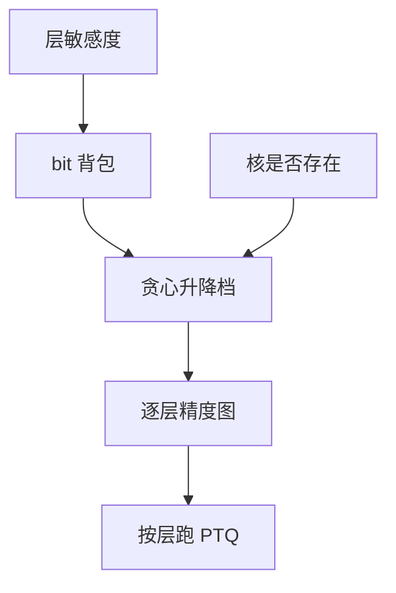

# 混合精度搜索

不是每一层都该 4-bit。把 bit 预算当成背包：敏感层买 8，迟钝层卖到 4 或 3。搜索的是分配，不是又一种格子。

<footer>—— 对照 HAWQ / HAQ 一类混合精度；层敏感度来自上一课 Hessian</footer>

[Hessian 感知](/llm/hessian-aware-quant) 给出层或通道的敏感度。本课把它变成 **bit 分配**。缺口是组合爆炸：每层 $\{3,4,8,16\}$ 四种选择，$L$ 层就是 $4^L$，不能穷举。部署上还要核支持该层精度，以及 [粒度](/llm/quant-granularity) 与 pack 格式能按层切换。[GPTQ](/llm/gptq) 常对 lm_head 留 8-bit，已是手工混精；本课写如何系统化。

## 问题

均匀全局 4-bit 简单，但 embedding、第一层、lm_head、某些注意力输出往往更疼。全局 8-bit 质量好，带宽与显存不够。混精的目标是给定平均 bit 或给定延迟预算，最小化校准损失或下游掉点。

搜索空间还包括按块、按注意力/MLP、按 KV vs 权重。KV 混精是服务旋钮，与权重量化不是同一背包，但共享「敏感度」思想。问题是 **代理指标必须便宜**，否则搜索比量化还贵，PTQ 意义消失。

HAQ 用强化学习搜视觉网 bit；LLM 上更常见启发式：Hessian 迹排序 + 贪心填背包，或只手工保护几类层。RL 搜索不是必须。

## 方法

代理：层输出 MSE、校准 CE、Hessian 迹。贪心：从全 8-bit 开始，每次把「降 bit 后代理增加最少」的层降一档，直到平均 bit 达标；或反过来从 4-bit 提升最敏感层。约束：该档必须有核；pack 对齐；不要在 TP 切分边界用不同精度导致通信 dtype 混乱。

手工先验值得当搜索初始化：lm_head、embed、第一层 LN 附近、MoE 共享专家，优先保护。搜索在剩余层上跑。

搜完必须在下游集验收，代理会骗：MSE 低的层可能专管算术格式。分能力指标见后课退化模式。

## 机制

敏感度排序假设层误差近似可加。残差网络里误差会补偿，可加性只是一阶。所以贪心分配是启发式，不是最优控制。QAT 混精把 bit 选择放进训练，更一致也更贵。PTQ 搜索 + 逐层 GPTQ 是工程甜点。

平均 bit 含元数据。宣传 3.5 bit 若把 scale 算进去可能是 4.1。对比要用有效加载字节。

## 边界与工程取舍

不要为 1% 的代理收益引入每层不同 kernel 的运维地狱。不要在没有 3-bit 核时搜索出 3-bit 层。不要把 KV 的 bit 与权重的 bit 加总成一个「模型 bit」。下一课 NF4：码本从均匀换成正态分位，混精之外的另一条精度轴。

## 小结

- 混精是 bit 背包 + 敏感度启发式，不是新量化器。
- 代理要便宜；最终用分能力下游验收。
- 核与 pack、TP dtype 是硬约束。
- 手工保护 head/embed 往往已是大半收益。
- 出处：HAWQ/HAQ；GPTQ 对 lm_head 留精度的工程实践。
