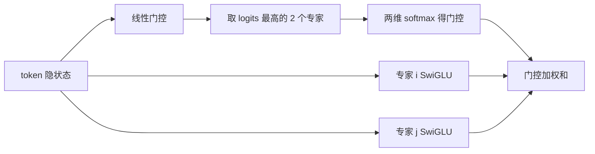

# Mixtral 8x7B / 8x22B

    
每一层 8 个前馈专家，路由器只取 top-2 做加权和：容量按 8 份专家涨，每 token 的 FFN 计算按 2 份走。

    <footer>—— Jiang et al., Mixtral of Experts, 2024；8x22B 规模以 Mistral 官方博客为准</footer>

Mixtral 把 MoE 做成开源默认实现：专家少、个头大、路由固定为 top-2，许可 Apache 2.0。8x7B 有完整技术报告（arXiv:2401.04088）：总参约 47B，激活约 13B，上下文 32K。8x22B 于 2024 年 4 月以博客发布：约 141B 总参、39B 激活、64K 上下文，同样稀疏 8 选 2，没有与 8x7B 同等篇幅的 arXiv 长文。本篇只写这两档的路由与规模，家族里稠密 7B 的滑窗见 [Mistral 与 Mixtral](/llm/mistral-mixtral)。

## 问题

Switch 用 $k=1$ 把 MoE 推到极简，质量对路由错误很脆。GShard 的 $k=2$ 更稳，但早期万亿模型不可下载。Mixtral 要的是一张「单节点或小集群能装下、激活远小于 70B 稠密」的开源权重。8 个专家是实现甜点：Megablocks 一类核好写，EP 度低，路由表小。问题转化为：top-2 的加权和是否足够；专家会不会按语种裂开；以及把每个专家从「7B 级 FFN」拉到「22B 级 FFN」时，激活与显存如何一起涨。

### 命名里的乘法是错觉

8x7B 不是 56B，8x22B 不是 176B。注意力、嵌入、RMSNorm 共享一份；八个专家是八份 FFN。报告给出 47B / 13B；博客给出 141B / 39B。激活包含 2 个专家的 FFN 加共享的注意力路径，所以激活大于「两个 7B 的 FFN」，小于「两个完整 7B 模型」。写容量规划用报告数字，不用口算乘法。

8x22B 没有单独列出与 8x7B 表 1 完全同构的超参表（层数、头数等以发布配置与社区模型卡为准）。本文只钉博客写明的总参、激活、64K 窗口与 Apache 2.0，不编造一层数表再挂 arXiv 号。

## 方法

8x7B 架构参数（论文表 1）：隐藏维 4096，32 层，头维 128，FFN 中间维 14336，查询头 32，KV 头 8，词表 32000，专家数 8，每 token 专家数 2，上下文 32768。门控为

$$
G(x)=\mathrm{softmax}(\mathrm{TopK}(x W_g)),\quad k=2,
$$

$\mathrm{TopK}$ 把未入选维设为 $-\infty$。层输出

$$
y=\sum_{i=0}^{7} G(x)_i\, E_i(x),
$$

$E_i$ 为 SwiGLU。注意力与 Mistral 7B 同系修改，但 8x7B 使用 32K **稠密**上下文，而不是把滑窗当这一篇的主角。Instruct 用 SFT + DPO。推理侧报告提到向 vLLM 提交 Megablocks 核。

8x22B 保持「8 专家、top-2」这一路由形状，把专家与骨干做大，激活约 39B，使 FLOPs 仍低于稠密 70B，同时总参进入 140B 量级。上下文 64K。许可同样 Apache 2.0。多语言与代码是官方叙事中相对 8x7B 的升级点，具体榜以博客图表为准。

## 机制

top-2 有两层意义。计算上，$k=2$ 比 $k=1$ 多一次 FFN，换来路由容错：第二专家可以补第一专家的盲区。表示上，输出是两个子空间的凸组合（门控非负且两维归一化），不是硬切换。增加专家数 $n$ 而固定 $k$，总参涨、激活几乎不变——这是稀疏 MoE 的定义。Mixtral 把 $n$ 停在 8，组合数 $\binom{8}{2}=28$，远小于 DBRX 的 $\binom{16}{4}$ 或 DeepSeek 的细粒度组合；换来的是实现与负载问题更简单。

论文分析显示专家**没有**按自然语言类别干净专项化。路由对位置和句法更敏感，这意味着不能靠「这个专家专门做法语」做调度优化。负载仍可能偏斜，需要核层处理不等长专家 batch，而不是假设 12.5% 均分。GQA（32 查 / 8 KV）继续压 KV，使 32K/64K 服务时注意力缓存可接受；显存的大头仍是 8 份 FFN。

### 8x7B 与 8x22B 的部署差

8x7B 量化后可进单卡或双卡，是开源 MoE 的入门档。8x22B 的 141B 权重把门槛抬到多卡 80GB 级，激活 39B 使 decode 明显重于 13B，但相对稠密 70B 仍省计算。64K 上下文再乘 KV。两者路由算法相同，不能把 8x7B 的延迟曲线按参数比线性外推到 8x22B——专家 GEMM 形状变了，通信与核效率都变。

门控在 top-2 **之后** softmax，概率只在入选专家上归一化，不是先对 8 维 softmax 再取前二（那样另外两套实现会把质量分到未计算的专家上，部署必须与训练一致）。

## 边界与工程取舍

### 两档同路由，不是两篇同论文

8 专家 top-2 是 2024 年初的开源共识，不是 MoE 的上限。要更高组合数，应看 DBRX、DeepSeekMoE，而不是把 Mixtral 的 $n$ 口头改成 64 却仍声称「同款」。无共享专家，公共变换挤在被路由的肥专家里。8x22B 缺长篇论文，系统研究应以权重、模型卡和博客为证，避免伪造 arXiv。把 8x7B 的评测表直接抄到 8x22B 上没有意义：激活从约 13B 到约 39B，数学与多语言的提升来自容量和数据，不是来自改了 $k$。服务上两者都要面对「八份 FFN 常驻」这一显存形状；量化可以降低门槛，但不能把 top-2 变成 top-1 而不改质量。若框架用「先 8 维 softmax 再取前二」的错误门控，两个专家的权重会被未计算的六维分走，logits 与训练不一致，这比选错量化更伤准确率。稠密注意力在 32K/64K 上仍是二次的，MoE 只减免 FFN；超长文档还要另做窗口或分块，不能指望专家路由顺便解决上下文。

Apache 2.0 使商用与再训练障碍低，生态（llama.cpp、vLLM）跟得快。评测对照是论文当时的 Llama 2 70B、GPT-3.5 等；用后来的 Llama 3 70B 去「打脸」8x7B 没有历史意义。Instruct 与 Base 模板不同。滑窗若在某次实现里被重新打开，必须核对该检查点是否真的按窗训练。选型上，8x7B 是「能进双卡的稀疏容量」；8x22B 是「愿意为约 39B 激活和 141B 存储换质量」的下一档，路由形状不变，运维账单变。两档都不要用总参去除以八来估计单专家大小，共享件只算一次。选 8x22B 前先确认节点放得下八份专家，而不是只看 39B 激活是否像一个稠密 40B。

Megablocks 把变长专家 batch 当成稀疏矩阵乘，比「for 循环 8 个专家」快一个档。没有这类核时，8x7B 的理论 13B 激活兑现不成墙钟，会看起来比稠密 13B 还慢。

## 小结

- Mixtral 路由：8 个 SwiGLU 专家，token-choice top-2，softmax 加在入选维上。
- 8x7B：约 47B / 13B，32K，论文给出完整超参表，Apache 2.0。
- 8x22B：约 141B / 39B，64K，出处为 Mistral 官方博客，路由同形。
- 专家不必按语种专项化；显存由 8 份 FFN 主导，FLOPs 由 $k=2$ 主导。
- 出处：Jiang et al., *Mixtral of Experts*，arXiv:2401.04088，2024；Mixtral 8x22B，Mistral AI 博客 *Cheaper, Better, Faster, Stronger*，2024。
