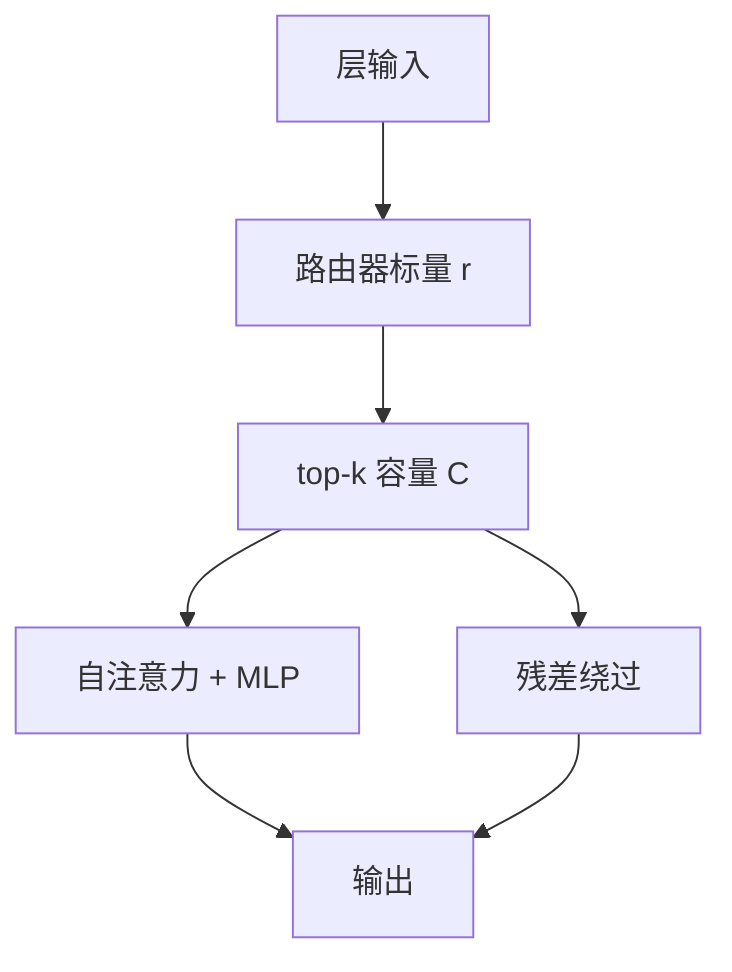

# Mixture-of-Depths

    
总计算预算事先封顶，哪些 token 走进这一层却随内容变；图是静态的，深度是动态的。

    <footer>—— Raposo, Ritter, Richards, Lillicrap, Humphreys, Santoro, Mixture-of-Depths, 2024</footer>

Transformer 对序列里每个位置、每一层付同样的 FLOPs。[Mixtral](/llm/mixtral) 一类 MoE 把宽度做成条件计算：token 仍过每一层，只是 FFN 换成专家。Raposo 等人的 Mixture-of-Depths（MoD）把条件用在深度上：一层里只有 top-$k$ 个 token 走自注意力与 MLP，其余走残差。$k$ 事先固定，张量形状不变，硬件仍看见静态图；哪些身份进 $k$ 由路由器学。采样可比对照快约一半，因为前向更瘦。

## 问题

不是每个 token 都需要同样多层。功能词、已确定的局部句法，可能不值得再做一次全局注意力。早期退出让 token 从此不再更新，也从此不能被后面的层当作键。动态图（ACT、Universal Transformer 的自适应步数）与现有加速器不和：形状随样本变，编译与批处理都痛。理想是：总 FLOPs 用户先定，低于稠密 Transformer；每层容量固定；身份可变。

MoE 保持总计算大致不减，用专家换容量。MoD 故意把容量降到序列长度 $S$ 以下，省下的 FLOPs 或用来把模型加厚，或用来换更短的步时。随机丢层（dropout 式）会把需要计算的 token 一并丢掉；必须学着选。

路由器同时决定「谁被更新」和「谁作为键可见」。被绕过的 token 不出现在该层注意力里，后面的 token 也无法在这一层读到它。省计算不是免费的通信：你也在选记忆。

### 与早期退出不是同一张图

早期退出一旦 halt，后续层全部跳过。MoD 允许中间层跳过、更深层再参与，于是一个很少更新的 token 仍可能与「走过很多块」的邻居在后面的满容量层里交互。作者认为这比串行 halt 更灵活。实现上他们发现：隔层做 MoD、中间夹满容量层，比每层都削容量更稳。

## 方法

### 容量与 expert-choice

每层（或每隔一层）设容量 $C\lt S$，原文 isoFLOP 里最好的档是 $C=256$、$S=2048$，即 12.5% 的 token 进块，87.5% 走残差。路由器对每个 $x_i^l$ 出标量 $r_i^l=w^\top x_i^l$。expert-choice：按 $r$ 取 top-$k$（$k=C$），保证负载精确平衡，不必辅助均衡损失。token-choice 则容易挤爆一条路径。只有一条「真专家」（完整 block）和一条「空专家」（残差），top-$k$ 自然把序列劈成互斥两半。

选中 token 的更新为 $x\leftarrow r\cdot f(\tilde X)+x$，其中 $f$ 是自注意力+MLP，$\tilde X$ 仅含选中者。把 $r$ 乘在路径上，路由分数进入梯度。随机 top-$k$（高斯权重）作为对照，显著差于学习路由，也差于稠密基线。

### 采样：非因果的 top-$k$

训练时 top-$k$ 看全序列，后面 token 的分数会影响前面是否入选，自回归时没有未来。两种补法：对路由器加二元交叉熵，用训练时的 top-$k$ 当标签，把 sigmoid 推到 0.5 两侧，对 LM 损失扰动约 0.2–0.3%；或另训一个小 MLP 预测是否入选，停梯度进主损失。辅助任务很快到约 99% / 97% 准确，自回归评测相对训练时 top-$k$ 几乎不掉点。

6e18 FLOPs 的超参搜索里，隔层路由 + 12.5% 容量最好。isoFLOP 最优的 MoD 比最优稠密更深/更大，损失更低；也存在更小的 MoD，损失打平最优稠密，但每步快约 60%。更大预算（2e19、1e20）趋势相同。作者还把 MoD 与 MoE 合成 MoDE：先绕过整块再专家，或把 no-op 当成一个专家。

## 机制

### 静态图为什么还能省

容量决定最坏情况的张量大小，编译器看到的是 $C$ 不是 $S$。注意力里 $QK^\top$ 从 $S^2$ 变成 $C^2$，12.5% 容量时这一项大约是原来的 1.56%。MLP 按 token 线性，也按 $C/S$ 缩。总 FLOPs 按层交错平均，不是每层都削到 12.5%。省下的预算在 isoFLOP 实验里被用来加参数；在「打平损失、更快」的点上，则直接变成步时。

学习路由会把难预测、高熵的位置更频繁地送进块；可视化里可见某些 token 几乎层层都进，另一些能绕则绕。这与「功能词永远跳过」的简单故事不完全一样：是否参与还影响未来能否被attend，目标是整句对数似然，不是单步分类难度。

隔层满容量是安全阀：即使 MoD 层选错，相邻稠密层仍能做全员注意力。每层都 12.5% 会切断信息面，原文里明显更差。复现时不要把「12.5%」套到每一个 block 上。

### MoE 管宽、MoD 管深

MoE 的专家是同类 MLP，路由不减少注意力 FLOPs。MoD 的「专家」是「算或不算」，注意力与 MLP 一起省。MoDE 的集成版把 no-op 放进专家集合，实现简单，但不能跳过注意力；分阶段版先跳块再进 MoE，省得更多。原文显示 MoD 增益与 MoE 可叠加。不要把 Mixtral 的 top-2 专家数理解成 MoD 的 $k$：一个是宽度上的几份 FFN，一个是序列上的容量百分比。

## 边界与工程取舍

主实验在 60M–3B、最长 1e20 FLOPs，不是 70B 生产模型。KV 缓存要按「该层是否跳过」管理索引，开源转换实现里这是实际坑：跳过却写坏缓存会在 `generate` 时炸掉。训练用 expert-choice、推理用预测器，部署必须带上辅助头或阈值化的路由器，不能只拷贝稠密权重再随机跳层。

容量过小会不可逆地丢掉键。12.5% 是该设定下的经验最优点，换序列长度、换任务要重搜。辅助损失略伤 LM；预测器不伤损失但多一点点参数。top-$k$ 对变长 batch、padding 的定义要写死，否则容量被 pad 占满。

MoD 不是测试时计算扩展（多采样、长思维链）：它减的是每 token 前向，不是加搜索。与早期退出、LayerSkip、CoLT5 的轻重路径相比，特点是解码器、静态图、深度上的二元跳过。不要预期它单独解决长上下文二次项——注意力在选中集合上仍是 $C^2$，只是 $C$ 更小。

isoFLOP 最优 MoD 往往更大。若硬件卡在显存而不是 FLOPs，更大模型可能装不下，这时应选「更小、更快、损失打平」的那一档，而不是曲线最低点。

## 小结

- MoD 用固定容量的 top-$k$ 决定哪些 token 进入一层的注意力与 MLP，其余走残差。
- 图静态、身份动态；隔层 12.5% 容量在原文 isoFLOP 上最好。
- 学习路由远好于随机跳过；采样靠辅助分类器模仿非因果的 top-$k$。
- 可打平最优稠密基线并用更少每步 FLOPs，或在同样训练 FLOPs 上把损失压得更低。
- 与 MoE 正交且可叠加（MoDE）；一个省宽，一个省深。
- 缓存索引、因果路由与容量超参是部署主风险；证据规模在十亿参数以下。
- 出处：Raposo et al.，*Mixture-of-Depths: Dynamically allocating compute in transformer-based language models*，arXiv:2404.02258，2024。
