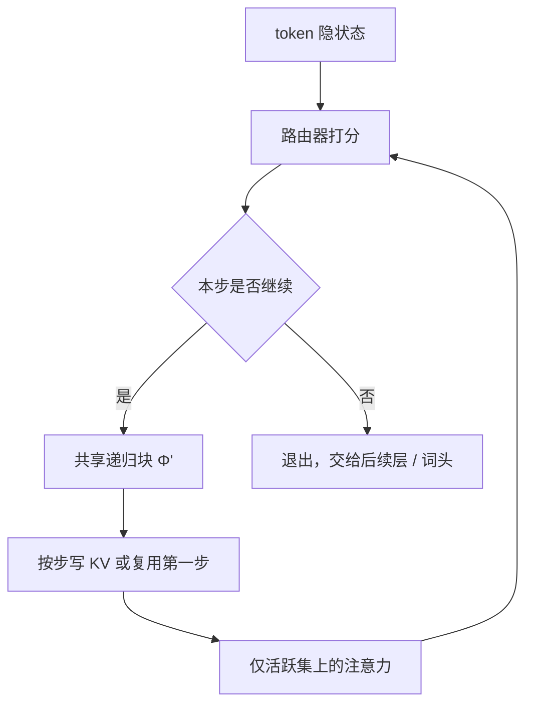

# Mixture-of-Recursions

同一组层反复套用，已经把参数摊薄；再让路由器按 token 决定套几次，计算才真正跟着难度走，而不是每个位置都付满深度的账。

<footer>—— Bae, Kim, Bayat et al., Mixture-of-Recursions: Learning Dynamic Recursive Depths for Adaptive Token-Level Computation, NeurIPS 2025</footer>

参数共享与自适应计算长期各走一条路。前者把若干层绑成同一组权重，用深度换容量、不涨参数；后者让简单 token 早退、难 token 多算，但多数实现仍要事后再训退出头，而且 KV 在深层会缺洞。Bae、Kim、Bayat 与 KAIST、Mila、Google 合作者把两条轴收进同一个递归 Transformer，称作 **Mixture-of-Recursions（MoR）**：共享层栈在递归步之间复用，轻量路由器给每个 token 动态分配递归深度，注意力只在「这一步仍活跃」的 token 之间做二次计算，KV 也按递归步选择性缓存。论文在 135M 到 1.7B 的基座规模上、等训练 FLOPs 下报告了相对稠密与固定深度递归的 Pareto 改善。本篇按 arXiv:2507.10524 / NeurIPS 2025 写路由、KV 与训练对齐，不把 Mixture-of-Depths 的「跳过整层」说成同一件事。

## 问题

标准解码器每个位置穿过全部 $L$ 层，参数量与有效深度绑定。递归 Transformer 把 $L$ 层收成 $N_r$ 个共享块反复套用：Cycle 方案把层循环展开，例如 9 层、$N_r=3$ 时是 $[(0,1,2)]\times 3$；Sequence 方案是同一层连用再换下一层；Middle-Cycle 保留首尾层不共享，中间才绑。参数可以少一个递归倍数，FSDP 一次 all-gather 也能服务 $N_r$ 次前向。但若每个 token 仍走满 $N_r$ 步，FLOPs 并没有按难度降下来，KV 也仍按展开深度存满——共享了权重，没有共享计算。

自适应计算的常见补丁是早退：浅层先出词，置信够了就停。这类方法多半要额外阶段、会伤预训练质量，而且早退 token 在更深递归处没有 KV，后续位置要补洞或并行重算。理想状态是预训练就学会「这个位置该想几步」，推理沿同一路由走，不必事后装门。

### 固定深度递归把难度当成常数

语言建模里，功能词、局部重复与真正需要长程规划的位置，所需深度差一个数量级。固定 $N_r$ 等于假设每个 token 同等难。Mixture-of-Depths（Raposo 等）让路由器决定是否进入某一层，那是「跳过层」；MoR 的问题更窄：层已经共享，决策是「再套一次同一块，还是退出」。两者都要处理因果泄漏与负载，但 KV 的缺失模式不同——递归深度上的洞，不是层索引上的洞。

论文报告的 135M–1.7B 是对照稠密基座的规模；MoR 因共享，独立参数更少。比较必须钉「等 FLOPs」还是「等独立参数」，不能拿较小的 unique 参数去对较大的稠密模型宣称全面胜利。

## 方法

MoR 的前向是：token 进入共享递归块 $\Phi'$，每一步一个路由器打标量分，决定该位置是否继续。两条路由。

**Expert-choice**：把每个递归深度当成专家，按当前隐状态打分，取 top-$k$ 继续。层次过滤保证只有第 $r$ 步入选的 token 才能竞第 $r+1$ 步，形成从浅到深的漏斗。容量按完美均衡的 token-choice 校准：若 $N_r=3$，三步分别处理约 $3/3$、$2/3$、$1/3$ 的 token，使两条策略的计算预算可比。

**Token-choice**：在进入递归栈时一次定深度 $i=\arg\max_j g_t^j$，然后连续套 $i$ 次。没有「看见未来 token 再决定谁留下」的泄漏，但负载要靠均衡损失或无损失偏置来撑，否则热深度吃满、冷深度空转。

### 两套 KV：按步缓存，或第一步共享

动态深度的自回归难题是：早退位置在更深步没有键值，后面的查询会缺上下文。MoR 给了两种缓存。

**Recursion-wise caching**：只缓存本步仍活跃 token 的 KV，注意力也只在这些条目上做。容量因子直接决定每步缓存大小；注意力 FLOPs 相对稠密大约按 $(k/N_{\mathrm{ctx}})^2$ 下降。

**Recursive sharing**：所有 token 至少走完第一步，KV 只在第一步写满，后续递归复用。查询长度随活跃集缩短，键值长度保持全序列。内存可降到约 $1/N_r$，但注意力只按 $k/N_{\mathrm{ctx}}$ 降，解码仍可能被 KV IO 卡住。共享与 Cycle 展开更合拍，因为层身份在步之间对齐。

训练在 Llama 式解码器、SmolLM 配置、去重 FineWeb-Edu 上从零做。对照含等 FLOPs（文中 16.5e18）与等 token（20B）两套；评测用 FineWeb-Edu 验证负对数似然与六个 few-shot 任务。路由与推理一致：不必再训一个退出头。连续深度批处理（同一共享块上、不同递归进度的 token 可拼批）是递归模型已有的吞吐手段，MoR 的活跃集更不规则，实现要按步做变长批。

## 机制

参数效率来自 $\Phi'$ 的复用：有效深度可以大于独立层数。自适应来自路由器把二次注意力限制在仍「在想」的子集上——难 token 多付一层注意力，易 token 在浅步离开，不再进入更深的 $QK^\top$。这与 MoE「选哪组 FFN 权重」不同：MoR 选的是**同一组权重用几次**，专家是深度而不是参数槽。

Expert-choice 的泄漏与 MoD 同类：训练时 top-$k$ 依赖全序列分位数，推理时未来不可见。论文沿用辅助路由或正则去逼近；token-choice 无此病，但要均衡。层次过滤把「先浅后深」写成硬约束，避免路由器给一个 token 跳过中间步、导致 KV 语义不连续。

Recursive sharing 假设「第一步对所有人必要」。若配方允许第 0 步就退出，共享底就没了，必须改回按步缓存或补算。不要把两种 KV 策略的显存数字混用。

### 和早退、和 MoD、和潜空间思考

早退通常在唯一层栈上切深度，权重不共享；MoR 的深度是共享块的迭代次数。MoD 跳过的是层，被跳 token 仍可能在别层出现；MoR 被漏斗滤掉的 token 在后续递归步不参与注意力。潜空间推理（反复套同一块、不把思考写到词面上）在 Geiping、Hao 等人的工作里常是固定迭代次数；MoR 把迭代次数变成 token 级路由，垂直轴上的「想几步」可学。

## 边界与工程取舍

规模停在约 1.7B 基座与 FineWeb-Edu 量级，不要外推到千亿稠密或生产 MoE 服务。Expert-choice 的推理路由若校准差，活跃集与训练不一致，接受率式的「算对了」会掉——这里没有投机解码的无损证明，掉的是语言模型质量。Token-choice 在小 batch 上负载噪声大，均衡项会抖。

服务侧，按步缓存要维护多份不等长 KV，连续批处理的分页比标准 decode 复杂；共享 KV 实现简单、吞吐不一定更好。报告吞吐时必须写清缓存策略与是否深度批处理。Middle-Cycle 的首尾独立层不参与共享，参数账要分开算。不要把「递归」理解成在输出序列上展开思维链：MoR 的递归发生在层方向，词表上仍是逐步预测。

出处：Bae et al., *Mixture-of-Recursions: Learning Dynamic Recursive Depths for Adaptive Token-Level Computation*，NeurIPS 2025，arXiv:2507.10524。参数共享谱系见 Dehghani Universal Transformer、Bae 等 Recursive Transformer；自适应层见 Raposo Mixture-of-Depths、Schuster CALM。代码仓库以论文给出的 `raymin0223/mixture_of_recursions` 为准。

## 小结

- MoR 在共享递归块上用路由器给每个 token 分配深度，同时做参数共享与 token 级自适应计算。
- Expert-choice 逐步漏斗、有泄漏风险；token-choice 一次定深、要均衡。
- Recursion-wise 缓存按活跃集存 KV；recursive sharing 复用第一步 KV，更省内存、注意力降得少。
- 等 FLOPs 下相对稠密与固定递归报告了更低验证 NLL 与更高 few-shot，规模以论文表为准。
- 与 MoD 跳层、与输出侧思维链不是同一对象。
- 出处：Bae, Kim, Bayat et al., NeurIPS 2025，arXiv:2507.10524。
