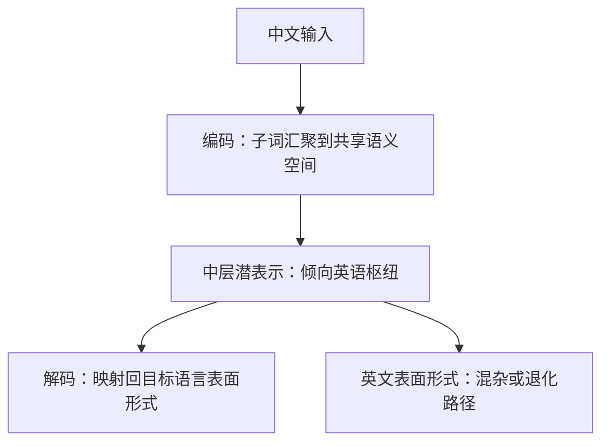
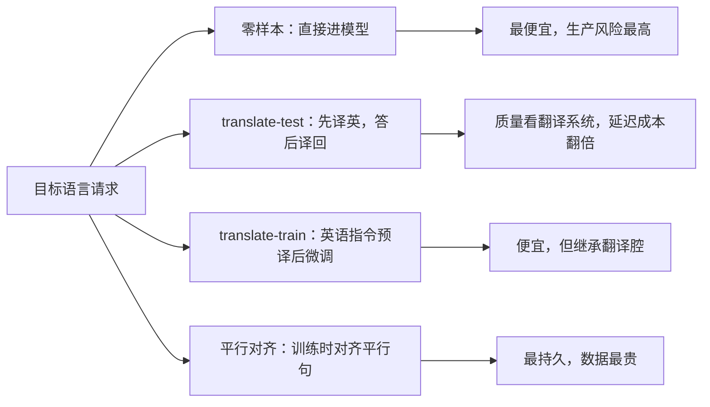

# 跨语言迁移

迁移不是翻译：模型可以把两门语言的词面对齐到同一片表征里，但把这片表征当成翻译器用，就会在语序与知识密度上摔跤。

<footer>—— 据 Pires 等 2019、Conneau 等 2020、Wendler 等 2024 整理</footer>

[上一课](/llm/ml-tokenizer-multilingual)把分词的工程账算清：名额、块长、形式三本账，fertility 表当诊断仪。但 fertility 只保证「切法便宜」，不保证切出来的子词在表征里语义对齐——中文与英文的「银行」可以都切成便宜的好块，却落进不相干的表征区域。本课写零样本跨语言迁移的机制：为什么共享词表能带来迁移，迁移在哪里失效，什么时候该退回翻译管道。

## 问题

预训练语料里混了中英文，模型没做过中文指令微调，却往往能答中文问题——这就是零样本跨语言迁移。mBERT 一类模型最先给出系统证据：只用英语或联合语料训练，零样本 XNLI 上非英语仍可用（Pires 等 2019；Wu & Dredze 2019）。但迁移高度不均匀：与英语语序接近的语言跌分少，语序差异大的语言跌分多；分类任务迁移好，生成任务与知识密集任务迁移差。

术语翻译：零样本（zero-shot）就是「没专门教过也能上手」。类比：一个只受英语训练的学生，看到中文数学题仍可能做对——因为数字、公式这类「锚点」是共享的，题面词汇靠上下文猜。迁移好坏取决于这类共享锚点有多少，而不是翻译能力。

缺口在于：切法共享只是必要条件。两门语言的同义子词要在表征里汇聚，任务语义要跨语言泛化，生成时还要能切回目标语言的表面形式。三步里任何一步断裂，迁移就退化成「英语模型的中文界面」——看起来能对话，规划与判断都在英语侧发生。

### 机制假设有两条

词汇正交说：联合语料里的跨语言同现——人名、数字、实体、代码切换文本——把不同语言的子词嵌进同一语义空间，实体是天然锚点。潜语言说：生成侧的证据指向模型中间层倾向以英语为枢纽，先在潜空间里规划，再映射回目标语言表面形式（Wendler 等 2024）。两条不互斥：前者解释编码侧对齐，后者解释解码侧为什么常出现「中文问题、英文推理链」。

## 方法

工程上有四条迁移路径，按干预强度排序。零样本：什么都不做，靠预训练对齐；诊断价值最高，生产风险也最高。翻译测试（translate-test）：输入先译成英语、答案再译回，把跨语言问题交给翻译管道；质量上限取决于翻译系统，延迟与成本翻倍。翻译训练（translate-train）：把英语指令数据机译成目标语言再做微调，XLM 时代的经典配方（Conneau & Lample 2019），便宜但继承翻译腔。平行对齐：训练时用翻译语言建模一类目标对齐平行句，或用双语词典做正则；效果最持久，数据最贵。

推理侧还有一条便宜路径：思维链语言选择。MGSM 的结果显示，模型用高资源语言写推理链、再用题目语言作答，能显著提升低资源数学题表现（Shi 等 2022）——这正是潜语言假设的工程化利用。允许模型自选推理语言时，要处理[语言混杂](/llm/language-mixing-reasoning)：混杂可能是能力也可能是失控，评测里分开计数。

Pires 等 2019 的反直觉结论：mBERT 对从未见过的中文句子做零样本 NLI 可用，但与英语语序差异越大的语言，迁移质量系统性越低——共享词表买来的对齐自带类型学偏向。

## 机制

四条路径对应的干预点不同。零样本只依赖编码侧汇聚，所以分类任务（浅层语义）最好、生成任务最差；translate-test 把整条链搬到英语侧，目标语言只剩表面形式生成，质量受限于翻译而不是模型；translate-train 干预指令层，让任务语义以目标语言为载体，但语料是翻译体，文风与语用被源语言语法渗入；平行对齐直接加强汇聚本身，是唯一触及机制的做法。诊断用探针而不是猜测：问目标语言的本地知识（只有目标语料里有）与跨语言可借的知识（英语语料里有），两题的表现差就是「迁移管道化」的程度。

为什么重要：管道化迁移的模型并不是「学会了中文」，只是搭了一条通往英语能力的管道——它能答英语语料里有的知识，答不出只有中文语料才有的本地知识（本地法规、本土常识）。上线前用「本地知识 vs 可借知识」两道探针对测，一下就能看出迁移是真对齐还是空管道。

## 边界

迁移不搬运知识。中文语料里没有的本地法规、英语语料里有，翻译路径能借到；两边都没有的知识，任何迁移机制都变不出来——那是[低资源语言](/llm/ml-low-resource)要处理的数据问题。迁移还会放大配比偏差：联合语料里英语占比过高时，任务规划、拒答边界、价值判断都发生在英语侧，评测要把这类「管道化迁移」单测出来。诊断也不能只看分类正确率：它掩盖语病与混杂，而用户看到的是表面形式质量；生成任务要配该语言的母语者人评。

常见误区：把「分词器对中文友好」（fertility 低）当成「中文能力好」。切得便宜只保证 token 数少；子词语义是否与英语对齐、生成是否通顺，是分词器管不到的后两步。评估多语能力要看生成质量与本地知识探针，不能只看分词账本。

## 小结

- 零样本迁移 = 编码侧子词汇聚 + 中层潜表示 + 解码侧表面形式映射；三步都可能断。
- 词汇正交与潜语言两条机制假设互补；「中文问题、英文推理链」是后者的可观察证据。
- 工程路径按干预强度排序：零样本、translate-test、translate-train、平行对齐；CoT 语言选择是便宜的推理侧杠杆。
- 迁移不搬运知识，知识缺口交给数据；管道化迁移要靠本地知识探针单测。
- 出处：Pires et al., ACL 2019；Wu & Dredze, EMNLP 2019；Conneau & Lample, NeurIPS 2019；Conneau et al., XLM-R, 2020；Shi et al., ICLR 2023；Wendler et al., 2024。
