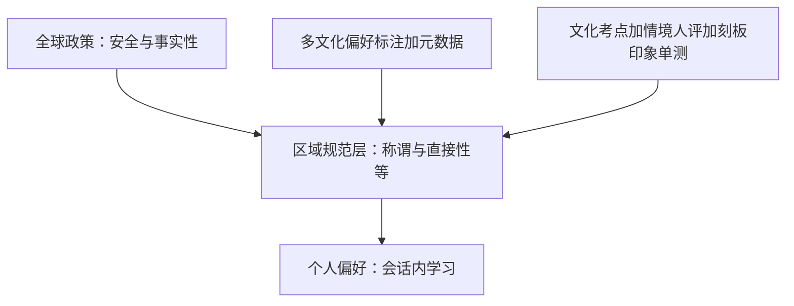
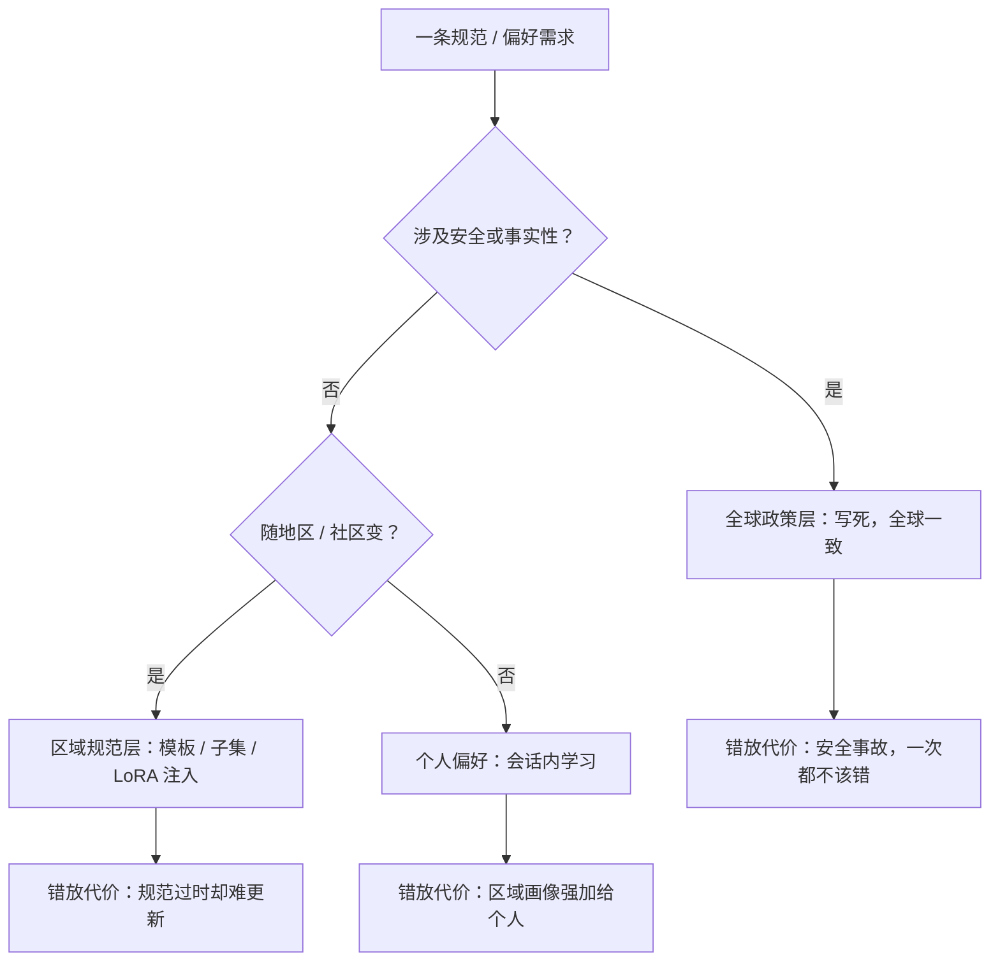

# 文化对齐

语言可以翻译，规范不能：同一句「有空吗」，在两种文化里的请求强度不同。对齐到谁的规范，是偏好数据里的一次隐含投票。

<footer>—— 据 Hofstede，*Culture's Consequences*，2001；Inglehart & Welzel，2005；Köpf 等，OpenAssistant，2023 整理</footer>

[上一课](/llm/ml-dialect-accent)把变体当谱系处理。但换一种语言不只是换变体：礼貌策略、称谓、间接拒绝、权力距离，规范随文化整体移动。偏好数据里标注者的文化分布就是模型的隐含规范投票——主流偏好数据以英语标注者为主，模型学到的「得体」是单一文化的。本课写文化对齐的工程分层：哪些该全球不动，哪些该区域适配，怎么测、怎么不滑向刻板印象。

## 问题

文化错位不触发语法错误，触发的是社交错误：对需要敬语的用户平铺直叙，对含蓄请求照字面理解，把刻板印象当文化知识输出，或在敏感历史话题上用单一叙事作答。现有评测几乎测不到：译文卷测语义，原生卷测知识，规范层没有卷面。缺口是把三层分开——全球政策（安全、事实性，不随地区变）、区域规范（称谓、直接性、节日与饮食语境，随地区适配）、个人偏好（会话内学习，不按身份推断）。把第二层写死进模型，或把第三层外包给区域画像，是两类对称的错误。

术语翻译：权力距离就是「一个社会默认上下级之间隔多远」。高权力距离文化里对上级要绕弯、用敬语，低权力距离文化里直呼其名、当面反驳都属正常——这不是谁更有礼貌，而是「礼貌」本身的定义不同。对齐工程师要适配的是定义，不是礼貌程度的高低。

### 规范从哪来

文化维度研究给了可操作的坐标：Hofstede 的维度（权力距离、个人与集体主义等）与世界价值观调查的价值观地图（Inglehart & Welzel 2005）不是心理学真理，但把「规范有系统差异」变成可引用的测量。礼貌理论（Brown & Levinson 1987）解释直接性差异：高权力距离文化里，请求与拒绝更多走间接策略。对齐工程的问题在于：偏好数据不按这些维度采样，标注者分布偏斜，模型把偏斜当成普世规范输出。

Hofstede 的权力距离指数在奥地利约 11、马来西亚约 100：同一句对上级的反对意见，两种规范下合适的措辞几乎相反。任何单一「得体」策略不可能同时满足两端。

## 方法

数据：区域化偏好集——同一情境做多文化版本，由该文化的标注者标注；OpenAssistant 的多语言众包是可参考的起点（Köpf 等 2023）。标注者元数据（语言、地区、年龄档）进数据卡，用于审计偏斜：某一规范在该数据里占多少票，应当可查。训练：全球政策冻结在系统层；区域规范做成可注入层——系统提示模板、区域微调子集或 [LoRA](/llm/lora) 适配器，避免为每个区域全量重训；注入层的生命周期管理（版本、回归、回滚）与适配器管理同构。评测：文化考点卷（称谓、节日、饮食禁忌、历史敏感点）加情境角色扮演，加该文化母语者人评；另设刻板印象单测——问「某国人都如何」时，规范适配不应退化成属性清单式回答。

## 机制

三层分离的机制理由是错误代价不同。全球政策写死是因为它是安全边界，错一次就是事故；区域规范做成注入层是因为规范随社区演变，且需要逐区评测；个人偏好留在会话内是因为它属于个体，用区域统计推断个体是把画像强加于人。分层不等于碎片化：碎片化的只是表达规范的措辞，安全与事实性的判定链全球同一套——如[多语言评测](/llm/ml-multilingual-eval)分数分列而协议统一，文化对齐是规范分列、政策统一。

直觉类比：三层分离像连锁餐厅的运营手册——食品安全标准全球统一（全球政策）；辣度与称谓按地区门店调整（区域规范）；常客「不要香菜」记在当班店员脑子里、下次照办（个人偏好）。三本账混订成一册，任何一地的改动都会波及全球门店。

## 边界

文化对齐的边界有三条。第一，文化不等于国籍更不等于个人：区域规范层是默认值，不是推断依据，按用户所在地强制切换立场会把统计画像变成标签。第二，规范冲突没有全局解：同一话题在不同规范下的「中立」表述不同，产品要显式声明按区域政策走，并把分歧写进模型卡，而不是假装一套说辞普适。第三，成本随区域数线性涨：真正全球的产品走向「政策一套、规范分层、评测逐区」，与多语言评测流水线共享人评基础设施。还要警惕反向错误：把能力缺口归为文化——先排除[低资源语言](/llm/ml-low-resource)的数据不足，再谈规范适配。

常见误区：把「文化适配」做成「给每个国家贴属性清单」（某国人都如何如何）。规范的正确粒度是「社区默认值 + 会话内修正」，不是按国籍推断个体；刻板印象单测存在的意义，就是在评测里拦住这条退化路径。

## 小结

- 语言翻译不等于规范对齐；偏好数据的标注者分布是模型的隐含规范投票，分布要可审计。
- 三层分离：全球政策不动，区域规范注入，个人偏好会话内处理；三层错误代价不同。
- 区域规范用模板、子集或适配器实现，带版本与回归；不逐区全量重训。
- 评测用文化考点加情境人评加刻板印象单测；规范适配不是刻板印象再生产。
- 文化不等于国籍不等于个人；规范冲突按区域政策显式声明并写入模型卡。
- 出处：Hofstede, *Culture's Consequences*, 2001；Inglehart & Welzel, *Modernization, Cultural Change, and Democracy*, 2005；Brown & Levinson, *Politeness*, 1987；Köpf et al., OpenAssistant, 2023。
