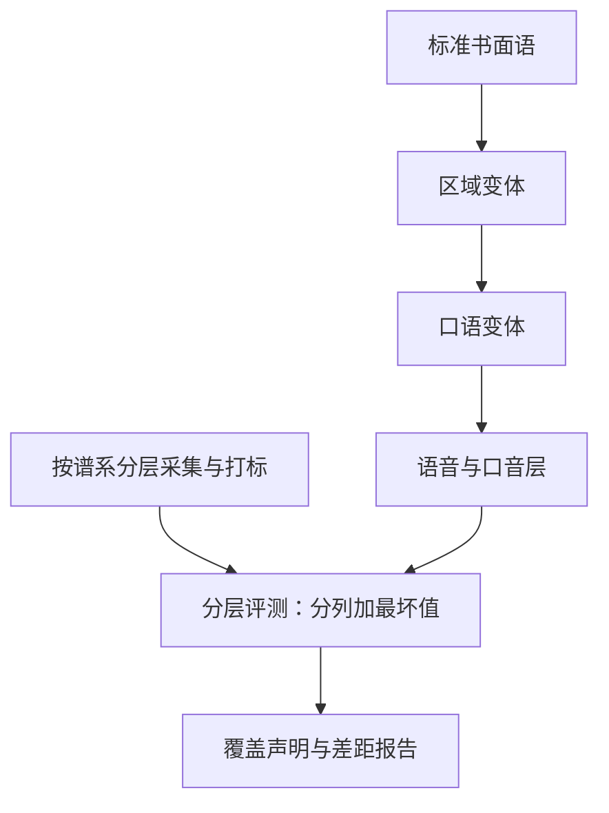

# 方言与口音

「语言是有陆军海军的方言。」方言与口音不是语言的残次版本，而是被标准语的统计优势淹没的平行世界。

<footer>—— Max Weinreich 语，经 Labov 转述；口音与识别差距据 Koenecke 等，PNAS 2020 整理</footer>

[上一课](/llm/ml-multilingual-eval)把评测流水线落到作答语言与判卷语言上。但「一种语言」内部并不均匀：粤语与普通话共享书写系统却不同音；阿拉伯语的标准语与各方言的距离接近两门语言；同一种英语在不同口音下的识别率能差几倍。评测卷按标准变体采样，方言用户拿到的就是别人的分数。本课写变体谱系的工程处理：数据怎么采、模型怎么对、评测怎么分列。

## 问题

标准语言偏置由爬取造成：网页文本偏向官方书面语，方言活在口语、聊天与语音里，在语料配比中接近零。失败分三类。文本侧：模型把方言表达当错别字「纠正」，或改写成标准语，或干脆拒答——粤语书面语、拉美西语与半岛西语的用词差异、阿拉伯语方言口语全在此列。语音侧：自动语音识别的词错率按口音分层，标准口音好、边缘口音差。评测侧：按标准变体构造的基准测不出这些差异，平均分把边缘变体淹没——这正是[多语言评测](/llm/ml-multilingual-eval)禁止单标量平均在语言内部的重演。

### 谱系，不是清单

变体是连续谱：标准书面语 → 区域变体 → 口语变体 → 语音与口音层。工程上按谱系采样而不是按「语言清单」采样：每一层都要有数据、有评测子集、有覆盖声明。阿拉伯语有 MADAR 一类按城市编号方言的语料（Bouamor 等 2019），把方言当一等公民处理；中文的粤语、吴语、闽南语各有书面传统与社区语料，规模与规范度不同，不能被一个 `zh` 标签盖掉。

Koenecke 等 2020 测得：主流语音识别服务对黑人说话者的词错率约为白人说话者的两倍。口音差距不是学术细节，是同一产品对不同人群的服务质量分层。

## 方法

数据：按谱系分层采集。语音侧，Common Voice 一类众包语料的口音元数据是可用起点（Ardila 等 2020）；文本侧从社交媒体与本地社区文本补，过隐私审查。标签：变体标签进数据卡与评测分组，粒度跟随社区书写实践。模型：语音侧按口音分层评测驱动微调——[Whisper large-v3](/llm/whisper-large-v3) 一类大规模弱监督模型显著压缩了口音差距但没有消除；文本侧用变体数据继续训练时，盯住标准语能力的回退，变体补充不能以牺牲标准语为代价。评测：每种变体分列分数与最坏值；人评必须招募该变体的母语者。

## 机制

分层评测之所以必要，是因为变体间的差距来源与语种间不同：不是「没学过这门语言」，而是「学过但信号稀」。这决定了补法的优先级——变体数据通常不需要从头改词表或动结构，缺的是继续训练数据与评测信号，成本远低于新增一门语言。但差距的分布有结构：语音侧的差距集中在语速、连读、声调与共享词表的切分上，文本侧集中在词汇与语法标记上。按谱系分层的评测能定位差距落在哪一层，从而决定补数据还是补转写规范；一刀切的「方言增强」会把预算花在差距最大但用户最少的那层。

## 边界

变体处理有三个容易走偏的方向。一是把方言当「带口音的标准语」硬转写：丢失词汇与语法差异，母语者不认账。二是按变体给用户分级服务：口音数据应该用来补训练，不是用来路由到更低质量的服务——那是把测量工具当成了歧视依据。三是发明标准：哪些变体算独立语言、哪种正字法算规范，是社区身份问题（粤语书面语标准化仍在进行中），工程跟随社区的书写实践，不越权裁定。语音侧还有成本边界：全变体采集不可能，优先级按用户分布与差距大小排，并且把没测的变体如实写进覆盖声明。

## 小结

- 标准语言偏置来自爬取；失败分文本「纠正」、语音识别词错率分层、评测平均淹没三类。
- 变体按谱系分层采样与评测，每层分列分数与最坏值，不做语言清单。
- 口音差距是真实的服务分层（曾有约两倍词错率差的报告）；弱监督大模型压缩但不消除。
- 变体数据用于补训练而非用户分级；语言与方言的地位跟随社区实践，工程不发明标准。
- 出处：Bouamor et al., MADAR, LREC 2019；Ardila et al., Common Voice, LREC 2020；Koenecke et al., PNAS 2020；Radford et al., Whisper, 2022。
