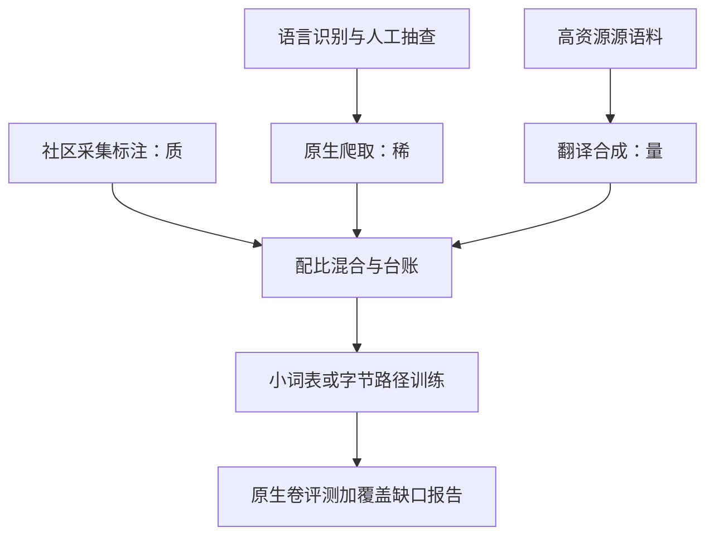

# 低资源语言

全球约七千种活语言，绝大多数没有多少数字文本；「低资源」缺的不是语言学复杂度，而是爬虫与标注预算。

<footer>—— 据 Joshi 等，ACL 2020；Team NLLB，2022；MasakhaNER 共建实践整理</footer>

[上一课](/llm/ml-crosslingual-transfer)写明迁移不搬运知识：两边语料都没有的东西，任何对齐机制都变不出来。缺口随即而来：对上百种语言，语料就是没有。本课写低资源语言的数据获取、模型与配比，不重讲迁移机制。后课的多语言评测要给这些语言单列分数，默认你会先判断一门语言的资源档位。

## 问题

低资源不是二值标签。Joshi 等 2020 按说话人数量对数据量的比分层：数亿人使用却几乎无数字文本的语言，比几百万人的欧洲小语种更难——后者至少有议会记录与报纸存档。工程要回答三个问题：文本从哪来；模型怎么练；练完怎么知道没有自欺。

三条坏路都常见。一是硬凑：用英语语料的翻译冒充原生语料，模型学到的只是翻译腔的影子。二是过采样：把稀缺语料重复几十遍灌进配比，撞上[数据约束下的扩展](/llm/data-constrained-scaling)给出的重复报酬递减。三是盲目上大词表：名额给足，但每个词条见次太少，尾部词条退化成 glitch。正确做法是按档位组合策略。

### 数据侧：三条获取路径

原生爬取：该语言的网页文本本来就稀，而且语言识别会把短文本误判回高资源语言（见[语言识别与安全过滤](/llm/langid-safety-filter)），需要更敏感的识别阈值加人工抽查。翻译合成：用机器翻译把高资源语料译入目标语言，规模可控、质量控制难，教给模型的是「目标语言的翻译体」。社区采集与标注：MasakhaNER 一类由非洲研究者社区共建的标注集质量最高、量最小，还自带方言与正字法多样性。三条路径按配比混合，配比本身是实验对象，进台账。

Ethnologue 记录约七千种活语言，常用 NLP 基准合计覆盖不足百种。Joshi 等 2020 把多数语言划进「几乎无数字文本」档位——覆盖的瓶颈在数据基础设施，不在模型结构。

## 方法

模型侧按档位降级。数据极小时，小模型小词表可能优于大模型大词表：AfriBERTa 用几 MB 级语料训练小型编码器，在非洲语言命名实体识别上可用（Ogueji 等 2021）——小词表让每个词条见次不至于太稀，这是[多语言分词的工程](/llm/ml-tokenizer-multilingual)名额账在低资源端的反面。未见字符用[字节回退](/llm/byte-fallback)兜底。机器翻译是低资源的最大单一受益者：NLLB-200 覆盖 202 种语言，靠的是「爬取、翻译合成、人类评估」的流水线（Team NLLB 2022）。配比上，低资源语言的重复次数、合成数据占比与回退路径都要写进实验台账，与[数据配比定律](/llm/data-mixture-laws)的账本同一套记法。

## 机制

低资源的中心机制是数据效率与表容量的张力。整子词需要见次学习，而语料不给见次，于是名额问题走向三个出口：缩（小词表）、绕（字节路径）、灌（用翻译合成把见次制造出来）。灌有副作用：合成数据把源语言的句法结构带进目标语言，模型生成的文本会带翻译腔，母语者一读便知；更危险的是自我强化——用合成数据训出的模型再产数据，腔调被放大。评测侧同理：[多语言基准](/llm/multilingual-benchmarks)区分译文卷与原生卷，低资源语言往往只有译文卷可用，这本身就是要报告的缺口，不是可以忽略的空白。

## 边界

低资源工程受三个硬边界约束。第一，翻译腔会自我强化，合成数据的占比要设上限并用母语者抽检；第二，评测集本身是稀缺资源：把小测试集反复跑成「能力证明」，是把噪声当信号，覆盖声明要止于已测语言；第三，伦理与社区：语言是身份，未经社区参与的数据采集与「濒危语言拯救」叙事容易变成单方面提取，MasakhaNER 一类共建模式的价值正在于此——数据与评测由该语言的研究者主导。低资源不是慈善项目尾注，它决定产品能诚实声明多大的覆盖范围。

## 小结

- 低资源按说话人与数据量之比分档；人多数据少的语言最难，不是地理意义上的小语种。
- 数据三路径：原生爬取、翻译合成、社区采集；配比进台账，翻译腔单独评估并设上限。
- 模型侧按档位降级：小模型小词表或字节路径；NLLB-200 是流水线标杆。
- 评测只有译文卷时必须声明缺口；不把小测试集的噪声当能力证明。
- 社区共建优于单方面提取；覆盖声明止于已测语言。
- 出处：Joshi et al., ACL 2020；Ogueji et al., AfriBERTa, 2021；Adelani et al., MasakhaNER, 2021；Team NLLB, 2022；Goyal et al., FLORES-101, TACL 2022。
