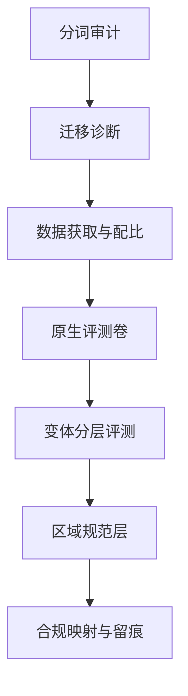

# 多语言与区域化收束

多语言与区域化的产出不是一张覆盖地图，而是一套花钱看得见的顺序：切法、迁移、数据、卷面、变体、规范、法律。

<footer>—— 据本课程各课口径整理</footer>

[上一课](/llm/ml-regional-compliance)把硬约束收进流水线：区域判定、政策分层、审计留痕。至此零件齐了：语言侧三课管「模型怎么吃进与生成这门语言」，区域侧四课管「这门语言的用户拿到什么质量与什么边界」。本课把它们装配成一张上线地图与一张决策单。**本课程到此收束。**

## 问题

上线一门新语言或新区域时，决策散在七处：词表与正则要不要动、零样本够不够、数据从哪补、评测卷怎么建、变体怎么分层、规范怎么适配、法律怎么映射。各自局部最优会互相拆台：不先审 fertility 就上原生评测卷，碎片化会把编码损失写成能力差距；不先建原生卷就调文化层，调的是噪声；不先做合规映射就定产品边界，返工的是整个拒答策略。收束要给的是先后顺序与跨语言不动的不变量。

## 方法

决策单七步，按依赖排序。第一步分词审计：用[多语言分词的工程](/llm/ml-tokenizer-multilingual)的 fertility 表与回退率，决定名额与正则要不要动。第二步迁移诊断：[跨语言迁移](/llm/ml-crosslingual-transfer)的零样本基线加思维链语言选择实验，判断干预强度。第三步数据获取：[低资源语言](/llm/ml-low-resource)的三条路径按档位配比，进台账。第四步原生卷：[多语言评测](/llm/ml-multilingual-eval)的三卷流水线，作答语言一致性与判卷本地化随分数发布。第五步变体分层：[方言与口音](/llm/ml-dialect-accent)的谱系采样，分列与最坏值。第六步规范层：[文化对齐](/llm/ml-cultural-alignment)的三层分离与区域注入。第七步合规映射：[区域合规与本地化](/llm/ml-regional-compliance)的谓词表与留痕。

每步的输出是下一步的输入：fertility 表决定评测分数怎么解读；迁移诊断决定数据预算往哪花；合规映射决定产品边界的最外圈。倒着做，每一步的归因都会被上一步的欠账污染。

多语言上线与单语言上线的默认风险不同：平均分会掩饰一切。七步中任何一步的欠账——碎片化、数据稀、判卷偏置、口音差距——都集中兑现在尾部语言与边缘变体上，所以每一步都看最坏值，不看均值。

## 机制

七步之下有四条跨语言不动的不变量。第一，分列报告：任何多语言分数不做单标量平均，尾部语种与最坏值必须可见——被平均掉的就是最需要看见的。第二，原生卷优先：译文卷测迁移，原生卷测该语言世界；覆盖声明止于已测语言。第三，变体与规范是谱系：语言内部不均匀，文化不等于国籍；分层采样与默认值语义替代二元清单。第四，硬软分层：文化规范可实验、可灰度，法律谓词走评审与版本冻结；两层共用注入机制但更新流程分离——合规错误与文化错误的代价不同，流程必须不同。这四条不变量与单语言对齐工程里的成对报告、政策先行同构：尺度换了，审计结构不换。

## 边界

这张地图的适用边界要诚实。其一，它是工程顺序，不是能力承诺：七步走完不保证质量，只保证每一步的归因干净——分得清编码损失、知识缺口、规范错位与法律约束。其二，路线级替代在地图之上：字节级模型绕开词表名额之争，翻译管道把跨语言问题外包给机器翻译，区域专训小模型用局部换全局；选型先于七步，而不是七步代替选型。其三，语言与区域都在移动：正字法在标准化、法规在分阶段生效、社区在争取命名权；地图要带版本号重跑，不是一次测绘终身使用。

## 小结

- 上线顺序七步：分词 → 迁移 → 数据 → 原生卷 → 变体 → 规范 → 合规；依赖方向不可倒。
- 四条不变量：分列报告、原生卷优先、谱系代替清单、硬软分层。
- 每步产出是下一步的输入；归因干净比分数好看更根本。
- 字节级、翻译管道、区域小模型是路线级替代，选型在地图之上。
- 语言与区域都在移动；地图带版本重跑，覆盖声明止于已测。
- 出处：Conneau et al., 2020；Shi et al., ICLR 2023；Team NLLB, 2022；Joshi et al., ACL 2020；Koenecke et al., PNAS 2020；Hofstede, 2001；GDPR 与 EU AI Act 官方文本，按本课程整理。
