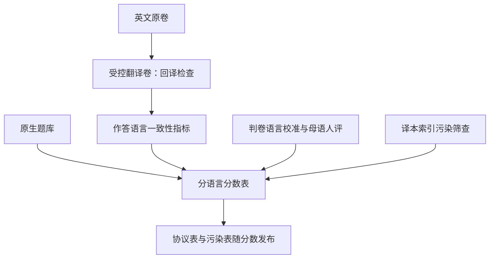
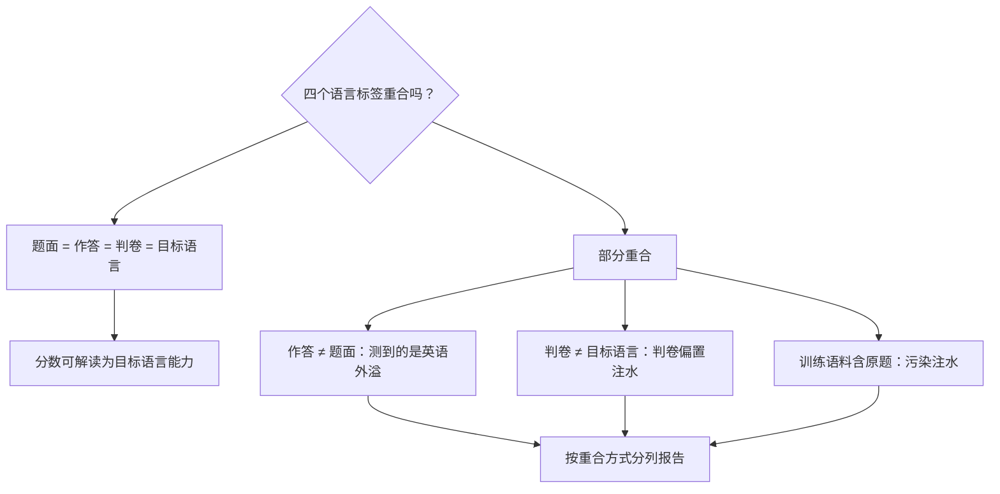

# 多语言评测

多语言评测的可信度不在题量，而在三件事：作答语言跟不跟得上提问语言、判卷人懂不懂这门语言、题在几种语言里各泄了多少。

<footer>—— 据 Conneau 等，XNLI，2018；Hu 等，XTREME，2020；Shi 等，MGSM，ICLR 2023 与公开套件口径，按本课程整理</footer>

[上一课](/llm/ml-low-resource)收在覆盖声明：没有原生卷的语言就写「未测」。[多语言基准](/llm/multilingual-benchmarks)已经立了总纲——译文卷测迁移、原生卷测该语言世界的知识、禁止单标量平均。本课补操作层：把总纲落成一条可复现的评测流水线，处理回答语言一致性、判卷语言偏置、跨语言污染这些总纲之下最容易自欺的环节。

## 问题

多语言分数有三类隐性注水。第一类是回答语言不一致：用中文提问，模型用英文作答，判卷器恰好懂英文，分数照高——测到的不是中文能力而是英语能力。第二类是判卷偏置：LLM 判卷器自己就以英语为中心，对非英语答案的文风与正字法更严，同样的内容换语言打分系统性偏低；[人工评测 vs 自动评测](/llm/human-vs-auto-eval)的原则在这里加倍成立——判卷者必须真正掌握该语言。第三类是跨语言污染：英文原题已在训练集里，译文卷继承了泄漏；原生题库与该语言维基百科高度重叠时泄漏更深。三类注水方向一致：把「英语能力外溢」或「背过答案」写成「多语言能力」。

### 流水线上的检查点

把三类问题各落成一个检查点。翻译质检：机译后做回译一致性检查，母语者抽检选项顺序、命名实体与题面自然度——生硬的译文测出的是翻译鲁棒性，不是目标语言能力。一致性指标：记录每题的提问语言、要求的作答语言、实际作答语言，回答语言匹配率单独成列发布。判卷校准：自动判卷的提示词用目标语言写并逐语言校准；人评招募该语言母语者，评分量表本地化。污染筛查：[训练-评测污染检测](/llm/eval-contamination)的 n-gram 口径要加译本索引——同一题在不同语言里的表面形式完全不同，只查原文查不到。

回译检查翻译成大白话：把译文再机译回英语，跟原题对比，看意思是否走样。质检最常见的发现是细节走失——选项顺序被译者顺手调换、人名地名被转写成另一种惯用形式、题面从口语变成书面腔。这些改动单看译文毫无破绽，一对照原文才露出来，所以母语者抽检不能省。

MGSM 把 GSM8K 的 250 道小学数学题译成 10 种语言加英语成卷；其结果显示思维链语言选择能抬升低资源成绩——这也意味着判分时必须区分「解题语言」与「作答语言」，否则语言混杂会伪装成能力提升。

## 方法

发布口径定成三张表。分语言分数表：每语言一列，附样本量与置信区间，小样本语言明确标注；不做跨语言平均，改报尾部最坏值。协议表：few-shot 例题语言、聊天模板是否本地化、判卷器版本、评测提示词语言，全部钉死——few-shot 例题用英语而题面用目标语，本身就是一种隐性迁移测试，要显式声明。污染表：各语言卷的泄漏筛查结果与排除规则。CMMLU 一类原生题库提供「该语言世界」的考点，与译文卷分列（见 [CMMLU](/llm/mmlu)）。

## 机制

三类注水共用一个机制：评测信号在语言边界上被偷换。回答语言不一致把目标语言理解偷换成英语生成；判卷偏置把语言质量差异偷换成能力差异；跨语言污染把记忆偷换成推理。三张表的作用是让偷换可检测：一致性指标暴露第一类，逐语言判卷校准与母语人评的差值暴露第二类，污染表暴露第三类。多语言评测多出的复杂度全在边界上：题面、作答、判卷、训练语料四个语言标签不重合时，分数必须按重合方式分列——这是[分词 fertility 与公平](/llm/tokenizer-fertility)「按语言分列」原则在评测端的对应物。

可以拿考试作弊类比四个标签：考卷（题面）、考生答题（作答）、阅卷人（判卷）、考前背过的资料（训练语料），各有各的语言。四个标签都是目标语言，考的才是这门语言；只要有一个标签被英语偷偷顶替——考生用英语答、阅卷人用英语批、答案考前背过——这个分数衡量的就不再是目标语言能力。初学者容易只盯分数高低，不去查标签错位。

## 边界

流水线解决不了覆盖问题：原生卷只能覆盖有限语种，其余语种保持「未测」，不用译文分冒充——这是[低资源语言](/llm/ml-low-resource)留下的边界。译文卷测不出文化考点：选项里的本地法规、地名、历史语境翻不过来，那要等文化考点卷（[文化对齐](/llm/ml-cultural-alignment)一课处理）。判卷校准也有限度：自动判卷器在低资源语言上本身的可靠性未经验证，此时唯一的裁判是人评，样本量与成本在协议表里如实报告。评测语言清单必须与产品声明覆盖的语言一一对应：多测是浪费，少测是虚报。

「未测」比「低分」诚实的原因：低分至少还可能来自判卷偏置或翻译走样，是测量工具的问题混着能力的问题；「未测」则明确告诉用户这一列没有尺子。这一步如果做错了——拿译文分冒充原生能力——后面产品的语言覆盖声明就整体失真，用户会拿着虚高的分数做技术选型。

## 小结

- 三类注水：回答语言不一致、判卷语言偏置、跨语言污染；各配一个流水线检查点。
- 发布三张表：分语言分数（含尾部最坏值）、协议（few-shot 与判卷语言）、污染筛查。
- 判卷必须逐语言校准，人评用母语者；自动判卷在低资源语言上不能默认可信。
- 污染检测要含译本索引；MGSM 类套件要区分解题语言与作答语言。
- 覆盖声明止于已测语言；文化考点留给原生卷与文化考点卷。
- 出处：Conneau et al., XNLI, 2018；Hu et al., XTREME, ICML 2020；Shi et al., MGSM, ICLR 2023；Li et al., CMMLU, 2023；据[多语言基准](/llm/multilingual-benchmarks)与[人工评测 vs 自动评测](/llm/human-vs-auto-eval)口径整理。
