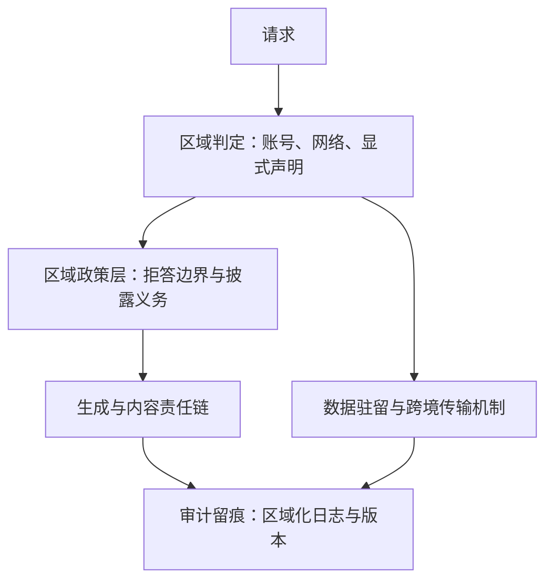

# 区域合规与本地化

合规不是把英文政策翻成二十种语言，而是把二十套法律映射到同一条产品流水线上。

<footer>—— 据 GDPR（EU 2016/679）、EU AI Act（EU 2024/1689）、《生成式人工智能服务管理暂行办法》整理</footer>

[上一课](/llm/ml-cultural-alignment)把规范分成全球政策与区域适配两层，区域层是软适配——猜错顶多失礼。接下来这一层是硬约束：法律。数据怎么存、往哪传、生成内容谁负责、哪些义务要备案审计，都按司法辖区生效，违反了不是分数下跌。本课写区域合规与本地化的工程架构：区域判定、政策分层、审计留痕。

## 问题

同一份全球产品在多辖区同时上线：欧盟要求数据出境走 GDPR 第五章的机制，AI 系统按风险分级履行透明度义务；中国的《生成式人工智能服务管理暂行办法》对生成式服务提出备案与内容责任要求；其他辖区各有数据驻留与消费者保护条款。工程问题有三个：区域判定——用户在哪、数据落哪、适用哪套规则；政策分层——哪些规则改系统提示、哪些改训练、哪些改产品流程；留痕——监管问询时能否出示证据。

三类常见错法。把合规当翻译：政策文档译成当地语言，行为不变。把合规当开关：一个「合规模式」布尔值，掩盖辖区间的真实差异。把合规当事后补丁：上线后按投诉打补丁，没有辖区映射表。

两个术语翻译：「数据驻留」指法律要求某些数据必须存在本国境内的服务器上，不许出门；「数据出境」则允许出门，但必须走法定通道——比如欧盟的标准合同条款。打个比方：驻留是「人不得离境」，出境机制是「可以离境但要先办签证」，两者对应完全不同的工程配置。

### 架构

区域判定要可解释：账号注册地、网络位置、显式选择的优先级写死并公告，因为同一次会话跨区域移动时适用规则会变。政策层与[文化对齐](/llm/ml-cultural-alignment)的规范层共用注入机制，但更新流程不同：文化层可以实验灰度，合规层要走法务评审与版本冻结。留痕要能回答三个问题：这条内容由哪个模型版本、哪套政策版本生成；数据存在哪个辖区；当时的拒答依据是哪一条。

EU AI Act 于 2024 年 8 月生效，义务分阶段适用：禁止性条款自 2025 年 2 月起适用，通用目的模型义务自 2025 年 8 月起适用。同一产品在不同月份面对的义务清单不同，映射表必须带生效日期。

## 方法

合规映射的本质是把法律谓词编译进流水线。每个辖区产出一组「谓词 → 措施」：数据出境要求 → 驻留与跨境传输机制（标准合同条款、出境评估）；内容责任与标识义务 → 生成管线里的披露与审核环节；透明度义务 → 模型卡与用户告知。谓词之间会重叠与冲突：删除权与日志保留义务可能同时适用，需要法务解释写成显式优先级，而不是留给自己在事故现场裁量。语言识别在这里回归但角色反转（见[语言识别与安全过滤](/llm/langid-safety-filter)）：说西语的用户可能在任何辖区，语言只能做体验路由，不能做合规判定；合规判定只认区域判定链。本地化的另一半是产品清单：计量单位、日期格式、医疗与法律资质声明、消费者保护措辞，与合规谓词分开管理、分别验收。

## 机制

这条架构的机制约束是「误判时的默认安全侧」。区域判定永远可能错：跨区网络与账号使判定可被绕过，所以义务设计按「判定错误时落在更严格的一侧」配置——这类似保守拒答的思路，但粒度是辖区。留痕之所以是机制而不是日志习惯，是因为合规义务的举证责任在服务方：一条生成的可回溯链（模型版本、政策版本、数据辖区、拒答依据）是唯一能同时应对三个辖区问询的证据形态。验收口径也由此不同：这一课的验收标准不是平均分，而是「任一次生成可回溯到政策与模型版本」——与对齐评测的能力口径分开，两者不可互相替代。

## 边界

工程边界有三。第一，法规在移动：AI 立法在多辖区同步演进，映射表要带生效日期与版本，评测里加「合规回归」项，法规修订按版本触发。第二，合规映射不产生伦理：法律是底线，[文化对齐](/llm/ml-cultural-alignment)的规范层可能比法律更严，两层不一致时取更严者并记录分歧。第三，本地化的深度有限度：术语、格式、披露可以逐区做，模型的核心行为不应该逐区分叉出不可审计的版本——分叉越多，留痕与回归的成本越高，出事时的解释链越长。合规团队要的是可审计的证据链，不是能力分数；这条边界决定了合规工程与评测工程的分工。

## 小结

- 合规按辖区生效：区域判定、政策分层、审计留痕是三件工程事实，不是文档翻译。
- 法律谓词编译成「谓词 → 措施」映射表，带生效日期与版本；冲突时写显式优先级。
- 文化层可实验，合规层走法务评审与版本冻结；两层共用注入机制但流程分离。
- 语言不是辖区的代理；语言路由只做体验，合规判定只认区域判定链，并按误判保守侧设计。
- 验收口径是可回溯性：任一次生成可指认模型版本、政策版本与数据辖区。
- 出处：GDPR (EU) 2016/679；Regulation (EU) 2024/1689 (AI Act)；《生成式人工智能服务管理暂行办法》，2023；PIPL 跨境条款。
