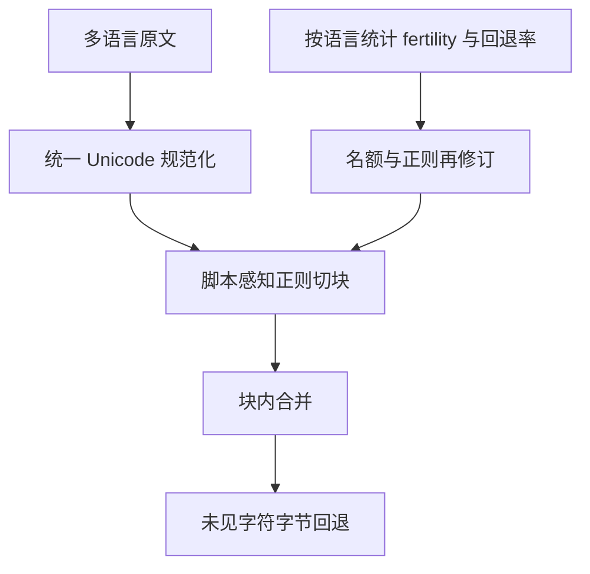
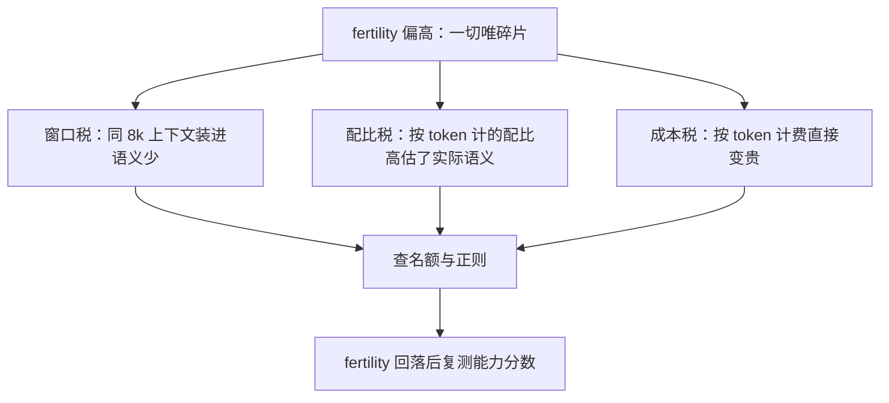

# 多语言分词的工程

词表名额是经济问题而不是语言学问题：谁的语言在语料里便宜，谁的用户在推理时就更便宜。

<footer>—— 据 Conneau 等，XLM-R，2020；Petrov 等，NeurIPS 2023 与主流开源分词器实践整理</footer>

[上一课](/llm/rw-map)把复现工作流收成九步决策单与四条不变量：数字带坐标、run 可重建、结论分档、死路可检索。复现的纪律落到分词上，先看那条最硬的边界：[预分词正则](/llm/pretokenization-regex)把合并之前的硬边界立起来——正则按字符类别切块，禁止跨类焊对，正则与合并表同快照冻结。但那条承诺是在英语文本上设计的——GPT-2 的模式里写死了 `'s`、`'ll` 这类英语缩写分支，字符类在拉丁文字上干净利落。把同一套配置搬到中日韩、泰语、天城文上，账要全部重算：名额给谁、块切多长、规范化动不动表面形式。本课写多语言分词的工程账。后课的跨语言迁移与低资源语言，都默认你会先审计 fertility 再谈能力。

## 问题

多语言分词的失败不是「切不开」，而是三本账同时算错。第一本是名额账：在联合语料上按频率跑 BPE，英语高频对占满合并名额，32k 级词表里留给中文、天城文的整子词所剩无几，目标语言大量走[字节回退](/llm/byte-fallback)。第二本是块长账：正则按 `\p{L}+` 切，泰语、老挝语这类无空格文字一整句落进一个块，块内合并的搜索空间被超长块吃掉——这是[预分词正则](/llm/pretokenization-regex)里汉字问题的极端版。第三本是形式账：天城文的元音符是组合记号，阿拉伯语的叠音符可有可无，全角半角与 NFC、NFKC 形式混存；训练语料与用户输入若规范化不一致，同一句话会走两条不同的 token 序列。

三本账共同的错法，是把英语分词器当默认值，出问题后归因于「模型语言能力差」——碎片化把编码效率问题写成了能力问题，后续所有评测都被它污染。

BPE（字节对编码）翻译成大白话：先按字符切开文本，然后一遍遍把语料里最高频的相邻块两两焊成新块，焊多少次有上限，这个上限就是「名额」。名额是 32k 就只能焊出约三万个新块——英语高频词先占坑，排到中文、天城文时名额所剩无几，剩下的字只能逐字甚至逐字节硬切。

### 先审计，再动刀

动手改之前先量化。[分词 fertility 与公平](/llm/tokenizer-fertility)已给出方法：按语言 × 领域交叉统计 fertility（每字符平均 token 数），看高分位而不是全球平均。一份多语言分词体检表至少包含：各语言 fertility 高分位、字节回退率、最长块分布、规范化前后 token 序列一致性。这张表决定名额往哪倾斜、正则哪里要补，也是后课评测分数解读的底账。

Petrov 等 2023 估计：同一段语义内容，部分语言在某些词表下需要数倍 token。按 token 计价时，这等于非英语用户为同等内容支付更高价格——fertility 是定价问题，不只是效率问题。

## 方法

名额：从头训多语言词表时，联合语料的抽样配比就是名额政策——[分词器训练语料](/llm/tokenizer-training-corpus)的配比直接写进词表形状。XLM-R 用约 25 万词条、mT5 用同量级词表，就是为了给大字符集语言留整子词；坚持 32k 级小词表的路线，必须接受低资源语言的碎片化，或事后走[词表扩展与多语言](/llm/vocab-extension-multilingual)的 append 路径补名额。

正则：用 Unicode 属性类而不是 ASCII 集合，`\p{L}`、`\p{N}` 天然覆盖全部文字系统；把组合记号 `\p{M}` 并入字母块——GPT-4o 的 o200k 正则就显式包含 `\p{M}`，天城文的辅音与元音符才不会裂开；ZWJ/ZWNJ 单独成块处理，避免表情序列与印度文字粘块。英语缩写分支可以保留，但它只服务英语。

规范化：确定一条 NFC 或 NFKC 路线，训练、推理、评测三处同一条。NFKC 会把全角数字折叠成半角，对把全角当语义的文本是信息损失；这个决定要写进分词器文档，不要留给实现随手选。

## 机制

三本账通过 fertility 复合成三重税。窗口税：同样 8k 上下文，碎片多的语言装进的语义少。配比税：按 token 计的配比（见[代码、数学、多语言配比](/llm/code-math-multilingual-mix)）里，高 fertility 语言的训练信号被高估，实际看到的语义内容更少。成本税：推理计费按 token，编码低效直接变成价格差异。三重税的共同源头是块边界与名额的联合决策，与注意力机制无关。

块边界与名额还会互相放大：名额少 → 整子词少 → 回退字节多 → fertility 高 → 同 token 预算下该语言的梯度信号更稀。逆向流程也成立：fertility 表是诊断仪，某语言回退率异常高时，先查名额与正则，再怀疑数据量。数字块在多语言混排里同样适用[数字切分](/llm/digit-splitting)的规则——`2024` 与 `二〇二四` 不该因为词表形状享受不同待遇。

窗口税的数字实例：假设英语 fertility 为 1.0、某语言为 1.5，同样 8192 个 token 的上下文窗口，英语能装进约 8192 字符的内容，这门语言只装得下约 5461 字符——相当于换了台屏幕小三分之一的手机读同一篇文章。能力评测若不修正这笔税，会把「窗口装不下」误判成「模型笨」。

## 边界

词表不是越大越好。嵌入矩阵与输出头随 $|V|$ 线性涨，25 万词条的表里尾部词条见次稀少，容易退化成 glitch 源。glitch token（异常 token）就是「在训练语料里几乎没出现过、模型见了就行为失常」的词表条目：用户输入它时模型可能突然输出乱码或无视指令。给它算笔账：25 万词条乘上 4096 维、每参数 2 字节，仅嵌入矩阵就近 2 GB——名额给了，见次没跟上，等于花钱买了大量「生词卡」还随时作妖。[字节级](/llm/byte-fallback)路线是另一极端：没有名额之争，代价是序列更长、上下文消耗更大。分词工程也解决不了语言学分歧：粤语算不算独立语言、藏文要不要按音节切，是产品与社区的决策，工程只负责把决策可复现地写进正则、名额与快照。改任何一处都要回到[预分词正则](/llm/pretokenization-regex)的铁律：正则、规范化、字节映射、合并表同快照冻结，并用多语言混排样例做回归测试。

## 小结

- 多语言分词是名额、块长、形式三本账；先按语言审计 fertility 与回退率，再动刀。
- 名额由语料抽样配比决定；大字符集语言要整子词，小词表要么接受碎片化要么事后扩展。
- 正则用 Unicode 属性类并把组合记号并入字母块；规范化三处统一并写进文档。
- Fertility 复合成窗口、配比、成本三重税；诊断顺序是名额与正则在前，数据量在后。
- 词表大小、字节级路线、语言学分歧是边界；改动必须同快照冻结并做混排回归。
- 出处：Kudo & Richardson, SentencePiece, 2018；Conneau et al., XLM-R, 2020；Xue et al., mT5, 2021；Rust et al., ACL 2021；Petrov et al., NeurIPS 2023。
