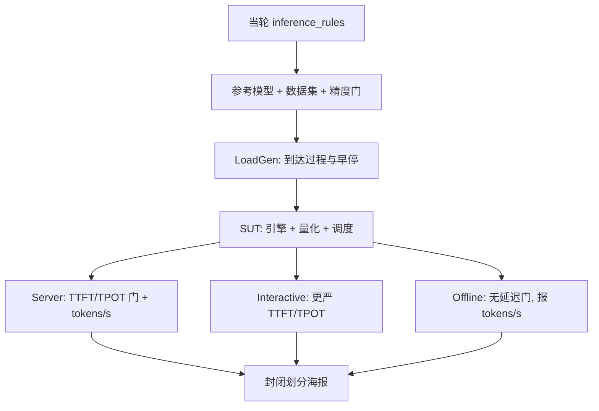

# MLPerf Inference LLM

LoadGen 发出样本，SUT 必须在规定的到达过程与延迟约束下给出与参考实现足够接近的生成结果；提交的 tokens/s 才被允许写上 MLPerf 的海报。

<footer>—— MLCommons MLPerf Inference 规则：LLM 任务的样本定义、精度门槛、Server 场景的 TTFT/TPOT 阈值由政策文件固定</footer>

厂商海报上的「每秒多少 token」只有在同一模型、同一数据、同一延迟合同下才可横比。MLCommons 的 **MLPerf Inference** 把生成式任务收进数据中心套件：参考模型、数据集、预处理、LoadGen、以及封闭划分里允许改什么。LLM 条目从 GPT-J 扩到 Llama 2 70B、Mixtral 8x7B、Llama 3.1 405B，v5.1 再引入 Llama 3.1 8B、DeepSeek-R1、Whisper 等。本篇写 **Inference 套件里的 LLM 合同**，不是训练套件，也不是某家用内部提示集测的 GenAI-Perf 曲线。规则以 `inference_rules.adoc` 与当轮官网为准；下列阈值来自政策文件中的 Llama 2 70B 等表，换轮次必须重读，不要把 v4 的 GPT-J 延迟抄到 v5 的 405B 上。

工程扫描仍用 [GenAI-Perf](/llm/genai-perf)；合规横比才用本套件。工作点与 SLO 的几何见 [帕累托](/llm/latency-throughput-pareto)。

## 问题

没有规则的推理基准会在四件事上作弊或误导：换更小的模型、截短生成、放宽采样、以及报一个没有延迟约束的离线吞吐。MLPerf 用参考实现钉死任务：例如 Llama 2 70B 是问答，数据为 OpenOrca，`max_seq_len=1024`，封闭划分要求 ROUGE 达到 FP32 参考的 99.9%，且每样本生成 token 数不少于参考的 90%（政策表写明参考 `tokens_per_sample`）。生成算法对若干模型规定为 greedy，另一些规定温度与 top-p。这些把「质量」从海报上拿掉，变成入场券：达不到就不算合法提交。

场景把用途切开。**Offline** 不模拟用户到达，尽量喂满系统，报吞吐。**Server** 用 LoadGen 的泊松到达模拟在线服务，必须满足 TTFT 与 TPOT（时间每输出 token）约束才承认该吞吐。Llama 2 70B 在政策表中的 Conversational 档是 TTFT 2000 ms / TPOT 200 ms；Interactive 档更严，450 ms / 40 ms。v5.0 起 Interactive 作为独立压力出现；v5.1 把交互场景扩到更多模型。同一套硬件，Offline tokens/s 可以远高于 Server：前者没有尾延迟合同。把 Offline 第一名写成「聊天延迟冠军」，是读错表格。

### 样本、LoadGen 与 SUT

一个 LLM 样本在规则里是一条序列（或多模态里的一条带图提示）。SUT（system under test）吃 LoadGen 查询，返回生成。计时边界由 LoadGen 管：何时发、何时算完成、早停条件。提交者不能自己写一个「先把整个测试集排好序再跑」的离线作弊器还标 Server——规则禁止在数据集边界上排序一类行为，并对 LLM 工作负载点名。封闭划分还限制模型等价性、预处理与后处理；开放划分允许更多改动，但海报必须标明划分。精度有 99% 与 99.9% 等高精度变体，LLM 常用相对参考的 ROUGE 与长度约束，而不是 ImageNet 的 top-1。

MLCommons v5.1 新闻稿：Llama 2 70B 仍是最热门条目之一；新条目包括 DeepSeek-R1、Llama 3.1 8B（替换 GPT-J 的小模型档，CNN-DailyMail，上下文相对 GPT-J 的 2048 提到 128K 量级的模型能力）、Whisper Large V3。引用某轮第一名必须写轮次、场景、划分。

## 方法

读当轮政策表，锁定：模型、数据集、最大生成长度、精度指标、Offline / Server / Interactive 是否提交、延迟阈值。实现参考仓库 `mlcommons/inference` 里对应目录（如 `language/llama2-70b`），用官方 LoadGen。量化、编译、连续批处理、投机解码在封闭划分允许范围内可以做，但必须过精度门。NVIDIA 在 v5.0 技术博客里写 Blackwell 上用 NVFP4 等精度提交并满足准确率——这是「精度门 + 硬件路径」同时成立的例子，不是「FP4 一定合法」的空白支票。

Server 场景的调优目标是：在 TTFT/TPOT 约束下最大化被承认的吞吐。这与无约束拉满 batch 不同，通常要降并发、保预填充队列、有时拆 PD。Interactive 更狠：40 ms TPOT 约等于每用户 25 token/s，batch 不能堆太深。Llama 3.1 8B 在 MLCommons 解说里对 Server 写过 TTFT ≤ 2 s、TPOT ≤ 100 ms 一档，Interactive 再收紧；以政策文件该轮表为准。405B 的 Server 延迟在 NVIDIA v5.0 博客中举例为 TTFT 6 s / TPOT 另有规定，大模型允许更长首包，不能把 70B Interactive 的 450 ms 套过去。

提交包含日志、精度转储与系统描述。审阅看是否改了不允许改的生成长度、是否用错划分。异构系统（多类加速器负载均衡）在 v5.1 已有先例，规则要单独满足，不能把两台机器的 Offline 吞吐相加冒充一台 SUT。Edge 与 Datacenter 类别的电源与形态约束不同，小模型 8B 可以两边都出现，70B 级主要在数据中心。

### 和 GenAI-Perf 数字为什么对不上

GenAI-Perf 可自选并发、长度、是否忽略 SLA。MLPerf Server 的到达率由 LoadGen 搜到「约束将破未破」的工作点，报的是该点吞吐。提示分布是 OpenOrca 或 CNN-DailyMail，不是你的生产日志。分词、stop、以及「完成」的定义按参考实现。所以同一台 H200，海报 tokens/s 与你昨晚扫的曲线可以差一截，两者都可能诚实。横比只用同一轮 MLPerf 表格；纵向看自己的 GenAI-Perf 曲线。

Mixtral 等 MoE 条目额外打到专家路由与 All-to-All，硬件若只有 PCIe 八卡，Server 延迟可能过不了交互档。规则不保证所有提交者都跑所有 LLM 条目；缺席不等于性能为零，只是没有合规数字。

## 机制

LoadGen 把「何时发查询」从 SUT 手里拿走，防止实现用未来知识排序。Server 的泊松到达产生排队，TTFT 含排队 + prefill；TPOT 约束迫使 decode 步时间在统计意义上低于阈值（具体统计在规则与 LLM 脚注里，常用百分位要求）。早停避免无限跑：达到统计置信或样本上限。精度门阻止靠乱生成刷吞吐——短且烂的输出会在 ROUGE 与长度约束上失败。Greedy 使随机性不成为变量；规定 sampling 的条目则把温度钉死。

tokens/s 对 LLM 是「生成 token / 时间」，输入长度方差大时，若用请求/s 会不公平，所以套件用 token 吞吐。这与 GenAI-Perf 的 output token throughput 同族，但分母与样本集不同。高质量变体 99.9% 往往迫使少用最猛的量化，吞吐下降——海报上的「高精度」列是另一场比赛。

政策表对 Llama2-70b 写明 Conversational 与 Interactive 两档 TTFT/TPOT，并要求生成长度不低于参考的 90%。只报 ROUGE 过线、却把 `max_new_tokens` 砍短，属于违规。输入侧也不允许用压缩过的私有格式绕开计时。

### 轮次演进不要回溯乱比

GPT-J 小模型档被 Llama 3.1 8B 替换后，数据集任务仍是摘要（CNN-DailyMail），但模型上下文与结构变了，不能把 GPT-J 的历史 tokens/s 和 8B 新结果连成一条「硬件加速曲线」。Llama 2 70B 跨多轮仍在，用来看趋势相对合法，仍要声明场景（Offline 还是 Server）和是否 Interactive。Blackwell 相对 Hopper 的倍数只在同一条目、同一场景、同一划分下有意义；NVIDIA 博客里的 unverified 数字必须标未验证，不能当正式表格。

## 边界与工程取舍

不要用 MLPerf Offline 第一名承诺聊天产品的 P99 TTFT。不要在封闭划分里换未经允许的权重再报官方数。不要把不同轮次、不同模型拼成排行榜。不要忽略系统描述里的 GPU 数、互连、软件栈——8×H200 与 1×GB200 NVL72 不是同一 SUT。边缘设备跑 8B 与数据中心跑 405B 没有可比的 tokens/s。DeepSeek-R1 一类推理模型的生成长度和思维链会改 TPOT 画像，套 70B 对话阈值会错。

规则文件会改。写博客与写容量规划都以当轮 `inference_rules.adoc` 与 MLCommons 发布说明为准。本篇阈值是为了说明合同结构，不是永久物理常数。

出处：MLCommons MLPerf Inference 政策（`inference_rules.adoc`：样本定义、Llama2-70b OpenOrca、ROUGE 与长度门、Conversational/Interactive TTFT/TPOT）；mlcommons/inference 参考实现；MLCommons v5.1 结果新闻稿；NVIDIA *Blackwell Delivers … MLPerf Inference v5.0* 技术博客（新条目与精度路径，含未验证数字的标注）。

## 小结

- MLPerf Inference 的 LLM 条目用参考模型、数据、精度门和 LoadGen 定义可横比的 tokens/s。
- Offline 无延迟门；Server / Interactive 有 TTFT 与 TPOT 合同，同一硬件数字不可互换。
- Llama 2 70B 的对话档与交互档阈值不同；大模型与小模型各有表，禁止抄阈值。
- 与 GenAI-Perf 分工：合规海报对工程扫描，提示分布和到达过程都不同。
- 引用必须写轮次、场景、划分和 SUT 规模。
- 出处：MLCommons 规则与发布说明。
