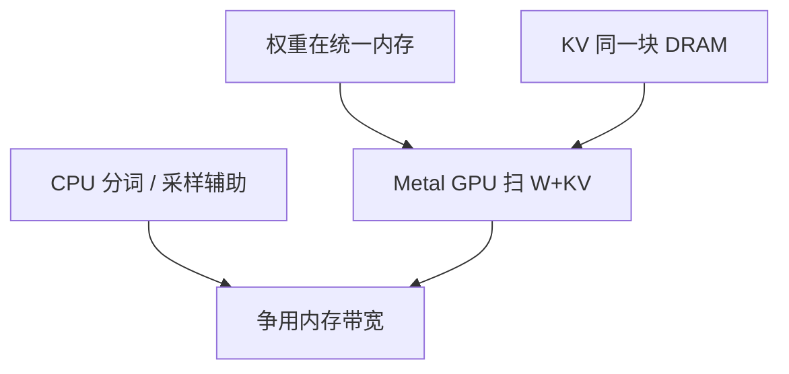

# Apple MLX

统一内存让权重、KV 与激活住在同一块 DRAM 里：没有 PCIe 拷贝，但屋顶线换成了内存控制器与 GPU/ANE 能同时咬多少带宽。

<footer>—— Hannun 等，MLX 框架；Apple Silicon 统一内存是硬件前提</footer>

[上一课](/llm/openvino)在 Intel 上讲共享内存。Apple Silicon 把 CPU、GPU 做成统一内存（UMA）：MLX 用这点做数组框架，延迟求值、在 GPU 上跑 Transformer。llama.cpp 的 Metal 后端是另一条路径，见 [llama.cpp](/llm/llamacpp)。本课写 MLX 的差：Python 研究友好、统一内存上 *驻留策略简化*、以及 decode 仍被内存带宽绑住——只是没有 PCIe 那一项。不把某一 M 系列芯片的 GB/s 写成科学常数。

## 问题

CUDA 服务的加载是盘 → 主机 → HBM。[权重加载](/llm/weight-loading-streaming)的 PCIe 在 Mac 上不存在同一形态：GPU 直接看统一内存中的数组。缺口是：程序员容易以为「没有拷贝 = 没有带宽墙」。decode 每步仍要扫 $W+\mathrm{KV}$，墙是 DRAM 控制器。统一内存上 CPU 与 GPU 争同一带宽，一边 Python 预处理、一边 GPU decode，会互相伤害。

量化（4-bit）同样关键：笔记本级 DRAM 容量是容量墙。MLX 的量化类型与 GGUF k-quant 不是同一码本，质量数字不可直接比。

ANE（神经引擎）与 GPU 不是自动可互换。MLX 主路径是 GPU；把算子下沉 ANE 有形状限制，LLM decode 不总适合。

## 方法

用 MLX 实现或社区 LLM 包：权重以框架格式或转换脚本进统一内存，generate 循环在框架内。批处理 $B\gt 1$ 在本地聊天少见；若做，UMA 上加大 $B$ 仍摊权重，拐点逻辑同前，只是峰值不同。与 Python 互操作：大数组应保持 MLX 端，避免 `numpy()` 隐式拷到 CPU 再拷回。流式 detokenize 仍在 CPU，注意不要每 token 触发大同步。

## 机制

UMA 消灭设备拷贝，不消灭访存能量与带宽。Horowitz 的 DRAM 能量项仍在。研究迭代（改模型、立刻跑）是 MLX 的强项；多租户 SLA 不是——没有 HBM 池与成熟的连续批生态可与 vLLM 对标。选择 MLX 是为了本地与研究，不是把数据中心服务搬到 Mac Studio 就结束会计。

## 边界与工程取舍

不要用 MLX 的 eager 研究脚本当生产多用户引擎。不要把 Metal 与 CUDA FA 的加速比横比而不钉 $n,B$。下一课：浏览器里的 WebGPU，连 Python 都没有。

出处：MLX 项目（Hannun 等）；Apple Silicon 统一内存硬件文档。不发明 arXiv。

## 小结

- MLX 利用 UMA：无 PCIe 拷贝，decode 仍绑 DRAM 带宽。
- CPU 与 GPU 争用同一总线；预处理要让路。
- 量化码本与 GGUF 不同，质量分开测。
- 适合本地与研究，不是数据中心连续批。
- 避免无意义的 `numpy()` 往返。
- 下一课：WebGPU 推理。
- 出处：MLX；Apple Silicon 统一内存。
