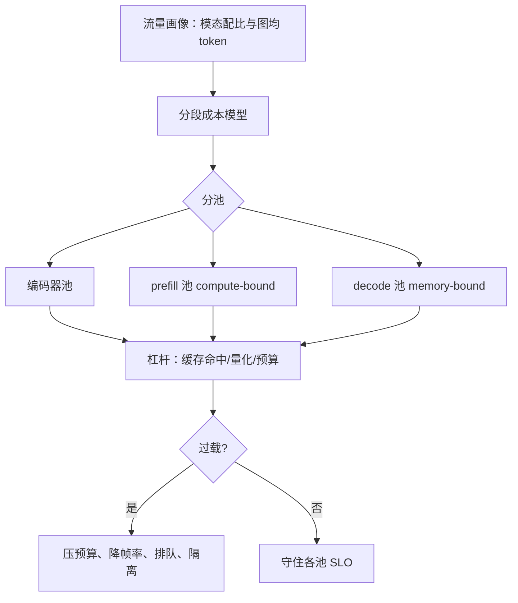
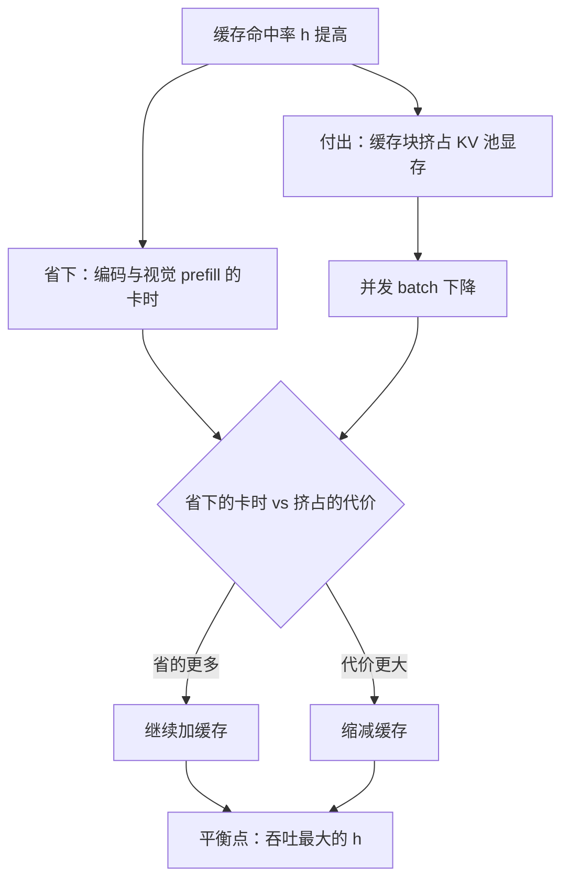

# 成本案例与容量规划

多模态把账单结构倒了过来：文本服务省钱靠少生成，多模态服务省钱还要靠少看——图看多细，是钱说了算。

<footer>—— 据 PagedAttention（Kwon et al., SOSP 2023）、FP8 推理与 PD 分离系统文献口径整理</footer>

[上一课](/llm/mm-safety-filtering)把过滤闸装上，服务栈至此齐了；最后一笔是钱与容量。前面各课的旋钮——[视觉 token 预算](/llm/mm-visual-token-budget)、[嵌入缓存](/llm/mm-serving-vision-encoder)、帧率与分辨率——本课把它们折算成单位成本，再从单位成本走到容量规划：一张图、一分钟视频、一通语音各多少钱，混合负载怎么配卡，过载时先降什么。

## 问题

多模态请求的成本结构与纯文本不同：大块成本从 decode 移到了 prefill。文本服务的算力账主要花在逐 token 解码；图文请求要为上千视觉 token 付一次性 prefill，这笔钱在文本请求里接近为零。于是成本模型要拆段：编码器段的算力、视觉与文本 prefill 的算力、decode 的带宽、外加预处理 CPU 与嵌入传输。负载还高度异质：图文问答要低首 token 延迟、视频理解是长离线任务、语音对话是持续流——三种延迟目标、三种资源形态，混在同一池里互相拖累，[连续批处理](/llm/continuous-batching)的效率红利会被混部吃掉。

compute-bound 与 memory-bound 翻译过来是「卡在算」和「卡在搬」：前者厨师手速跟不上（算力跑满，数据早备好），后者送菜电梯跟不上（数据喂不过来，算力闲着）。视觉 prefill 是大矩阵乘，属于「卡在算」；decode 每步只算一点点却要把全部权重和 KV 搬一遍，属于「卡在搬」。两类瓶颈的解法相反——前者要更强的算力，后者要更宽的带宽，这正是后文分池的依据。

## 方法

先立单位成本模型。每请求成本可拆为

$$C \approx \frac{2 P N_{\mathrm{pre}}}{F} + t_{\mathrm{dec}} + C_{\mathrm{pp}} + C_{\mathrm{net}},$$

$P$ 为参数量，$N_{\mathrm{pre}}$ 为 prefill 总 token（视觉加文本），$F$ 为有效算力，$t_{\mathrm{dec}}$ 为输出 token 数乘每 token 解码时间，后两项是预处理 CPU 与带宽存储。模型一经立起，各旋钮的位置一目了然：预算砍的是 $N_{\mathrm{pre}}$，缓存命中免掉整段编码与 prefill，量化抬 $F$（[FP8](/llm/fp8-inference)）或压 KV（[KV 量化](/llm/kv-quant-int8-int4)）。

容量规划四步走。**画像**：统计模态配比与图均 token，成本模型按画像加权。**分层利用率**：编码器池、prefill、decode 各自的饱和度分开看，补卡补在最紧的一段。**分池**：视觉 prefill 是 compute-bound，与 memory-bound 的 decode 天然该分开——这是 [PD 分离](/llm/pd-disaggregation)的模态版，编码器池在[第一课](/llm/mm-serving-vision-encoder)已独立成段。**降级梯子**：过载时按顺序拉闸——先压视觉预算，再降视频帧率，再对新请求排队，最后隔离非核心租户；每一档都对应可感知的服务变化，提前写进产品文案。

一笔例账：一张 1536-token 图的视觉 prefill 约为 $2\times8\times10^9\times1536\approx2.5\times10^{13}$ FLOPs，在 300 TFLOPs 有效算力上约 80 ms；若输出 300 token、每 token 20 ms，decode 段就要 6 秒——输出长度是第一成本杠杆，看图贵、写更贵。

## 机制

缓存的经济学最容易算错方向。嵌入与 KV 缓存命中率 $h$ 近似省掉 $h$ 份额的编码与视觉 prefill，省的是最贵的那段；但缓存本身占地，KV 池被缓存块占满后并发下降，吞吐反而掉——最优命中率不是越高越好，而是「省下的卡时等于多占的显存代价」的平衡点，要用[评测服务化](/llm/mm-eval-serving)的冷热数据实测定点。降级梯子同理：压预算省 prefill 与 KV，但质量账随预算单调变差，梯子每降一档都要在质量监控上有读数，否则降级是盲飞。

容量按峰值配冗余：$\text{容量}=\text{峰值请求率}\times\text{单请求成本}\times(1+\text{冗余})$，多模态流量的峰谷差比文本大（上传场景集中在白天与事件），弹性伸缩的收益也更大。GPU 代际会移动瓶颈：算力涨得比带宽快的新卡，把瓶颈进一步推向 decode 与 KV——同样一份画像换卡重算，结论可能反过来，成本模型必须跟卡型走。

这张图回答的是：「缓存加到多少该停？」初学者容易以为缓存命中率越高越好，实际上缓存本身占显存——KV 池被缓存块挤占后，能同时服务的请求数下降，吞吐可能不升反降。类比家里囤货：囤得多少跑超市（省时间），但柜子占满了活动空间（生活质量降），最优囤货量在两者之间，不是越多越好。

## 边界

成本模型的有效期以模型换代为单位：编码器与语言模型的参数配比、视觉预算的合理档位都在变，例账的数字每个模型重测，机制不过期。定价口径要与成本结构对齐：按次计费让重图用户占便宜，按 token 计费要把视觉 token 明码标价，含糊的口径最后都变成客诉。降级梯子的每一档必须可观测、可对账——「今天为什么慢」要有答案。最后，容量规划里最贵的是没有预案的峰值：营销活动前压测要带多模态画像，纯文本压测给出的容量数字在图文流量面前是假的。

「降级梯子」可以类比电路的断路器：电流超载时不是全楼断电，而是先跳非关键回路、再跳次关键的，保住冰箱和医疗设备。多模态服务同理——先压视觉预算、再降帧率、再排队、最后才隔离租户，每跳一档都对应可感知但可解释的服务变化。这一步如果做错了（比如一过载就全量拒绝），损失的就不只是成本，是用户对产品的基本信任。

## 小结

- 成本大块从 decode 移到视觉 prefill，账要按编码、prefill、decode、预处理四段拆。
- 单位成本模型把旋钮放到显式位置：预算砍 token、缓存免重算、量化抬算力。
- 编码池、prefill 池、decode 池分而治之，是 PD 分离的模态版。
- 缓存命中率与降级梯子都要按实测平衡点定，盲飞式降级伤质量不省钱。
- 容量按多模态画像与峰值冗余规划，换卡型重算；纯文本压测的容量数字不可信。
- 出处：据 PagedAttention（Kwon et al., SOSP 2023）、FP8 推理与 PD 分离实践口径，及本课程各课成本账整理。
