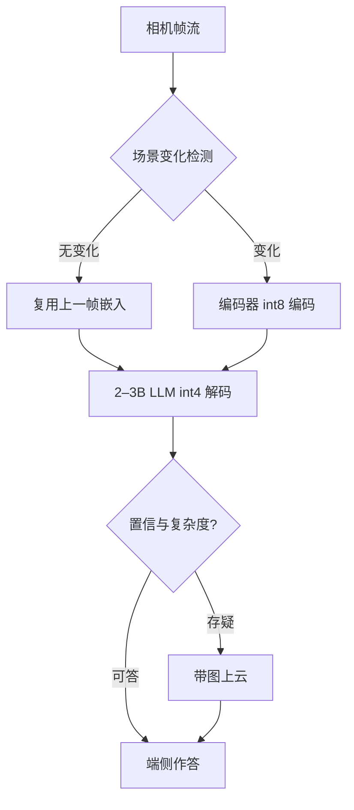

# 边缘多模态

云上谈利用率，端上谈配额：内存给多少、电池给多少，模型只能在这些数字里挑自己能做的事。

<footer>—— 据 llama.cpp 端侧推理实践与端云协同系统文献整理</footer>

[上一课](/llm/mm-multimodal-speculative)按内容开关投机；云上那些旋钮——分池、扩容、驱逐——在端侧全部失效，手机、车机、眼镜给的不是机房，是一份内存与功耗配额。端侧 LLM 的通用实践（[llama.cpp](/llm/llamacpp)）与[端云协同](/llm/edge-cloud-split)的分工已各有专课，本课只写多模态压上去之后改了什么：编码器挤进内存账、相机流变成持续功耗、以及「什么时候必须上云」。

## 问题

内存是第一道墙。3B 级语言模型 int4 权重约 2 GB，0.3–0.7B 的视觉编码器加投影再占零点几 GB，剩下给 KV、激活与运行时的空间在 8 GB 手机上常不足 4 GB——多模态会话的 KV 又比纯文本重一到两个量级（[多模态 KV 管理](/llm/mm-multimodal-kv)），预算必须从内存账反推，而不是从上下文长度正推。第二道墙是功耗：端侧相机是持续流，编码器若逐帧常开，屏幕还没亮起回答，电池已经先掉一格。第三道墙是算子：NPU 工具链只支持覆盖好的算子集，编码器里一个不支持的归一化或重排，整段就得回退到更耗电的 CPU。

## 方法

三个动作按顺序做。**减规模**：语言模型压到 2–3B，编码器换同族小杯，先保证能住下；量化分级——LLM 权重走 int4（[AWQ](/llm/awq) 一类激活感知口径），编码器 int8，激活按算子支持选精度，精度不是一刀切而是逐组件配额。**节流**：帧级调度是边缘多模态独有的节能层——低频跑一个轻量场景变化检测，画面没变就复用上一帧嵌入（[嵌入缓存](/llm/mm-serving-vision-encoder)的省电版），变了才全功率编码；问答间隔长的会话把编码器整个下电。**分工**：端侧模型先答常见问题，置信低、要大上下文或要最新知识的请求带图上云，云的返回再落到端侧继续多轮。

一笔端侧账：3B int4 权重约 1.8–2 GB，ViT int8 约 0.3–0.5 GB，系统与运行时占走大头后，8 GB 设备留给 KV 与激活的常不足 4 GB——视觉 token 预算在端上不是服务质量参数，是内存红线。

## 机制

端侧解码与云侧的瓶颈分布不同。批为 1 时解码是纯 memory-bound：每步都要把权重从存储搬进计算单元，首 token 与吐字速度主要吃内存带宽，而不是算力——这让[端侧投机](/llm/spec-edge)从「可选优化」变成「常规操作」：小草稿多出几个 token，摊薄的正是最贵的权重搬运。节流的经济学同理：场景检测器自身的功耗必须比省下的编码低一个量级，所以它跑低分辨率、低帧率，宁可漏检一次，也不能让「省电层」变成耗电层。

端云协同的判据落在置信度与上下文两端。端侧答不了的问题有两类：能力不够（细 OCR、复杂推理）与信息不够（知识过期、上下文超端侧窗口）。上传的不必是原图——按[视觉 token 预算](/llm/mm-visual-token-budget)压缩后再上行，省的是用户的流量与云的 prefill；云返回结果后，多轮状态留在端侧，后续追问不再上行。

## 边界

量化精度要按模态评测：编码器 int8 对「图里有什么」无损，对文档小字与二维码类的细结构可能致命，端侧 OCR 场景要么给编码器留 int8 以上的档位，要么把 OCR 路由上云。散热是隐形配额：连续视频问答几分钟后的热节流会把性能砍到与规格表对不上，容量测试必须含稳态段而不只跑冷启动。模型升级受存储与内存碎片约束，端上的「发布工程」是整套下架换装，不是改个配置。最后别忘了端侧存在的理由：数据不出设备是它最大的产品价值，任何为了精度把原始图悄悄上云的设计，都是在拆端侧多模态存在的地基。

## 小结

- 边缘多模态的约束是内存、功耗、算子覆盖三道墙，KV 预算从内存账反推。
- 量化分级：LLM int4、编码器 int8、激活随算子支持，逐组件配额。
- 节流靠场景变化检测加嵌入复用，省电层自身功耗要低一个量级。
- 端侧批为 1、解码吃带宽，投机是常规操作而非可选优化。
- 端云分工按置信与上下文判，上行前按预算压图，多轮状态留端侧。
- 出处：据 llama.cpp 端侧实践、AWQ（Lin et al., 2023）量化口径与端云协同系统文献整理。
