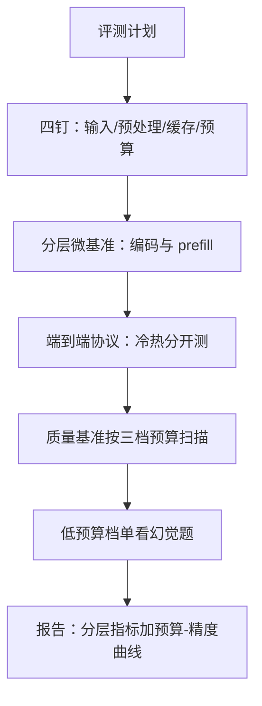
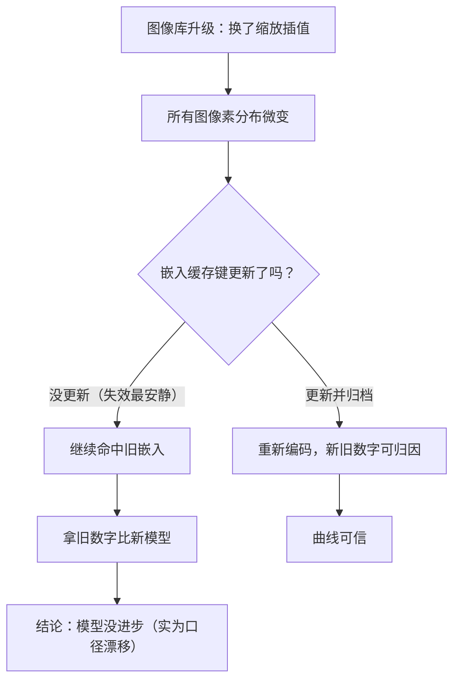

# 评测服务化

多模态服务的评测数字若不写明缓存是冷是热、视觉预算给了多少，那不是指标，是心情。

<footer>—— 据 Yue et al., MMMU, 2024；Lu et al., MathVista, 2024；Li et al., POPE, EMNLP 2023 与长上下文评测服务化口径整理</footer>

[上一课](/llm/mm-edge-multimodal)把整套栈压进端侧配额；至此云与端部署形态都齐了，缺一把统一的尺。多模态评测要同时回答两个问题：答得对不对、跑得快不快省不省——而两者被同一组变量搅在一起：首 token 延迟取决于图像大小与缓存状态，质量分数取决于视觉 token 预算。长上下文侧已有[评测服务化](/llm/lc-eval-serving)的先例，内核侧有[基准方法论](/llm/ak-benchmark-methodology)，本课把两者合到多模态：钉变量、分指标、带预算跑质量。

## 问题

两套评测各有盲区。质量侧的 [MMMU 与 MathVista](/llm/mmmu-mathvista)、[POPE](/llm/vlm-hallucination) 式幻觉集测模型能力，脚本通常默认最大分辨率、空缓存、独占机器——拿它推线上性能，等于用理想实验室外推晚高峰。服务侧的压测只管吞吐与延迟，输入图像随手抓，不看尺寸分布与命中率，同一服务换个图像集就能「快」一倍。多模态的独特麻烦在于：**图像本身就是自变量**，既进质量账又进成本账，不报告图像口径的数字无法跨实验比较。

术语翻译：冷缓存指服务第一次见这张图，要从头跑编码器，慢；热缓存指这张图的编码结果已经存过，直接查表复用，快。类比餐厅：冷缓存是「现点现做」，热缓存是「预制菜加热」。测量时必须说明你吃的是哪种——拿预制菜的上菜速度宣传堂食体验，就是后文说的「数字虚高最大单一来源」。

## 方法

协议的核心是四个「钉」。**钉输入**：固定图像集并归档字节 hash，文本模板随版本记录。**钉预处理**：图像库版本、缩放插值、档位表写进评测配置，这些正是[嵌入缓存](/llm/mm-serving-vision-encoder)键的内容，键变则一切旧数字作废。**钉缓存状态**：冷缓存（全部首次编码）、热缓存（嵌入与 KV 全命中）分开测、分开报，预热轮次显式声明。**钉预算**：视觉 token 上限是评测变量，写进每一行结果。

指标按流水段分层：编码器层每秒图数、prefill 层每秒视觉 token、请求层 TTFT 与 TPOT、成本层每图与每分钟视频的价格。分层让瓶颈可定位：请求层慢时先看哪一层饱和，再决定补卡还是改档位表。质量评测同样带变量跑：同一基准在三档[视觉预算](/llm/mm-visual-token-budget)下各跑一遍，报告的是预算-精度曲线，不是单点分数；幻觉类题目在低预算档单独看，预算压得越低，语言先验补图越多，[物体幻觉](/llm/vlm-hallucination)率是预算曲线里最先翘头的那条。

同一服务冷缓存的 TTFT 可达热缓存的数倍：热路径里编码与视觉 prefill 全部短路。「预热后测吞吐再外推线上首请求」，是自测数字虚高的最大单一来源。

## 机制

四钉里最易被忽视的是预处理钉，因为它失效得最安静：图像库升级换了插值，所有图像的像素分布微变，嵌入缓存键没变、旧数字被拿去和新模型比，结论看起来是「模型没进步」。这是[缓存键版本纪律](/llm/mm-serving-vision-encoder)的评测版——评测配置是缓存键的镜像，评测系统应直接消费线上键的定义，而不是各写一份。统计口径按[评测方差](/llm/eval-variance-seed)钉死：跑几轮、取什么分位；多模态单轮成本高，图省钱跑一轮，方差就把结论吃掉。

「图省钱跑一轮」为什么危险：假设某基准单轮分数的随机波动约 ±1.5 分，两个模型各跑一轮得到 71.2 与 72.8，看起来差 1.6 分——其实完全可能没有真实差距。多跑三五轮取均值与区间，才能分清「真差距」和「抖动」。类比称金子：精度 ±0.5 克的秤上，两次称重差 0.3 克说明不了轻重。

预算-精度曲线的机制在[预算课](/llm/mm-visual-token-budget)已给：削减先伤高信息密度区。评测的价值是把曲线从论断变成每个模型的实测——同一档预算，OCR 型任务掉得早、描述型几乎平，曲线形状本身就是选型依据。服务与质量评测共用图像集还有一层红利：同一条请求既能算对错又能算成本，质量-成本散点图直接可画，为下一课的容量与定价备料。

这张图回答的是：「预处理钉为什么最容易被忽视又最致命？」它的失效不报错、不崩程序，只是让所有对比悄悄失真。类比体重秤：你换了秤（新图像库）但没换刻度（缓存键没变），之后记录的「体重变化」全是假的——问题不在身体，在尺子。评测纪律的本质是先钉尺子，再谈测量。

## 边界

基准侧的老问题在多模态上只会更重：公开集的污染与[饱和](/llm/benchmark-saturation)让单点分数趋同，预算曲线与自有图像集是缓解，不是解药。线上与离线的差也不只是缓存：真实流量里图像分布高度偏斜——聊天里截图与头像占大头，基准里的文档页是小众，离线分数要配线上分布加权才有参考性。评测也有成本与合规：全量基准的钱不可忽略，敏感图像不能出测试环境。语音与视频各有时间维指标（端点延迟、事件定位），四钉框架照用，口径按模态补。

## 小结

- 多模态评测必须双轨：质量与成本，两轨共享图像自变量，任何一行都要报口径。
- 四钉协议：输入 hash、预处理版本、冷热缓存、视觉预算，缺一即不可比。
- 指标按流水段分层：编码、prefill、请求、成本，瓶颈定位靠分层饱和度。
- 质量跑预算-精度曲线，幻觉率在低预算档最先翘头，是选型依据。
- 线上分布偏斜与基准污染靠加权与自建集缓解；评测配置直接消费线上缓存键。
- 出处：据 MMMU（Yue et al., 2024）、MathVista（Lu et al., 2024）、POPE（Li et al., EMNLP 2023）与评测方法论课程口径整理。
