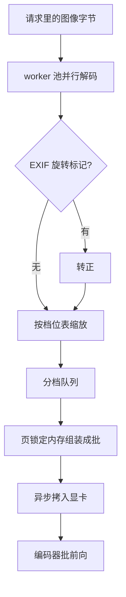

# 图像预处理的批处理

GPU 一步几十毫秒，CPU 解一张手机照片几十毫秒；多模态服务最长的队，常常排在没有 GPU 的那一段。

<footer>—— 据 HuggingFace 图像处理器与 vLLM 多模态输入管线的实现口径整理</footer>

[上一课](/llm/mm-serving-vision-encoder)把编码器立成独立服务组件：分辨率桶解决形状动态，嵌入缓存省掉重复编码。但桶的档位是谁定的、图像进编码器之前经历了什么，还悬着。JPEG/HEIF 解码、EXIF 方向、缩放、归一化、切 patch 全在 CPU 上，预处理是编码批处理的真正上游。本课写这段 CPU 流水怎么组织成批：worker 池、变长批的组装、主机到显卡的搬运，以及 CPU 跟不上时 GPU 饿死的样子。token 数怎么算留到下一课。

## 问题

一张图像从上传到能进 ViT，要过五道：字节流解码成位图；按 EXIF 转正——手机照片常带旋转标记，跳过这步模型看到的就是横躺的图；按目标档位缩放；减均值除方差地归一化；切 patch 排成序列。每道都是纯 CPU 操作，单张几十毫秒量级，且与请求的关键路径串行：预处理不结束，编码器无事可做。GPU 一秒能编几十张图，单线程 CPU 一秒只能预处理几十张，看似匹配，实则一个抖动就错位——批越大，需要的预处理越集中，CPU 峰值压力随批大小一起涨。

变长是第二重麻烦。[原生动态分辨率](/llm/qwen-vl-naive-dynamic-res)意味着同一批请求里的图宽高各异、patch 数各异，批内张量要对齐就得 padding 到最大形状。一个 224×224 缩略图和一张 1344×896 文档页同批，前者陪跑后者的计算与显存，浪费由批内方差决定。

## 方法

组织方式是把预处理做成**独立 worker 池**：解码、缩放、归一化在各 worker 上并行，产物进入按分辨率档分的队列；编码器池从队列取整批。这与[上一课](/llm/mm-serving-vision-encoder)的桶是同一套档位表——预处理按表把图缩到档，编码器按表组批，两张表必须同源，否则桶对不齐。请求到达即开始预处理，不等上一批编码结束，CPU 与 GPU 由此错峰。

搬运要过两道优化。解码产物是页锁定内存（pinned memory），主机到显卡的异步拷贝才能与下一次解码重叠；归一化能挪到 GPU 就挪——缩放留在 CPU（插值质量可控），归一化放进编码前向的第一层，省一半 CPU 与一次全量内存写。同一请求带多张图时，把它们的 patch 拼进同一个编码批，一次前向出全部嵌入，省掉多次小批的启动开销。

一张 3840×2160 的图解码成 RGB 是约 24 MB，是压缩文件的几十倍；批 32 张就有约 0.8 GB 内存要解码、缩放、再拷走。预处理的成本大头是内存带宽，不是 CPU 的算术。

## 机制

批组装的本质是用等待换效率：队列攒到同档 $B$ 张或超时 $\tau$ 就发批。$B$ 越大吞吐越高，但第 1 张图等了整整 $B-1$ 张的预处理时间，首 token 延迟被队列拉长；$\tau$ 是这条折中的显式旋钮，超时发批保证低流量时段延迟有界。padding 浪费可写成 $\sum_i (A_{\max}-A_i)/A_{\max}$，$A$ 为 patch 数：档位表越细，批内 $A_{\max}$ 越贴近每张图，浪费越小，但批越小、调度越碎。档位数、批上限、超时三个参数要一起调，单拧一个都会把瓶颈搬到邻段。

CPU 容量是隐性上限。设单图预处理 $t_{\mathrm{pp}}$ 毫秒、worker 数 $W$，预处理吞吐就是 $W/t_{\mathrm{pp}}$ 张每秒；低于编码器吞吐时，GPU 利用率天花板被 CPU 钉死，加卡无效，加核才有效。诊断顺序是先看 GPU 利用率与预处理队列深度：队列持续非空说明 CPU 是瓶颈，队列常空而 GPU 不满才是编码器的问题。

## 边界

预处理是[嵌入缓存](/llm/mm-serving-vision-encoder)键的一部分，也是漂移的高发地：图像库升级换了缩放插值，或归一化常数改了精度，键没变缓存不失效，线上精度缓慢下滑且无从对账；预处理代码要进版本管理，版本号进键。EXIF 只在解码侧生效，训练数据若多数已转正，服务侧漏转正等于悄悄换分布。HEIF、动图、超大图的降采样策略各是独立分支，评测集里要各有样本，否则它们只在生产里第一次见。最后，批组装带来的排队让延迟方差变大，对延迟敏感的请求应允许插队小批，用吞吐换尾延迟。

## 小结

- 预处理五道（解码、EXIF、缩放、归一化、切 patch）在 CPU，是编码批的真正上游与常见瓶颈。
- 独立 worker 池加分档队列，让 CPU 与 GPU 错峰；档位表必须与编码器分桶同源。
- 页锁定内存与异步拷贝让搬运重叠；归一化可上移进显卡。
- 批上限与超时是延迟-吞吐旋钮，padding 浪费由档内方差决定，三参数联动。
- 预处理进版本管理并写进缓存键，防止无声漂移；CPU 吞吐封顶时加卡无效。
- 出处：据 HuggingFace 图像处理器、vLLM 多模态输入管线实现与 Qwen-VL 动态分辨率叙述整理。
