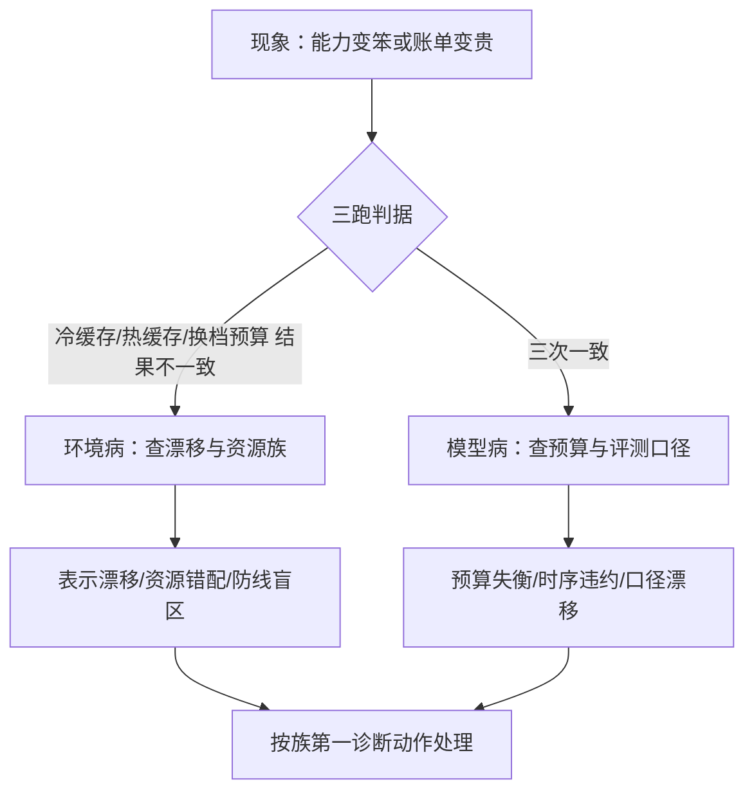

# 失败模式与收束

多模态服务的病很少喊疼：不报错，只变笨；收束的办法是把「变笨」钉回哪一族、出自哪一课。

<footer>—— 据本课程前十一课的失败条款与推理系统排障实践整理</footer>

[上一课](/llm/mm-cost-capacity)把整条栈折成成本账与容量梯子。至此课程走完一条线：[编码器池](/llm/mm-serving-vision-encoder)、[预处理](/llm/mm-image-preprocess-batching)、[视觉预算](/llm/mm-visual-token-budget)、[视频](/llm/mm-video-serving)与[语音](/llm/mm-speech-serving)、[KV 管理](/llm/mm-multimodal-kv)、[投机](/llm/mm-multimodal-speculative)、[边缘](/llm/mm-edge-multimodal)、[评测](/llm/mm-eval-serving)、[过滤](/llm/mm-safety-filtering)与[成本](/llm/mm-cost-capacity)。本课把全线失败条款收成族，给运维一张归因坐标，然后收束。本课程到此收束。

## 问题

多模态服务的失败有个共同脾气：**静默**。文本服务的失败常以报错或明显胡言出现，多模态的失败更常表现为能力悄悄变差——图看不准了、话接不上了、账单变贵了——且只在部分请求上复现。原因在前十一课里反复出现：管线变长，模态间合同变多，而合同违约不会抛异常。把失败条款归族，「变笨」才能变成可排障的事件，而不是「模型最近状态不好」的玄学。

## 方法

六族坐标，每族给信号与第一诊断动作。

**表示漂移族**：预处理库、编码器、对话模板任一升级而缓存键没跟上，新旧嵌入与 KV 混用。信号：能力缓慢退化、命中率反常地高。第一动作：核对[缓存键版本](/llm/mm-image-preprocess-batching)，清缓存对照。

**预算失衡族**：视觉 token 超卖打穿窗口与 KV，或压得过低逼模型用语言先验补图。信号：长请求 TTFT 抬升、幻觉率上翘。第一动作：拉[预算回执](/llm/mm-visual-token-budget)分布。

**资源错配族**：编码与 prefill 混池互抢、CPU 饿死 GPU、大批发里投机亏本。信号：某段饱和而端到端吞吐不动。第一动作：按[分层利用率](/llm/mm-serving-vision-encoder)找最紧一段。

**时序违约族**：视频时间戳丢失、[语音端点与打断](/llm/mm-speech-serving)丢上下文、流式挂起窗口错配。信号：定位类问答静默答错、对话答非所问。第一动作：回放中间产物，对时间合同逐条核。

**防线盲区族**：图内文本绕过文本审核、审核分辨率低于主模型档、误杀无申诉通道。信号：红队样例穿透、投诉分流异常。第一动作：用[合流审核](/llm/mm-safety-filtering)回归集重放。

**口径漂移族**：评测不钉缓存与预算、成本模型随模型换代过期、纯文本压测给出假容量。信号：离线数字与线上体感背离。第一动作：按[四钉协议](/llm/mm-eval-serving)重测对照。

## 机制

归因的枢纽是**三跑判据**：同一请求分别以冷缓存、热缓存、另一档预算跑三次。结果不一致，病在环境——缓存、版本、资源调度；三次一致，病才在模型或配置。这是[推理链课程](/llm/pl-map)「加预算恢复率」判据的多模态版：不猜病因，先花三次请求把环境与模型切开。六族在此框架下才有意义——族是归因坐标，不是互斥判决，一次事故常是两族复合。

各族的监测面建在族上而不是指标上：漂移族盯缓存键版本对账，预算族盯回执分布，错配族盯分层利用率，时序族盯合同字段完整性，盲区族盯红队回归通过率，口径族盯离线与线上分数差。面板按族排布，告警才能直接落到第一诊断动作。

一次典型的复合事故：预处理库升级使缓存键失效，旧嵌入继续命中，同时运营调低默认预算省成本——线上表现为「模型突然不识字」。单查预算或单查缓存都会得出错误结论，三跑判据是切开复合病因的刀。

## 边界

这门课收束的是**服务侧**：图像、视频、语音进入推理系统后怎么跑得对、快、省、稳。训练侧怎么造出更值得服务的模型——[多模态 RLHF](/llm/multimodal-rlhf) 与[多模态推理](/llm/multimodal-reasoning)的能力来源、生成侧的图像视频服务、基准的内部构造——各有其课，这里只接口。案例数字随模型与硬件过期，六族坐标与三跑判据跨代复用：管线还会更长，「静默变笨」只会更常见，归因坐标值得先于故障建好。

## 小结

- 多模态失败的共同脾气是静默：不报错、只变笨、部分复现，必须靠族坐标排障。
- 六族：表示漂移、预算失衡、资源错配、时序违约、防线盲区、口径漂移，各配信号与第一动作。
- 三跑判据（冷、热、换预算）先切环境病与模型病；族是坐标，不是互斥判决。
- 监控按族建面板，告警直接落到第一诊断动作；面板先于故障建好。
- 服务侧课程至此收束：训练侧与生成侧各有其课，此处只接口。
- 出处：据本课程十二课小结与排障实践整理；文献口径见各课末条。
