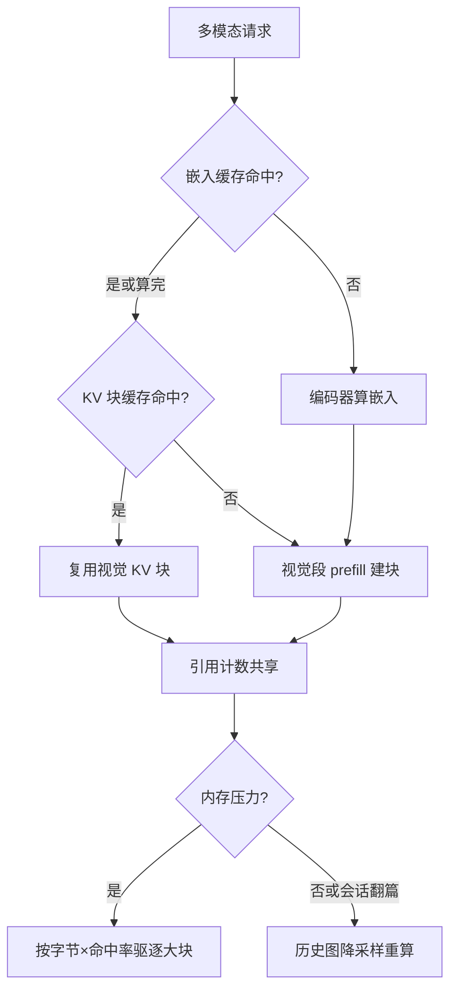

# 多模态 KV 管理

文本会话的 KV 按千 token 计，多模态会话的 KV 按「几张图」计；前缀缓存的键与驱逐的秤都得重做。

<footer>—— 据 Kwon et al., PagedAttention, SOSP 2023 与 vLLM 多模态前缀缓存实现整理</footer>

[上一课](/llm/mm-speech-serving)把语音的四段延迟分了账；图、视频、语音进了 prefill 之后，共同下游都是 KV。分页、共享与驱逐的机制由 [KV 生命周期](/llm/kv-map)一线讲过，本课不重推，只写多模态负载改了什么：视觉 token 的 KV 比文本大一到两个量级、复用结构完全不同、历史图像在多轮里如何存留成为独立的策略问题。

## 问题

尺寸失衡是根。每 token 的 KV 字节是固定的（层数 × 2 × KV 头数 × 头维 × 精度字节数），而一张文档页按[视觉 token 预算](/llm/mm-visual-token-budget)轻松用掉一千五百 token——相当于把一整章文本的 KV 一次性塞进会话。后果有三：按「请求数 × 平均文本长度」估容量全部失效；同样并发水位下，图文负载的 KV 池比纯文本早得多进入驱逐区；多轮会话里，几轮之前的截图还整幅常驻，用户却再也不会问它。

复用结构也不同。文本前缀缓存的命中主体是系统提示与少样本段，小而极稳；图像 KV 的大头是内容块，大而集中——爆款图、同商品图、同文档页被反复请求，命中时收益巨大，不命中时占地巨大。高收益与高风险挂在同一个键上。

## 方法

缓存放两级。第一级是[嵌入缓存](/llm/mm-serving-vision-encoder)：图像内容 hash 加预处理参数与编码器版本，命中则连编码器都不用跑。第二级是 **KV 块缓存**：把「图像嵌入 + 对话模板版本」映射到已算好的 KV 块，命中则跳过整段视觉 prefill。两级条件不同——嵌入命中不等于 KV 命中，模板或位置变了，嵌入还能用，KV 必须重算；反过来 KV 命中蕴含嵌入有效。命中链依次短路的是编码器、prefill 两段成本。

驱逐要用多模态自己的秤。块的处置按「字节 × 复用概率」排序：图像块单体大，驱逐一块回收的字节顶几十个文本块，所以**先审大块**；但点播集中度高的图命中率高，复用概率要用命中率数据喂，不能拍脑袋。会话内的存留策略独立于全局驱逐：翻篇的图像不走驱逐，走**降采样重算**——把历史大图换成低预算版本重 prefill，用一次小计算换长期的常驻占用，这是文本会话里不存在的第三条路（驱逐、保留之外）。

KV 字节账：28 层、4 个 KV 头、头维 128、bf16 时每 token 为 $28\times2\times4\times128\times2\approx57$ KB；一张 1536-token 的图约 87 MB，抵得上近两千 token 文本块的几十倍单体。图文并发容量必须按「图数」而不是「请求数」估。

## 机制

两级缓存的结构解释了为什么键必须分层。嵌入层键负责「编码结果是否仍为真」，由图像内容、预处理、编码器版本决定；KV 层键负责「这段 KV 是否能拼进当前上下文」，还要加上模板与位置布局。任何一层键少一项，失效就不传播——旧 KV 被新请求直接拼用，错误以「模型好像变笨」的形式出现，且只在部分请求上复现。这也是[缓存键版本纪律](/llm/mm-serving-vision-encoder)在 KV 层的加倍：模板升级、上下文重排、位置编码改动都要进键。

降采样重算的账要算两头。收益是常驻 KV 从全预算降到低预算版，会话能容纳的轮数与并发显著上升；成本是一次低分辨率 prefill，外加可复现性损失——历史里的图「变糊」之后，追问细节的答案可能与当初不同。所以降采样要留档：记录原预算与现预算，追问细节且原图仍在嵌入缓存时，透明地重算升回。

## 边界

KV 量化对视觉前缀不能沿用文本结论：视觉 token 冗余高，直觉上更耐压，但文档图表类高信息密度 token 与文字混在同一序列，敏感度要按模态分别评测（见 [KV 量化](/llm/kv-quant-int8-int4)）。音频会话的 KV 时效短：通话结束，上下文价值归零，缓存 TTL 与图文不同，默认即弃。跨机迁移与 PD 分离场景里，图像块只是更大的普通块，按块数估迁移字节会系统性低估。最后，敏感图像的块共享范围要收敛到单租户，租户隔离优先于命中率。

## 小结

- 视觉 token 的 KV 单体比文本大一两个量级，图文容量按图数而非请求数估算。
- 嵌入缓存与 KV 块缓存是两级：键不同、短路成本不同，失效必须逐层传播。
- 驱逐按「字节 × 命中率」排序，大块先审；历史图可走降采样重算的第三条路。
- 模板、位置、编码版本全部进键，少一项即出现部分请求的能力退化。
- KV 量化按模态分桶评测；音频 KV 默认短 TTL；租户隔离优先于命中率。
- 出处：据 PagedAttention（Kwon et al., SOSP 2023）、vLLM 多模态前缀缓存实现与 KV 管理课程口径整理。
