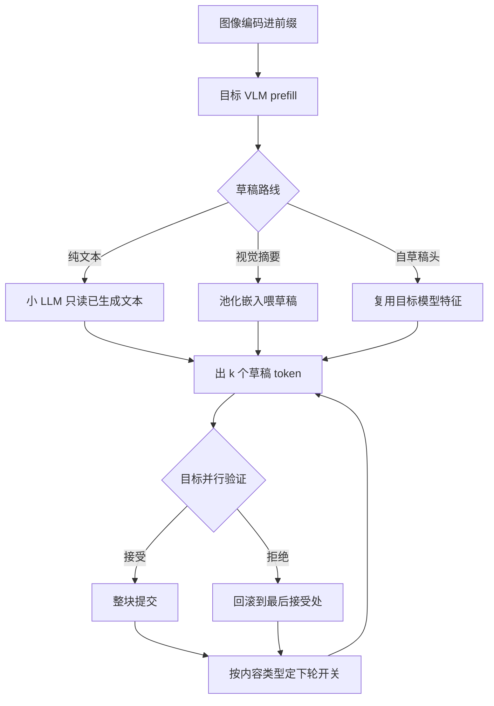
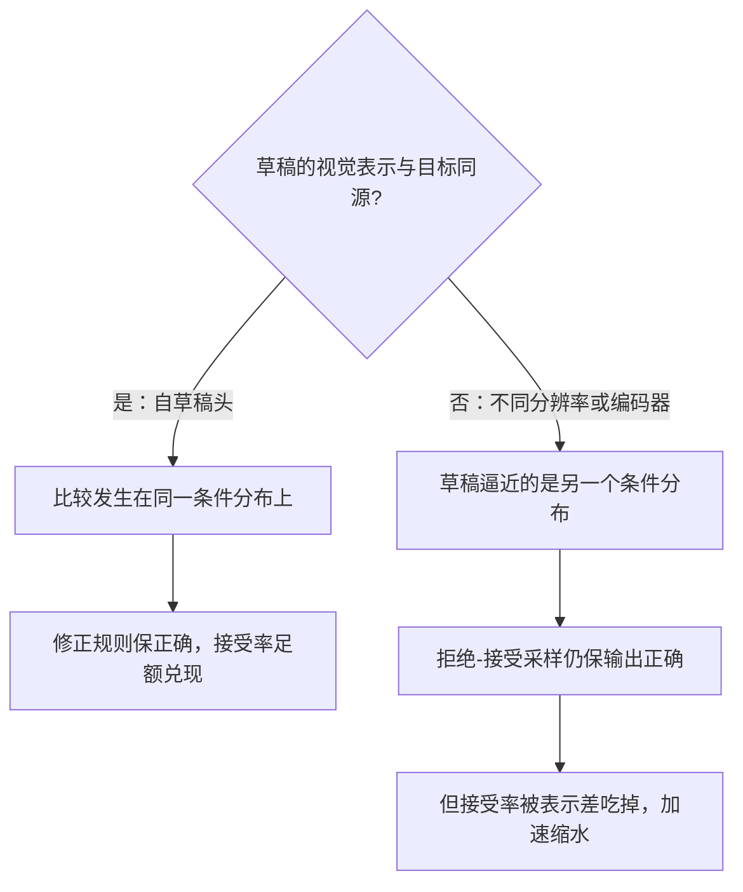

# 多模态投机解码

投机解码赚的是接受率的钱；图一进来，同一段输出里有的 token 唾手可得，有的一个都猜不中。

<footer>—— 据 Leviathan et al. 与 Chen et al., 2023（投机解码）；Li et al., EAGLE, 2024；Cai et al., Medusa, 2024 整理</footer>

[上一课](/llm/mm-multimodal-kv)把视觉 KV 的缓存与驱逐管好；本课回到解码加速。投机解码的拒绝-接受采样与期望收益由[投机解码](/llm/speculative-decoding)给出，草稿谱系见 [EAGLE](/llm/eagle) 与 [Medusa](/llm/medusa)，整线的批交互收在[投机收束](/llm/spec-map)。多模态不改算法，改的是**接受率的分布**：视觉前缀让某些输出段近乎可抄、某些段几乎不可猜，投机的开关要从「全局开」变成「按内容开」。

## 问题

接受率 $\alpha$ 的定义不变：草稿 token 被目标接受的概率。多模态把它按内容劈开。视觉描述类输出高度模板化——「图中左侧有一座……」的结构与词汇都可预测，$\alpha$ 高；OCR、表格数字、代码、URL 类输出，每个 token 是从图里读出的独立事实，草稿不看图就猜不中，$\alpha$ 低到接近乱猜。平均值失去意义：一条图文请求里两段输出交替，整体 $\alpha$ 是混合数，而收益随 $\alpha$ 指数变化，混合数同时高估简单段、低估困难段。

投机解码可以类比「写作文先让快手助手打草稿、老师逐段批改」：助手猜得准，老师一次过一整段，省时间；猜不准就整段作废重来。草稿模型小而快、目标模型大而准，最终以老师的批改为准，所以正确性不受损，赚的只是速度。

草稿侧还有一个结构缺口：文本草稿模型根本看不见图。它对「下一个描述哪个物体」完全无知，猜中全靠语言惯性。把视觉信息喂给草稿成为多模态投机特有的设计点——喂多少、用什么形式、草稿模型要不要重新训练，各有代价。

## 方法

三条部署路线，按草稿获得视觉信息的多少排。**纯文本草稿**：草稿只读已生成文本，实现最简，但图强相关段接受率塌方，只适合叙述为主的负载。**视觉摘要草稿**：把视觉嵌入池化成几百 token 喂给草稿（不跑完整编码器），困难段接受率回升，代价是草稿前向变贵且要蒸馏适配。**自草稿头**：[EAGLE](/llm/eagle) 与 [Medusa](/llm/medusa) 一类复用目标模型内部特征出草稿，视觉 token 的特征天然在特征流里，「看图」不需要额外通道——多模态目标配自草稿头，是当前性价比最高的组合。

按内容路由的开关补最后一层：输出进入 OCR 串、数字、代码等高信息密度区时临时关投机（信号是正则或 token 类型），回到叙述段再开。开关本身要便宜，否则省下的验证钱又花回路由上。

期望接受块长为 $\frac{1-\alpha^{k+1}}{1-\alpha}$：$\alpha=0.7$、草稿深度 $k=4$ 时约 $2.4$；OCR 段 $\alpha$ 掉到 $0.3$，同一公式只剩约 $1.15$，草稿前向的钱白烧。按段开关不是优化，是保本。

## 机制

拒绝-接受采样的正确性只依赖一个条件：草稿与目标在**同一条件分布**上比较，修改规则保证输出仍服从目标分布。多模态的陷阱在「条件」二字：草稿若看的是与目标不同的视觉表示（不同分辨率、不同编码器），它逼近的就不是目标的条件分布——采样修正仍保正确，接受率却被表示差吃掉。这是「草稿的视觉通道必须与目标同源」的原理依据，也是自草稿头天然占优的原因：特征同一份，不存在表示差。

语音是反例课。语音 token 二分（[语音 tokenizer](/llm/speech-tokenizer)）：语义类单元随词内容走，可预测、可投机；声学码本深层下标接近均匀分布，$\alpha$ 趋近随机水平，投机只亏不赚。TTS 的声学合成不开投机，ASR 的文本输出照常开——同一条语音管线里，投机按 token 类型分段适用。视频帧流的增量 prefill 与投机正交：一个省编码与 prefill，一个省解码，可叠加但账分开记。

常见误区：只看平均接受率。一段 $\alpha=0.9$ 的叙述配一段 $\alpha=0.2$ 的 OCR，平均 0.55 看着「还凑合」，但收益随 $\alpha$ 指数变化——分开统计才会发现 OCR 段每一步草稿都在亏钱。这就是评测必须按内容分桶的原因。

## 边界

批处理是投机收益的隐形天花板：大批下验证前向早已算满，草稿省不下墙钟时间，收益随批大小递减；图文负载的视觉 prefill 又抬高批压力——多模态在线服务里投机常只在低峰或小批会话开。为什么大批下投机失灵？投机赚的是「验证 k 个 token 不比验证 1 个贵多少」的并行余量；大批时 GPU 的并行额度早被真实请求占满，草稿 token 只能排队插空，省不下墙钟时间。低峰期并行额度空闲，才是投机的窗口。接受率评测必须按内容分桶，平均 $\alpha$ 会在模型升级时给反向信号：叙述段变模板化拉高平均，困难段其实没变。路由误判代价不对称：OCR 段误开只亏性能，叙述段误关只亏加速；但频繁开关让 TTFT 抖动，尾延迟敏感的会话宁可用保守固定档。

## 小结

- 多模态不改投机算法，改接受率分布：描述段高、OCR 数字段低，平均值失去意义。
- 草稿获得视觉信息的三档路线：纯文本、视觉摘要、自草稿头；末者表示同源、性价比最高。
- 按内容路由开关投机，OCR 段关、叙述段开，开关要便宜。
- 正确性要求草稿与目标条件分布同源；表示不一致先吃掉接受率再谈加速。
- 声学码本不可投机、语义单元可投机、ASR 文本输出照常，语音管线分段适用。
- 出处：据 Leviathan et al. 与 Chen et al., 2023；EAGLE（Li et al., 2024）；Medusa（Cai et al., 2024）与语音 tokenizer 文献整理。
