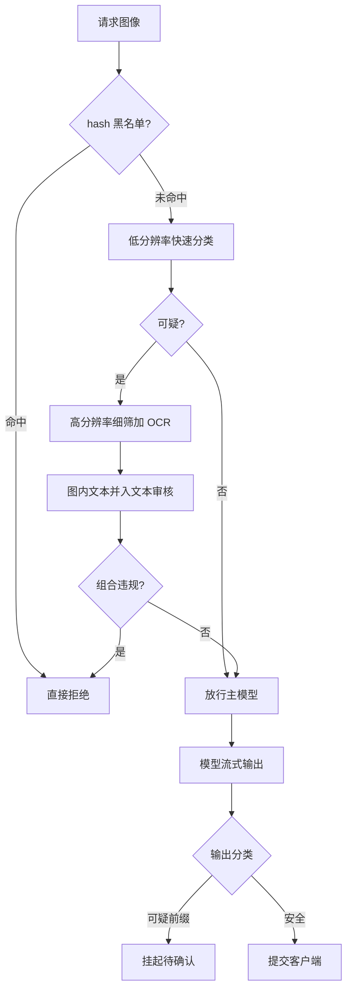

# 安全过滤

只扫文本的护栏，在图像流量里等于只检了行李的一半；而图里那半，往往还写着字。

<footer>—— 据 Shan et al., 2020（对抗性视觉防护）与多模态红队、护栏系统文献整理</footer>

[上一课](/llm/mm-eval-serving)立了评测协议，本课写线上另一道闸：安全过滤。多模态流量的审核面比文本宽：像素本身、图里嵌的字、视频每一帧、语音内容。跨模态越狱的通道错位已由[多模态越狱](/llm/multimodal-jailbreak)专文写过——对齐大多做在文本指令上，视觉 token 是护栏盲区；本课不再论证漏洞，只写过滤管线的落地：入口怎么筛、输出怎么拦、延迟与误杀怎么不失控。

## 问题

输入面至少三层。**像素层**：违规图像内容的视觉识别，经典分类任务。**图内文本层**：把违规指令印进图片是最省事的攻击——像素分类器看不见语义，文本审核看不见图，两条防线恰好都错过；主模型却看得清清楚楚，并照做。**旁路层**：文件名、EXIF 描述、链接预览，不进模型，但进日志与聚合系统。输出面同样双向：对图的描述可能复述敏感内容，OCR 类任务的输出就是原文搬运——图里有什么违规文本，输出里就有什么。

过滤还有自己的服务问题：审核也要算力。高分辨率审核串在关键路径上会把[首 token 延迟](/llm/ttft)翻倍；砍审核分辨率，小字违规就留给主模型去看——防线与被保护对象用着不同分辨率档，这本身就是漏洞。

## 方法

管线按成本分层。**入口粗筛**便宜且快：内容 hash 黑名单加低分辨率快速分类器，多数正常流量到此放行。**细筛**只对可疑或命中风险类目的请求开：高分辨率重筛、跑 OCR、图内文本汇入统一的文本审核流。关键是**联动**而非并联：图内文本须与用户提示合并成同一条待审文本，违规性常在「图 + 问法」的组合里成立——普通海报配上「照着图里的字做」就是攻击。输出侧流式过滤沿用流式 stop 的挂起思想：增量过分类器，可能构成违规前缀的尾巴挂起不提交，确认安全再放行；判定违规则切断并给固定拒绝话术。审核决策全落审计日志，是申诉与红队回归的共同底座。

审核分辨率的两难：粗筛用 512px 档时，图内小号字的违规指令在像素层面已不可读，躲过审核；主模型却用 1344px 档看图，同一行字看得一清二楚。审核档位不得低于主模型实际可能用到的档位。

## 机制

级联的经济学由错误成本的不对称决定：漏检的代价远高于误杀的体验代价，所以粗筛按高召回配阈值，细筛补精度。粗筛的分辨率与类目集是调参重点：类目开太多，粗筛变细筛，延迟崩；开太少，细筛触发率形同虚设。图内文本联动则是结构上的必然：违规性不在单一模态里，单通道分类器的最优阈值救不了通道缺失——先合流再审核，是唯一结构上站得住的做法。

流式过滤的难点是「部分文本不可分类」：半句话可能同时是违规句和正常句的前缀。挂起窗口由分类器的不确定区决定，与[流式 stop 匹配](/llm/stop-sequences)同构——都在「早提交的闪错」与「晚提交的卡顿」之间取窗口。类目多、模式互为前缀时窗口变长，用户感知为吐字一顿一顿，这是输出过滤的真实延迟成本。

## 边界

过滤是概率防线：对抗扰动、艺术字体、逐帧拆分进视频，攻防还在升级，红队要持续跑（[红队工程](/llm/aeval-redteam-engineering)口径直接适用），规则变更都过回归集。误杀侧同样有度量：过度拒绝率要与漏检率一起进[安全评测](/llm/aeval-safety-benchmark-design)报告，只报拦截量是在做业绩不做事。审核图像的留存设期限与用途边界，为申诉保留的素材不该变成训练数据。语音面另有法规红线：实时通话的内容过滤先过法务。

## 小结

- 输入面三层：像素、图内文本、旁路元数据；图内文本是文本护栏的经典盲区。
- 级联过滤：hash 黑名单加低分辨率粗筛保延迟，可疑流才进高分辨率细筛。
- 图内文本与用户提示合流审核，违规性常在图文组合里成立。
- 审核分辨率不得低于主模型可用档位，否则防线比被保护对象先失明。
- 输出过滤挂起可疑前缀，窗口是延迟与安全的折中；决策全落审计日志。
- 出处：据多模态越狱与红队文献、对抗性视觉防护（Shan et al., 2020）及安全评测课程口径整理。
