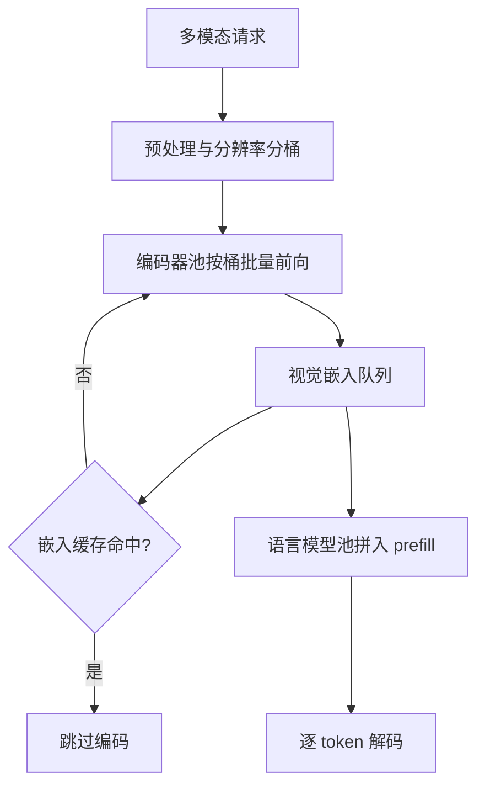

# 视觉编码器的服务化

视觉编码器不是语言模型里多出的一层，而是另一台机器：无状态、无 KV、一次前向；拿调度语言模型的方式调度它，两头都跑不满。

<footer>—— 据 Dosovitskiy et al., ViT, ICLR 2021；Liu et al., LLaVA, 2023；Qwen2.5-VL Technical Report 与 vLLM 多模态服务实现整理</footer>

[上一课](/llm/fw-contribution-map)把推理框架的贡献流程收成一条证据链：问题关复现、方案关定位、验证关数据、评审关回归，先组装证据再写代码。框架读透之后，这一栏转向负载侧的深钻——那套骨架的前提是输入清一色文本，缺口从请求带上第一张图开始：[视觉编码器流水](/llm/vision-encoder-pipeline)已写过两段屋顶与串行等待的首 token 代价，本课把编码器当**服务组件**写：部署在哪、按什么单位批处理、怎么与语言模型 prefill 重叠、嵌入何时值得缓存。后课默认编码器已是可独立伸缩的池。

## 问题

编码器的计算形态与语言模型只有一处相似：都是 Transformer 前向，差异决定调度。第一，无自回归：图像一次前向出全部 token，没有解码循环也没有 KV，算术强度高，是纯 compute-bound 负载。第二，形状动态：patch 数随分辨率平方变化，[原生动态分辨率](/llm/qwen-vl-naive-dynamic-res)把「每张图多长」交给用户上传的像素，批内张量不再同形。第三，比例悬殊：聊天流量多数没有图，图文请求的编码又可能占首 token 延迟的一半。

部署形态由此成为选择题。同进程内嵌省掉序列化与网络跳，代价是形状多变的编码前向反复打断语言模型的 CUDA graph 与批调度，抢显存与 SM，故障也耦合；独立编码器池按自己的负载曲线扩缩容，代价是多一跳延迟，且两边模型版本必须显式配对。

### 形状桶与重叠

服务化把这两个问题各给一个答案。形状动态收进**分辨率桶**：预处理把图像缩到离散几档，桶内 padding 对齐，CUDA graph 按桶捕获一次反复重放；档位太细则组合爆炸，太粗则小图陪跑大图。串行等待靠**重叠**消除：编码器算请求 A 的图时，语言模型池同时跑请求 B 的 prefill，两段负载本就不该互相等待。

1024×1024 的图按 14px patch 切是 $74\times74=5476$ 个 patch，ViT 每层自注意力要算约三千万对相似度；512×512 只有 $37^2=1369$ 个，注意力对数是前者的 $1/16$。分辨率桶的档位差在算力上是平方差，桶设计是性能工程。

## 方法

嵌入缓存是编码器服务化独有的红利。同一张图会被反复请求，编码结果与请求文本无关，可按「图像内容 hash + 预处理参数 + 编码器版本」为键缓存嵌入；键里必须带后两者，缩放规则改一版旧嵌入全部作废，这一坑在[预处理批处理](/llm/mm-image-preprocess-batching)展开。命中时请求直接从嵌入队列进入语言模型，首 token 延迟里整段编码时间清零。重叠的记账单位是流水段而不是请求：请求 $i$ 的编码与请求 $j$ 的 prefill 并行，吞吐由较慢一级封顶；容量规划分开问两个数——编码器每秒编码多少图、语言模型每秒 prefill 多少视觉 token，配比失衡时看各自利用率补卡。

## 机制

串行服务的首 token 延迟是 $T_{\mathrm{ttft}}=T_{\mathrm{enc}}+T_{\mathrm{prefill}}$；重叠后单请求仍要等自己的编码完成，但系统吞吐趋于 $\max$ 而不是 $+$。重叠的前提是两段负载不同资源：编码器 compute-bound、解码 memory-bound，同卡混跑互相抢 SM，分池或分时片是把「不同资源」做实。编码器也因此不能共享语言模型那个[连续批处理](/llm/continuous-batching)循环：解码每步几十毫秒的粒度，装不下一次几百毫秒、长度不定的编码前向。

批处理动力学也不同。语言模型 decode 批越大越省带宽，编码批越大越省算力，但 padding 浪费随桶内方差增长。编码器没有 KV，批上限纯粹是激活显存，可以开得比解码激进得多，单位算力产出因此更高。

## 边界

缓存键的版本纪律是本课最脆的一环：预处理库升级、编码器微调、甚至浮点实现变化，都该让旧嵌入失效；漏任何一项，线上长期跑着新旧混合的嵌入，表现为能力退化而非报错。视频把编码器变成持续负载，池容量按稳态帧率规划，这留到[视频理解的服务](/llm/mm-video-serving)；音频编码器按帧窗切分、形状固定，最好服务。分池也有代价：嵌入传输一图约几 MB，上规模后要进容量模型。

## 小结

- 编码器是无自回归、无 KV、形状动态的 compute-bound 负载，调度单位与语言模型不同构。
- 形状桶加 CUDA graph 解决形状动态；桶档位是平方级的算力折中。
- 编码与 prefill 分属不同资源，重叠把 TTFT 从相加变成并行，吞吐封顶于较慢一级。
- 嵌入缓存键必须含图像内容、预处理参数与编码器版本，缺一即缓存漂移。
- 分池换来独立扩缩容与故障隔离，代价是嵌入传输带宽与版本配对纪律。
- 出处：据 ViT（Dosovitskiy et al., ICLR 2021）、LLaVA（Liu et al., 2023）、Qwen2.5-VL Technical Report（arXiv:2502.13923）与 vLLM 多模态服务实现整理。
