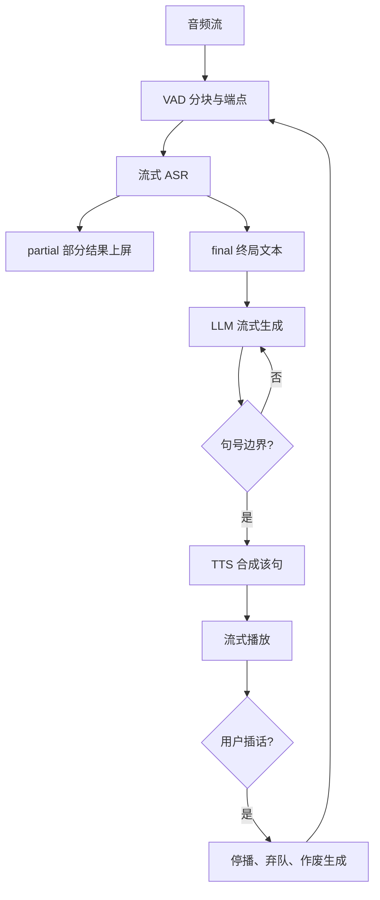
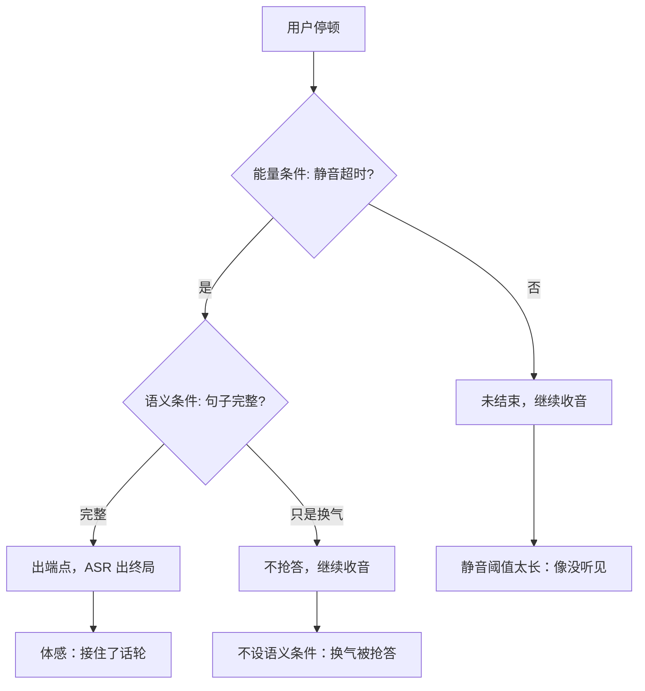

# 语音服务化：ASR 与 TTS

对话体感的延迟预算是一秒：端点尾点、识别终局、首 token、第一段音频，四段相加，没有一段可以挥霍。

<footer>—— 据 Radford et al., Whisper, 2023；Wang et al., VALL-E, 2023；Qwen3-ASR Technical Report 整理</footer>

[上一课](/llm/mm-video-serving)把视频做成流式负载；语音从第一天起就是流式，且双向都要。级联（ASR–LLM–TTS）与端到端的系统切法已由[端到端语音对话](/llm/e2e-speech-dialogue)对照过，本课写服务侧的账：流式 ASR 的分块与端点、TTS 的首音频、级联各段的延迟分账与打断处理。语音 tokenizer 与全双工栈只在需要处引用。

## 问题

级联把一次对话切成三跳，每跳自带排队，总延迟是相加的：端点判定没等到话音结束就提前截断，等太久用户以为系统没听见；ASR 出终局结果前，LLM 无事可做；TTS 拿不到整句就开不了声。四段加起来轻松过秒，体感即「对讲机」而不是「对话」。更难的是流式 ASR 本身不是普通推理：识别要边到边出部分结果，[Qwen3-ASR 的服务口径](/llm/qwen3-asr-vllm)明确流式只挂推理后端且不与批推理、时间戳同开——流式、批处理、时间戳三者的组合约束是工程事实，不是实现缺陷。

VAD（Voice Activity Detection，语音活动检测）就是「分辨此刻有没有人在说话」的小模型：不看内容，只管有声没声。别小看它——端点判定和打断触发都靠它，它一慢或误判，整条对话的节奏就乱了。

TTS 侧对应的问题是首音频：合成整句再播，句子越长首音频越迟；按 codec token 流式出声（[VALL-E](/llm/valle-tts) 一类把语音当语言模型续写）延迟低，但音质与稳定性随流式粒度变化。两头夹住 LLM：它必须在句号处就可切句，而不是等完整段落。

## 方法

服务把对话延迟拆成四段 SLA 分账：**端点段**（VAD 判定话音结束）、**识别段**（从尾点到 ASR 终局）、**生成段**（LLM 首 token）、**合成段**（TTS 首音频）。每段独立监控、独立设预算，总账超限时知道砍谁。识别段靠部分结果压缩体感延迟：partial 流式上屏让用户边说边看，final 才交给 LLM——partial 允许回改，final 必须稳定，两层语义要分开暴露。

合成段按句切分：LLM 流式输出在句号或子句边界切句，TTS 对已完成句子立刻开合成，首音频延迟从「整段生成完」变成「首句生成完」；vocoder 按帧流式出样本，进一步压尾。**打断**是级联最脆的一环：用户插话时，播放立刻停、未播句子队列丢弃、LLM 生成作废、VAD 重新接管——四步要原子完成，漏掉「丢弃未播队列」就会把旧答案的后半句播给已经换了话题的用户。

漏掉「丢弃未播队列」会怎样？用户已改问「那北京呢」，系统却把上一条答案的后半句「……杭州西湖非常适合游玩」播了出来——这种答非所问比慢一秒糟糕得多，用户还会重复提问，负载反而更重。

典型级联拆账：端点尾点约 300 ms、ASR 终局约 200 ms、LLM 首 token 约 300 ms、TTS 首音频约 200 ms，合计约一秒。端点阈值每多加 100 ms，用户体感不是「慢了一点」，而是「它在等我说话」。

## 机制

四段里重叠空间最大的是识别与合成之外的两处。LLM 首 token 不必等 TTS：生成流切句后逐句喂给合成队列，生成与播放流水化，总延迟趋近「端点 + 识别 + 首 token + 首句合成」而不是四段终局相加。端点判定是延迟与截断的直接旋钮：VAD 能量阈值加语义完整度（句子是否说完整）双条件判定，前者抓「说完了」，后者抓「还想说」；只有 VAD 的服务在用户换气时抢答，加语义条件又吃掉尾点预算——阈值要按场景调，客服与闲聊的合理值不同。

识别段还有一个隐藏量：音频块长。编码器按帧窗吃音频，块越短延迟越低、上下文越少、准确率越掉；[token 速率](/llm/qwen3-asr-token-rate)与块长的匹配决定流式识别的性价比。ASR 错误会沿级联传播且被放大：LLM 把误识别当真指令执行，错误在下游看起来像幻觉，根因却在识别——日志必须把三跳的中间产物（final 文本、LLM 输入）落盘，否则无法归因。

识别错误被放大成幻觉，可以类比传话游戏：第一个人把话听错，后面每个人（LLM）都一本正经地顺着错处编出通顺的话——越往后越离谱，且没人知道源头在哪。三跳中间产物落盘，才能把「模型胡说」按回「识别听错」。

## 边界

端到端语音栈省掉跳数，首响应更快，但服务语义反而更难：没有文本中间产物，打断、审计、合规都失去抓手，全双工的轮次控制见[全双工语音](/llm/full-duplex-speech)。TTS 读出的是文本的表面：逆文本归一化没做，日期、数字、单位会被逐字念错，这类错误在评测里像模型问题，在服务里是管线问题。多说话人与语种切换是另一个谱系（[Whisper](/llm/whisper-large-v3) 一类大模型 ASR 的强项），但切换点附近的块边界处理仍归服务管。最后，录音与识别产物的留存是合规敏感项，ASR 的 final 文本属于对话记录，缓存与训练使用要单独授权。

## 小结

- 级联对话延迟是四段相加：端点、识别、生成、合成，按段立 SLA 分账监控。
- partial 上屏压缩体感延迟，final 才进 LLM；两层语义必须分开暴露。
- TTS 按句切分加流式 vocoder，首音频从「整段完成」提前到「首句完成」。
- 打断四步（停播、弃队、作废、回听）要原子完成，漏一步就答非所问。
- 识别错误沿级联放大成「幻觉」，三跳中间产物必须落盘可归因。
- 出处：据 Whisper（Radford et al., 2023）、VALL-E（Wang et al., 2023）、Qwen3-ASR Technical Report 与语音对话系统文献整理。
