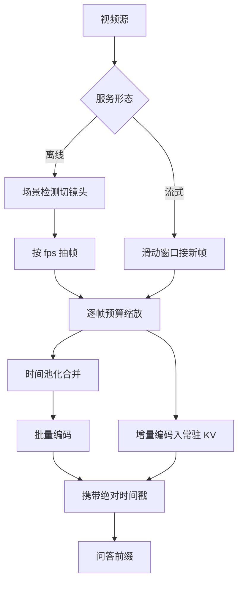
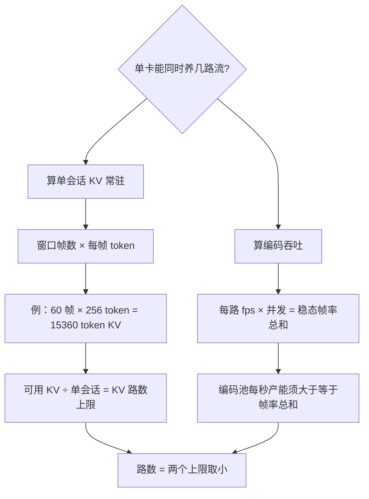

# 视频理解的服务

视频服务的难点不在每帧更贵，而在时间维把预算变成流：你没法等一部电影编码完，再回答关于开头的问题。

<footer>—— 据 Qwen2.5-VL Technical Report 的动态 FPS 与时间 MRoPE 叙述、视频 token 文献整理</footer>

[上一课](/llm/mm-visual-token-budget)把单图 token 预算立成三层闸；视频把预算乘上时间维——帧数乘每帧 token，一分钟素材顶上百张图。主干课已写抽帧与时间位置（[视频 token](/llm/video-tokens)）与抽帧后的时序融合（[时间池化](/llm/video-temporal-pool)）。缺口是服务语义：离线与流式是两种负载，帧缓存怎么键、容量按什么规划、采样率改变时模型怎么知道。本课只写服务侧，抽帧与位置编码只引用。

## 问题

先把账摆出来：抽 2 fps、每帧按单图预算，一分钟素材顶上百张图、越过大半个上下文窗口（细账见下方注）。降量有两个旋钮——抽帧率与每帧预算——但二者不独立定价：降抽帧率丢时间分辨率，压每帧预算丢空间分辨率，问答类型决定哪个先让。时间语义是第二重约束：模型靠[绝对时间对齐的 MRoPE](/llm/qwen25-vl) 知道两帧之间过了 0.5 秒还是 5 秒，服务侧任何抽帧、丢帧、变速都必须把真实时间戳传给预处理，否则模型看到的只是「第几张图」的均匀序列，运动速度的几何整体错掉。

「MRoPE」可拆开看：RoPE 是旋转位置编码——给每个 token 发一个「位置坐标」，注意力靠坐标远近判断谁和谁相关；MRoPE 把坐标从一维扩成多维，时间、高度、宽度各占一维，模型才知道「第 37 秒、画面上方」这种位置。

服务形态因此分叉。**离线**：素材已在，转码式批量抽帧、批量编码、一次性进上下文，追求总时长与成本。**流式**：边录边看边答（监控、会议、直播），新帧持续到达，答案只基于已见前缀，追求「事件到可问」的延迟。两种形态共享编码器池，但队列行为完全不同：前者是大批离线任务，后者是按会话常驻的增量流。

## 方法

离线管线把上一课的三层预算接上时间维：场景检测切镜头，镜头内按设定 fps 抽帧，逐帧走[图级预算](/llm/mm-visual-token-budget)缩放，再按时间池化合并相邻帧；预算闸从「每图」升级为「每分钟素材」定额。批处理用足[编码器池](/llm/mm-serving-vision-encoder)的优势——同视频帧形状一致，桶内方差近乎零。

流式管线的核心是**增量上下文**：滑动窗口内的帧编码后常驻 KV，新帧只编码增量，窗口左沿的旧帧按策略驱逐或摘要；问答请求拼在当前前缀上即时 prefill。跨请求复用靠帧级缓存：键是「视频内容 hash + 时间区间 + 采样参数」，同一素材被多人观看时编码只发生一次——这是[嵌入缓存](/llm/mm-serving-vision-encoder)从图到帧的推广，收益随点播集中度放大。

增量上下文可以类比看直播记笔记：不必每来一帧就把全场重看一遍，只把新画面补进笔记本，太老的页撕掉（驱逐）或浓缩成摘要。观众随时提问，你翻的永远是当前笔记本，而不是从第一帧重来。

同样一分钟，2 fps、每帧 256 token 约 3 万 token，是单图 1536 预算的二十倍。视频服务的定价与配额单位应是「每分钟素材」，把「每次请求」的直觉直接搬过来会系统性低估一个量级。

## 机制

时间戳因此是隐藏合同：变速转码、丢帧容错、直播卡顿都会让「帧序号」与「真实时间」脱钩，预处理必须携带秒级元数据；评测也要放时间定位题来盯——丢时间戳的服务在「第 37 秒发生了什么」类问题上会安静地答错。

容量规划按流式走：编码器池要扛的是稳态帧率总和（每路 fps 乘并发会话数），不是请求数；窗口长度乘每帧 token 给出单会话 KV 常驻量，决定单卡能同时养几路流。离线批相反，用大批换吞吐，两类负载不应混队——混队会让流式的「事件到可问」延迟被离线大批顶穿。

## 边界

流式与完整性互斥：答案只对已见前缀负责，产品必须把「截至第几秒」暴露给用户，否则「没看见」会被当成「没答对」。初学者容易把流式答案当「完整答案」用——其实它只对已见前缀负责。界面上不标「截至第几秒」，用户就会把「还没看到」当成「没答对」，这类问题在监控里表现为答案质量下降，实为预期行为。抽帧间隙是另一类盲区：事件落在两帧之间，提高每帧分辨率救不了，只能加抽帧率或回放定位——这决定「先快答再精读」的两段式形态。点播缓存的隐私账要单算：内容 hash 键命中率越高，敏感素材的帧 KV 停留越久，淘汰策略要把会话结束当硬边界。长视频超出窗口后靠检索与记忆接力，见[长视频理解](/llm/long-video-understanding)；本课的窗口服务只负责把窗口内做对。

## 小结

- 视频预算是帧数乘每帧 token，配额单位应为「每分钟素材」，比单图直觉高一个量级。
- 离线与流式是两种负载：大批换吞吐与增量窗口保延迟，不应混队。
- 时间戳是服务与模型间的正确性合同，抽帧变速都要把真实秒数传下去。
- 帧级缓存键为内容 hash 加时间区间与采样参数；点播复用收益大，隐私淘汰要硬边界。
- 容量按稳态帧率与单会话 KV 常驻量规划；抽帧间隙的盲区靠帧率或回放补救。
- 出处：据 Qwen2.5-VL Technical Report（arXiv:2502.13923）动态 FPS 口径、视频 token 与长视频理解文献整理。
