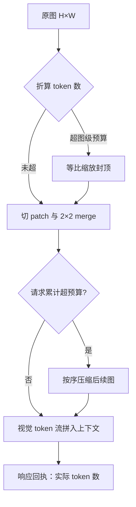

# 视觉 token 预算

视觉 token 不是免费的像素，是按上下文计价的注意力；预算不封顶，窗口和账单都会被一张 8K 截图吃光。

<footer>—— 据 Qwen2.5-VL Technical Report 的动态分辨率与 patch merge 机制、视觉 token 压缩文献整理</footer>

[上一课](/llm/mm-image-preprocess-batching)把预处理组织成分档批处理，但档位表的另一头连着语言模型：档定多高，进入 prefill 的视觉 token 就多长。缺口是预算本身——一张图该折算成多少 token、上限谁说了算、砍预算时丢的是哪种信息。本课把视觉 token 预算写成服务端的一等旋钮：怎么计价、怎么封顶、怎么按请求分配。视频的时间维预算留到下一课。

## 问题

计价公式是确定的。14px 一 patch，$2\times2$ merge 后每四格折一个 token（见 [patch merge](/llm/qwen-vl-patch-merge)），一张 $H\times W$ 的图占 $\frac{H}{28}\times\frac{W}{28}$ 个语言模型 token。问题在于用户不知道也不关心这个公式：一张 7680×4320 的截图按公式是近八万 token，不设上限，一次请求就能打穿上下文窗口、把 prefill 拖进秒级、给 KV 留下几百 MB 的账（账目细算见[多模态 KV 管理](/llm/mm-multimodal-kv)）。预算缺位不是报错，而是延迟与成本被最重的请求定形。

预算也不只是封顶线。聊天里配图的合理预算与 OCR 合同页的合理预算差一个量级：前者几百 token 足够，后者砍到几百 token 就是让模型猜小字。预算是按场景定价的资源配置，不是单一常数。

## 方法

服务端把预算拆成三层，各是独立可配的硬闸。**图级**：预处理阶段按档位表缩放，等比压到预算内；这是最高优先级闸，任何请求不得突破。**请求级**：单请求所有图的 token 总和封顶，超了按序压缩，防止十张小图叠成大账。**会话级**：多轮里历史图像 token 的存留策略——引用过的图保留全预算，翻篇的图降采样或只留摘要，会话越长这条越要紧。三层都实现为[预处理档位表](/llm/mm-image-preprocess-batching)的约束，预算执行不新增关键路径。

预算同时要可感知。响应里返回实际消耗的视觉 token 数，超限被压缩时明确告知：用户看到「图被降分辨率」与看到「模型看不清小字」，是可归因与不可归因的区别。对延迟敏感或低优先级请求，调度器可以按[优先级](/llm/sch-priority-fairness)动态压预算——预算因此成了过载时的第一道降级阀。

一张 1344×896 的文档页是 $\frac{1344}{28}\times\frac{896}{28}=48\times32=1536$ 个视觉 token，接近一千五百汉字的上下文占用；而 OCR 可读的小字往往就住在最高那档预算里。

## 机制

预算削减信息的方式有两种，性质不同。**编码前缩放**丢分辨率：等比缩到预算内，全局结构保留，最小字体与细线条先消失——这是预处理侧的闸，成本为零但不可逆。**编码后剪枝**丢冗余：按注意力或重要性分数把低贡献视觉 token 丢弃（[视觉 token 压缩](/llm/vision-token-compression)），分辨率不动，丢的是模型觉得冗余的部分——保留了看清的能力，代价是多付一次完整编码。两条线的取舍是场景定价的物理依据：聊天流量走缩放即可，文档与图表流量值得付剪枝的钱。

预算乘进三本账。延迟账：prefill 时间随视觉 token 数线性走，预算上限即首 token 延迟上限。KV 账：每 token 的 KV 字节固定，预算直接决定单请求 KV 占用，进而决定[连续批处理](/llm/sch-continuous-batching-deep)的并发水位。质量账：预算低于任务信息量时，模型不是报错而是用语言先验补图——预算压得越低，幻觉越像真话。三本账都随预算单调，说明预算是容量规划的原生输入，不是事后调的成本参数。

## 边界

预算对任务不对称：OCR、细图表、UI 截图的高信息密度区恰在最高预算档，压预算先死的是它们（[OCR 实践](/llm/ocr-vlm)），而「图里有什么」类任务在低预算下几乎无损。按场景配预算因此要靠请求路由，不能靠全局常数。其次，预算改变答案而不改变置信度：同一问题高预算答对、低预算答错，模型两边的语气一样肯定，评测必须把预算当实验变量钉住，否则结论随默认值漂移。最后，预算管不了精度之外的事——遮挡、模糊、离屏内容不因预算提高而回来，向用户解释能力边界时不要拿预算当挡箭牌。

## 小结

- 视觉 token 计价是 $\frac{H}{28}\times\frac{W}{28}$，与文本同价进注意力与 KV，必须显式封顶。
- 三层预算：图级缩放闸、请求级总量闸、会话级历史存留策略，全部落在预处理档位表上。
- 编码前缩放丢分辨率、编码后剪枝丢冗余，场景按此定价；OCR 类任务吃最高档。
- 预算乘进延迟、KV、质量三本账，是容量规划输入与过载降级的第一道阀。
- 超限要回执、评测要钉预算变量；低预算下模型用语言先验补图，幻觉更难辨。
- 出处：据 Qwen2.5-VL Technical Report（arXiv:2502.13923）的动态分辨率口径与视觉 token 压缩文献整理。
