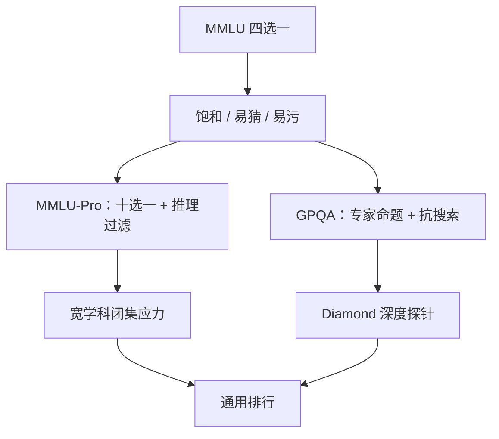

# MMLU-Pro / GPQA

当四选一的学科题已经接近天花板，再涨的准确率更多来自排除法与记忆；要把区分力找回来，就要加选项、加推理链、加「搜索也搜不掉」的专家题。

<footer>—— Wang et al., MMLU-Pro；Rein et al., GPQA</footer>

MMLU 把 57 个学科收成四选一考试，曾经是通用能力的默认尺。模型做到接近或超过「专家」标注水平之后，这把尺的刻度不够用了：提示模板、选项字母偏置、题面泄漏都能制造分差，真正的多步推理却被四选一的猜测空间淹没。Wang 等人提出 MMLU-Pro：更多选项、更少常识题、更强调推理。Rein 等人提出 GPQA：研究生级别、对谷歌搜索不友好的科学问答，并划出 Diamond 子集，使非该领域的专家也难以稳定做对。两套基准不互相替代：前者仍是宽学科的选择题应力测试，后者是窄而深的「搜不到就得想」探针。本篇讲它们相对 MMLU 改了什么，以及分数该怎么读。

## 问题

四选一的随机基线是 25%。对训练过海量题解的模型，有效基线更高：即使不会做，也能靠风格、长度、选项字母频率缩小候选。题一饱和，排行榜进入噪声区——1% 的差距可能小于提示方差。同时，MMLU 含不少知识回忆题：见过维基段落就能选对，不必进行符号操作。把这类题和需要多步计算的题平均成一个总分，会让「更会背」与「更会推」无法分账。

污染使问题更尖锐。MMLU 题面在互联网上复制极广，[n-gram 扫描](/llm/contamination-ngram) 往往能找到镜像。若新模型的训练截止日期晚于这些镜像的爆发期，MMLU 分数含记忆溢价。需要两件新东西：更难猜的题型（选项更多、答案不能搜），以及更难泄漏的命题方式（专家新写、有钻石筛选）。MMLU-Pro 与 GPQA 分别加重这两件，而不是再刷一轮旧 MMLU 的提示工程。

### 猜测空间与「可搜索性」是两把不同的刀

把选项从 4 增到 10，随机基线降到 10%，排除法的组合爆炸上升，纯记忆「这题选 B」的收益下降。但这仍是闭集分类：模型不必生成答案，只需在名单里打分。GPQA 可以做成选择题，其真正的设计目标却是：即使允许上网，非专家也难以在短时间内验证。可搜索性针对的是开卷作弊与检索增强，不是猜测空间。两把刀要分开报：在禁止工具的设定下看推理，在允许搜索的设定下看是否仍高于开卷人类基线。Diamond 子集不是「把 GPQA 再难一档」的营销名。它是按专家对非专家的区分度筛出来的：领域博士稳定对、高技能非专家不稳定。用主集总分代替 Diamond，会把较易的题重新平均进来，刻度再次变粗。

## 方法

### MMLU-Pro：加选项、滤常识、重推理

Wang 等人从 MMLU 风格的学科题出发，剔除过易与过偏知识回忆的条目，改写或新拟需要推理的题，并把选项扩到约十个。评分仍是准确率，但随机与「会排除一两个明显错项」的弱策略不再能撑起看起来体面的分数。学科覆盖仍宽——数理、工程、法律、心理等——因此它还承担「通用」这一政治任务：实验室不能只在自己擅长的两科上称王。提示上通常允许思维链；与原版 MMLU 比，CoT 的相对收益更大，因为题更依赖中间步骤而不是单跳事实。

比较协议必须冻结：零样本还是少样本、是否 CoT、选项是否打乱、用哪个校验正则。MMLU-Pro 对提示敏感，不等于它无效，只说明在已变难的闭集上，格式仍能吃掉几个点。报告应同时给 greedy 与某一种固定采样，避免把自洽投票的测试时计算偷运进「基座分数」，见[测试时缩放](/llm/test-time-scaling)。

### GPQA：Google-Proof 的专家题

Rein 等人请生物学、物理学、化学领域的专家命题，目标是研究生课程以上、且难以通过短时间网页搜索解决。他们让非该领域的高技能标注者开卷作答，作为「可搜索性」的人基线；领域专家闭卷作答，作为能力上界。GPQA Diamond 留下那些专家强、非专家弱的题，减少「其实是阅读理解」或「其实是搜得到的事实」的条目。

$$
\mathrm{gap}=\mathrm{Acc}_{\mathrm{expert}}-\mathrm{Acc}_{\mathrm{nonexpert}}^{\mathrm{open}}
$$

$\mathrm{gap}$ 大，说明题在区分专业推理而非检索。模型分数应画在这两条人基线之间：低于开卷非专家，谈不上专家推理；接近领域专家，才进入该尺的有效量程。允许工具的评测要把工具写进方法名，否则检索增强系统会假扮成参数里的知识。

## 机制

MMLU-Pro 恢复区分力的机制，主要是降低闭集捷径的期望收益。十个选项让「logit 最大项刚好是记忆中的字母」更难稳定发生；推理过滤让单跳检索的命中率下降。它并不消除污染：新题一旦公开，仍会进入下一代爬虫。它只是提高了「背选项字母」的成本，并把分数重新与多步解题相关。对[动态基准](/llm/live-benchmarks)而言，MMLU-Pro 仍是静态快照，寿命取决于泄漏速度。

GPQA 的机制是命题时就对抗检索。专家选择那些需要领域图式、实验直觉或多步定量推导的点，而不是百科条目的改写。Diamond 筛选相当于在题目空间里做了一次「对非专家信息增益」的过滤。模型若靠预训练里的论文段落做对，那是深度知识回忆，仍可能被指责为记忆——但这已经比 MMLU 上的高中事实更接近「专业能力」的操作定义。真正的过程监督还要看中间推导，选择题准确率只是端到端代理。

### 不要把两套尺加成一个「推理分」

加权平均会重新引入 MMLU 式的混淆：一个模型在 MMLU-Pro 法律科高、在 GPQA 化学低，平均后看起来「推理中等」。学科先验、训练数据配方、是否含 STEM 合成题，都会造成这种剖面。正确的读法是剖面图：横轴任务族，纵轴相对人基线的位置。需要单数字做门禁时，应预先声明用哪一子集（例如 GPQA Diamond + MMLU-Pro STEM），而不是发布后再挑亮点。GPQA 题量相对较小，二项式方差不可忽略。报点估计时附置信区间，或固定随机种子多次抽样解码。用一次 CoT 采样的抖动去宣传「超过人类专家」，统计上不成立。

## 边界与工程取舍

选择题终究不是生成。科学与工程实践里，答案是推导、代码、实验设计，而不是字母。MMLU-Pro / GPQA 适合当便宜的回归测试和跨模型比较尺，不适合当职业资格的代理。开放生成的竞赛数学见 [AIME](/llm/aime-contest-math)，仓库级工程见 [SWE-bench Verified](/llm/swebench-verified)。

专家命题贵，更新慢，泄漏后难以再造同等难度的新题。这与 LiveCodeBench 的「每月有新赛」不同。对 GPQA 更应配合污染扫描与隐藏内部集，而不是指望公开 Diamond 永远 Google-proof。一旦题解视频出现，抗搜索性质对人类失效，对模型的训练污染也随之上升。

提示与工具协议分裂严重。同一模型，闭卷 greedy、开卷检索、带代码解释器、带长 CoT，可以在 GPQA 上走出完全不同的曲线。论文表格必须把协议写进列名。与 [HELM](/llm/helm) 结合时，除准确率外还应看校准：十选一上的过度自信，会在真实咨询里变成危险的专家腔。

成本方面，GPQA 推理题鼓励长思维链，评测账单接近生成任务。把「GPQA 分数」写进每次提交的 CI，要抽样题目或用短解码门禁，全量长 CoT 放在发布前。不要为了省钱把 Diamond 换成主集再宣称同等结论。MMLU-Pro 的十选项并不自动免疫字母偏置：若训练或 few-shot 里 B、C 更常为正确项，模型仍会学到版面先验。评测时应随机打乱选项顺序再跑一遍，分差记进附录，而不是只在固定字母表上刷高分。

## 小结

- MMLU 饱和后，四选一与知识回忆题无法区分记忆和推理。
- MMLU-Pro 用更多选项和推理向过滤，恢复宽学科闭集的区分力。
- GPQA 用专家命题对抗短时搜索，Diamond 按专家/非专家差距筛选。
- 两套尺应读剖面，不应加成一个笼统的推理分；工具与 CoT 必须写入协议。
- 选择题仍是代理；开放生成与工程环境要另考。
- 静态专家题会泄漏，需扫描与内部隐藏集，不能当成永久动态基准。
- 出处：Wang et al., *MMLU-Pro*；Rein et al., *GPQA*。
