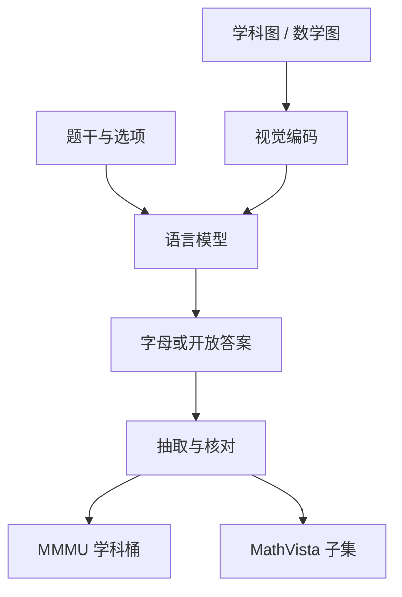

# MMMU / MathVista

专家级多模态理解不是「看见图里有什么」，而是在学科图、表、公式和照片上完成与大学考试同分布的推理；视觉数学则进一步要求把图中的几何、函数与坐标读成可计算的关系。

<footer>—— Yue et al., MMMU；Lu et al., MathVista</footer>

纯文本的 [MMLU](/llm/mmlu) 把知识收成四选一；一换到图，失败模式就分叉：看不清、看清了却不会用学科知识、会用知识却不会在图上定位条件。Yue 等人的 MMMU（Massive Multi-discipline Multimodal Understanding）按大学与职业考试的科目收题，图的类型覆盖图表、电路、化学结构、病理切片、乐谱与地图，难度对准「专家 AGI」而不是日常 VQA。Lu 等人的 MathVista 把范围收窄到**视觉上下文中的数学推理**：函数图像、几何图形、科学图表、带图应用题，把感知、OCR 与多步演算绑在同一条样本上。两套基准经常被写进同一张多模态表，但它们的题源、答案空间和失败归因并不相同。本篇把它们当成一对互补的尺子：MMMU 问跨学科专家理解，MathVista 问见图算数。

## 问题

早期视觉问答偏向自然照片上的物体与属性，语言模型一旦配上一个还过得去的视觉编码器，就能靠题干里的语言先验蒙对不少题——图甚至可以不看。学科考试不是这条分布。一张有机反应机理图、一张带误差棒的实验曲线、一张需要读坐标轴刻度的函数图像，正确答案依赖于图中的局部符号与全局结构，语言先验帮不上忙，有时还会把模型推向「看起来像教科书的错选项」。需要一套图是学科工件、题是专家题的考场，才能把多模态模型的「会聊天配图」和「会读专业图」拆开。

数学把这个问题再收紧一档。纯文本 [GSM8K / MATH](/llm/math-bench) 已经要求多步演算；图一加入，模型必须先从像素恢复几何关系、函数形状或表中数字，再进入原来的推理链。感知错一个刻度，后面的代数再漂亮也是错的。MathVista 要测的正是这条缝：视觉接地与数学推理有没有接上，而不是单独的识图或单独的算术。

### 日常 VQA 的语言捷径在专家图上失效

VQA 的经典漏洞是问题与答案在语言上高度可预测：「香蕉是什么颜色」几乎不需要香蕉的像素。MMMU 的选项按学科误解来写，图中的关键证据往往是小符号、虚线、坐标标注或表格的某一行。模型若只编码了图的全局风格（「这是一张电路图」），选不对具体结点电压。这把评测从「有没有视觉编码器」推进到「视觉 token 有没有把解题所需的局部结构送到语言模型一侧」。

MMMU 高分不能翻译成「医学影像可临床使用」。题来自公开教材与考试资料，没有患者、没有仪器伪影协议，也没有责任。它测的是多模态学科答题，不是执业。

## 方法

MMMU 收约一万一千余题，覆盖三十个科目、六个学科桶（艺术与设计、商业、科学、医学、人文与社科、技术与工程），题型以选择题为主、辅以开放题。图不是装饰：许多题在去掉图像后不可答，或会变成另一道纯文本常识题。协议上应锁死：是否允许思维链、是否把图以何种分辨率、多少 tile 送进模型、开放题如何抽答案。Yue 等人强调专家级：难度对准大学与研究生考试，而不是小学看图说话。

MathVista 的构造不同。它汇总二十余个已有视觉数学 / 图表问答集，并补了若干新子集（如函数图像问答、试卷截图、智力测验图），统一成约六千条评测实例。答案有选择题也有数值、短表达式。计分必须按子集的官方规则：有的要精确匹配，有的允许数值容差，有的要从冗长生成里抽最终数。把所有子集压成一个准确率可以发榜，但诊断时应按「图表读数 / 几何 / 函数 / 应用题」分列，否则感知失败和演算失败会被平均掉。

$$
\mathrm{Acc}_{\mathcal{D}}=\frac{1}{|\mathcal{D}|}\sum_{(x,I,y)\in\mathcal{D}}\mathbf{1}\bigl[\mathrm{extract}(f(x,I))=y\bigr]
$$

其中 $I$ 是图像，$x$ 是题干。$\mathrm{extract}$ 与纯文本数学评测同样关键：框、正则、LLM 抽取器都会改分，比较必须共用抽取器。

### 两张表不要互相代理

MMMU 的科学、医学桶含大量非数学图；MathVista 的题几乎都要计算或读量。一个在病理切片题上强、在函数图像上弱的模型，两张总分可以朝相反方向走。发布时应同时报：MMMU 总分与学科桶、MathVista 总分与来源子集。只用其中一张宣布「多模态数学 SOTA」，规格写错了。

## 机制

多模态答题可以拆成三截，失败发生在不同截上。第一截是感知：分辨率不够时，角标、虚线交点、表里的小数先丢。第二截是符号接地：把图中的 $f(x)$、电路元件、化学键接到题干里的名词。第三截是学科推理：在已接地的符号上做与纯文本考试相同的推导。MMMU 三截都重，且第三截的先验来自各专业语料；MathVista 的第一、二截更苛刻，第三截更接近数学基准。把视觉编码器换成更高分辨率或动态切块，通常先抬 MathVista 的读图子集；换更强的语言模型，通常先抬 MMMU 里图相对简单、知识密集的科目。

选择题仍然提供语言捷径。模型可以不读图，用选项的术语密度、与题干的词重叠来排除。开放数值题把这条路堵死，但对抽取器敏感。一套完整报告应含：原图准确率、题干打乱或遮图的对照——遮图后分不掉，说明在用语言捷径。

### 思维链在视觉题上会放大感知错误

纯文本数学里，CoT 常把准确率抬起来，因为它把算术展开成可检查的步骤。视觉题上，模型若在第一步把坐标读成 3 而不是 8，后面的链式推理会把错误写得更自信。是否允许 CoT、是否允许外挂代码解释器，必须与 [MATH](/llm/math-bench) 一样写进协议。打开工具之后涨的是系统能力，不是视觉编码器的感知存量。

分辨率是隐形超参数。同一张函数图，短边 336 与切成四块高清，读刻度的成功率可以差一截。不报视觉预处理，MMMU / MathVista 数字不可比。

## 边界与工程取舍

两套基准都不测多图长文档、不测视频、不测交互式画图（「把辅助线画出来再证」）。它们也继承了考试题的污染风险：教材插图与真题在网上重复出现，多模态爬虫同样会记住。应对与文本侧相同：冻结官方评测脚本、对高分科目做遮图对照、必要时用内部新图重测，见 [评测污染](/llm/eval-contamination)。

文化与语言分布偏英文、偏西方课程。中文试卷里的几何语言、统计表头、中医图示，不在 MMMU 的主分布上。产品若面向中文教育或国内职业考试，应另备同构的内部集，而不是把 MMMU 当作唯一门禁。

另一边界是「专家」一词。大学考试题是专家知识的文本+图切片，不是实验室或病房里的任务。模型可以在 MMMU 医学桶上好看，同时在真实影像协议上崩溃。MathVista 同样：能读教科书函数图，不保证能读用户用手机拍的歪斜白板。

不要把 GPT-4V 时代的早期分数当天花板。视觉编码器、切图策略与工具使用每一代都在改协议。引用数字时必须带模型版本、是否 CoT、图像预处理和抽取脚本，否则是在比较不同的考试。

## 小结

- MMMU 用跨三十科目的专家级图文题测多模态学科理解；MathVista 用带图数学题测视觉接地与演算是否接上。
- 日常 VQA 的语言捷径在专家图上会失效；遮图对照用来揭露「没看图也能蒙」。
- 发布应分列学科桶与 MathVista 子集，并锁死分辨率、CoT 与答案抽取。
- 感知错误会被思维链放大；打开代码工具涨的是系统分，应分表。
- 两张榜不能互相代理，也不能替代临床、工程现场或中文试卷。
- 污染、预处理和抽取器与文本数学评测是同一类可复现问题。
- 出处：Yue et al., *MMMU*；Lu et al., *MathVista: Evaluating Mathematical Reasoning of Foundation Models in Visual Contexts*。
