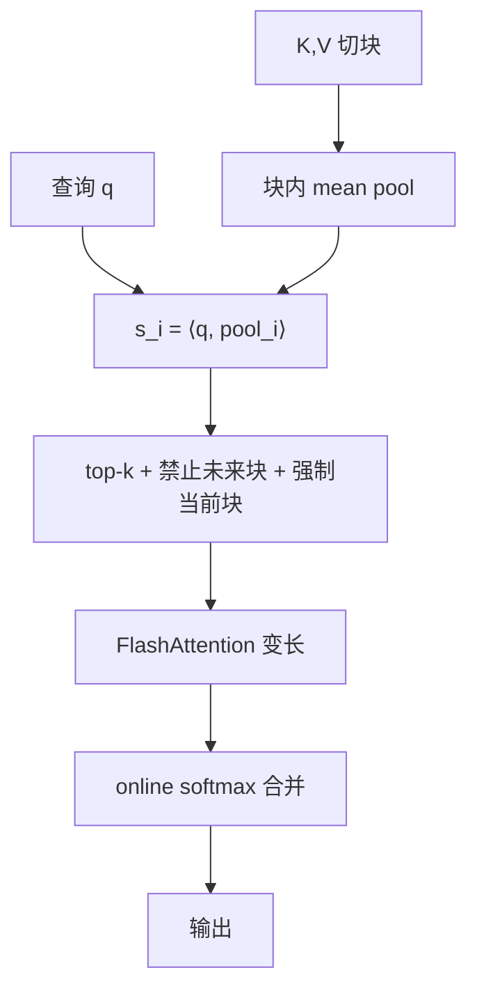

# MoBA 块注意力混合

    
少加结构先验，让模型自己决定看哪些历史块：把 MoE 的 top-k 路由接到注意力的键值块上。

    <footer>—— Lu, Jiang, Liu, Qiu, Zhou 等，MoBA: Mixture of Block Attention for Long-Context LLMs，arXiv:2502.13189 / NeurIPS 2025</footer>

滑窗与 sink 把稀疏图案写死，换任务就失效；线性注意力改核，复杂推理上证据不足，从现有 Transformer 迁过去也贵。Moonshot 的 Enzhe Lu、Jiezhong Qiu、Xinyu Zhou 等人提出 **Mixture of Block Attention（MoBA）**：上下文切成块，每个查询对块做均值池化打分，top-k 选块再在块内做 softmax 注意力。参数量与满注意力相同，因而可以在训练中切换满 / 稀疏，并接到 FlashAttention 变长接口。论文写明已用于 Kimi 的长上下文请求。代码：github.com/MoonshotAI/MoBA。本篇写路由与因果约束，不把部署声明写成公开的 Kimi 层配置表。

## 问题

有效上下文要涨到百万级，满注意力二次不可接受。一类方法加很强结构：sink、窗口、固定跨度——省算力，但把「该看哪」写进归纳偏置。[Longformer](/llm/longformer) 与 [NSA](/llm/nsa-paper) 各有图案；Quest、Minference、RetrievalAttention 在推理期动态选 token，却不大减**训练**期的长上下文账单。另一类改成 Mamba / [RWKV](/llm/rwkv) / RetNet，与 softmax 差距大，转换成本高。问题收成：如何保持 Transformer 框架、少加结构、让模型自治选择，并在满与稀疏之间可切换。

MoE 已在 FFN 上证明 top-k 专家路由可行。MoBA 把「专家」换成**沿长度切的 KV 块**。查询仍是 token，键值按块成组；门控决定看哪些历史块。这比「永远看最近一块 + 永远看前缀」更一般：窗口与 sink 都是 MoBA 在特定门控下的特例。

### 因果不能靠 softmax 自己保证

块内均值池化若包含未来 token，分数会泄漏。两条硬规则：查询不能路由到未来块（未来块分数 $-\infty$）；**当前块强制选中**并在块内用因果掩码。当前块类似现代 MoE 的共享专家：静态路由保证局部上下文，并堵住「池化看见未来」的洞。实现上当前块注意力与历史块注意力分开算，再用 online softmax 合并。

缩放律实验：块大小 512、top-3，8K 序列上稀疏度 $1-512\times 3/8192=81.25\%$；因当前块必选，历史最多再看 2 块。不要把 top-k=3 理解成三块任意历史。

## 方法

对单头查询 $q$ 与 $K,V\in\mathbb{R}^{N\times d}$，满注意力是 $\mathrm{softmax}(qK^\top)V$。MoBA 只在选中下标集 $I$ 上算。$N$ 分成 $n$ 块，块长 $B=N/n$，第 $i$ 块区间 $I_i$。亲和

$$
s_i=\langle q,\mathrm{mean\_pool}(K[I_i])\rangle,
$$

$g_i=1$ 当且仅当 $s_i$ 进入 top-k（加因果掩码与当前块强制）。$I=\bigcup_{g_i\gt 0}I_i$。无额外参数：分数用已有 $q$ 与块内 $K$ 均值，不是另训的专家网络。

实现五步：按门控与因果得到 query–块赋值；按块重排 query；对每块做变长 FlashAttention（当前块 causal=True，历史块 causal=False）；排回原序；online softmax 融合。图 2 显示相对 Flash 满注意力，在加长序列与固定约 95% 稀疏（64 块、top-k=3、块长随 $N$ 涨）下的时间优势。

细粒度：32K 上保持 75% 稀疏，把块从「8 选 2」细到「128 选 32」，验证损失可差约 $10^{-2}$，细更好——与 DeepSeekMoE 一类「细专家」同方向，只是切在长度维。混合：层可在满注意力与 MoBA 间切换。从 Llama 3.1 8B 做长上下文续训，窗口 128K→256K→512K→1M；最后 100B token 打开 MoBA，$B=4096$、top-K=12，相对 1M 稀疏可达 $1-4096\times 12/10^6=95.31\%$。推理可「prefill MoBA + decode 满注意力」。RULER@128K：两种 MoBA 配置 0.7690 / 0.7671，满注意力 0.8031。NIAH 到 1M 可接受，Prefill-Full-Decode 略好。

### 与线性注意力不是同一笔交易

MoBA 选中的块里仍是 softmax，保留精确的块内依赖与现有核；复杂度约 $O(NkBd)$ 量级（$k$ 个块），由 $B$ 与 $k$ 调稀疏。线性核把全部历史压进固定状态，回忆机制不同。论文明确反对「为了长上下文先改核」；要的是可从满注意力平滑走进稀疏。Kimi 产品线后来还有 [Kimi Linear](/llm/kimi-linear-kda)，那是另一条核；MoBA 是稀疏 softmax。不要把两篇的 RULER 分数混成一个架构。

## 机制

均值池化是廉价的块摘要，类似 MoE 用路由网络看专家原型。Top-k 强迫每个查询只付 $k$ 块的注意力 FLOPs。当前块保证局部句法；远程块由内容寻址，而不是由窗口碰巧覆盖。细块让路由分辨率提高：大块把无关 token 与针绑在同一专家里，分数被稀释。混合层留下几层满注意力当全局保险，类似 3:1 线性混合里的满注意力层，但是稀疏图案仍是 softmax。

Flash 变长路径避免为每个块 pad 到 $B$。Online softmax 保证一个查询看多块时归一化全局正确，不能各块各自 softmax 再拼接。因果掩码加在分数上，不是加在池化之后补救。

Llama-8B-1M-MoBA 从 128K 续训到 1M 用了位置插值。RULER 128K 上 MoBA 相对满注意力仍有约 3 分差距（0.77 vs 0.80）。引用「接近满注意力」要带上稀疏度与是否 decode 满注意力。

## 边界与工程取舍

### 路由错误不可由 softmax 纠正

针若落在未选中的块，块内再精确也看不见。均值池化对块内多主题不敏感，细 $B$ 是补救也是算力。Decode 若也走 MoBA，生成质量可能低于 Prefill-MoBA–Decode-Full；服务要在吞吐与针准确之间选配置。10M 长度实验靠固定块数、加大 $B$ 保持稀疏，块摘要更粗。训练期 MoBA 才能减长上下文训练成本；仅推理稀疏省不了预训账单。门控没有可训练的专家网络，分数完全来自 $q$ 与块均值的点积，省参数也限制了「块摘要」的表达力——多主题块会把针稀释。生产若把 decode 也稀疏化，必须单独报 NIAH，不能只用 prefill 数字代表整条请求。块大小与 top-k 要随序列长度一起改，才能保持论文里的稀疏度；只改其一会让对照失效。

出处：Lu et al.，Moonshot AI / 清华 / 浙大（浙大实验室），arXiv:2502.13189，NeurIPS 2025。MoE 经典：Shazeer et al. 2017。FlashAttention：Dao et al.。部署句以论文摘要为准，不要编造 Kimi 内部层数。

出处：Lu, Jiang, Liu, Du, …, Zhang, Qiu，*MoBA: Mixture of Block Attention for Long-Context LLMs*，arXiv:2502.13189。代码 MoonshotAI/MoBA。基线含 Llama 3.1 8B 长上下文续训设定。

## 小结

- MoBA 对 KV 分块做 top-k 路由，块内仍是 softmax 注意力。
- 禁止未来块、强制当前块因果，参数量与满注意力相同，可切换。
- 细粒度分块在同等稀疏下更好；可与满注意力层混合。
- 8B 续训到 1M；RULER 128K 接近满注意力；已用于 Kimi 长请求。
- 出处：Lu et al.，arXiv:2502.13189。
